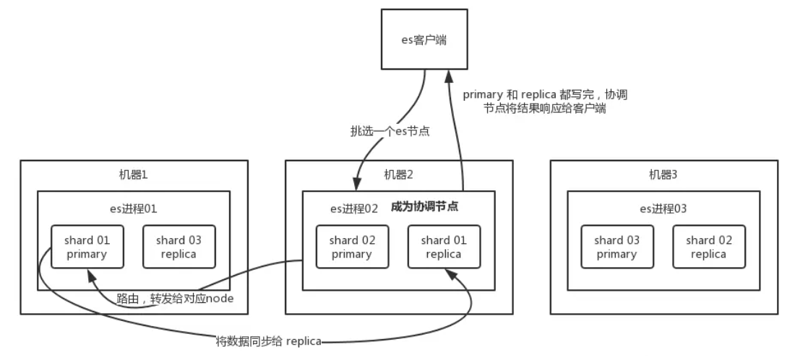
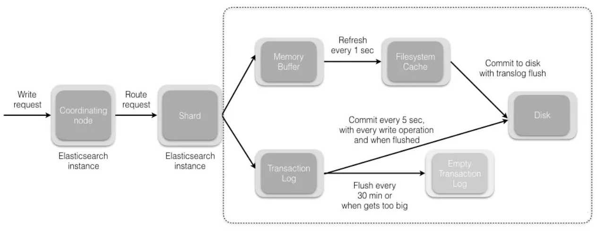

# ElasticSearch的写入、更新与删除流程

## 写入流程

### 1、过程

1. 客户端选择一个 node 发送请求过去，这个 node 就是 coordinating node （协调节点）；
2. 通过公式shard = hash(routing) % number_of_primary_shards，计算索引需要写在哪个主分片，routing默认就是文档的ID，coordinating node 对 document 通过**路由算法**，将请求转发给对应的 node（有 primary shard）；
3. 实际的 node 上的 primary shard 处理请求，然后将数据同步到 replica node；
4. coordinating node 等到 primary node 和所有 replica node 都执行成功之后，就返回响应结果给客户端。

### 2、原理

1. 数据先写入 memory buffer，然后定时（默认每隔1s）将 memory buffer 中的数据写入一个新的 segment 文件中，并进入 Filesystem cache（同时清空 memory buffer），这个过程就叫做 refresh。
    - ES 的近实时性：数据存在 memory buffer 时是搜索不到的，只有数据被 refresh 到  Filesystem cache 之后才能被搜索到，而 refresh 是每秒一次， 所以称 es 是近实时的，可以通过手动调用 es 的 api 触发一次 refresh 操作，让数据马上可以被搜索到。
1. 由于 memory Buffer 和 Filesystem Cache 都是基于内存，假设服务器宕机，那么数据就会丢失，所以 ES 通过 translog 日志文件来保证数据的可靠性，在数据写入 memory buffer 的同时，将数据写入 translog 日志文件中，在机器宕机重启时，es 会自动读取 translog 日志文件中的数据，恢复到 memory buffer 和 Filesystem cache 中去。
    - ES 数据丢失的问题：translog 也是先写入 Filesystem cache，然后默认每隔 5 秒刷一次到磁盘中，所以默认情况下，可能有 5 秒的数据会仅仅停留在 memory buffer 或者 translog 文件的 Filesystem cache中，而不在磁盘上，如果此时机器宕机，会丢失 5 秒钟的数据。也可以将 translog 设置成每次写操作必须是直接 fsync 到磁盘，但是性能会差很多。
1. flush 操作：不断重复上面的步骤，translog 会变得越来越大，当 translog 文件默认每30分钟或者 阈值超过 512M 时，就会触发 commit 操作，即 flush操作。
    - 将 buffer 中的数据 refresh 到 Filesystem Cache 中去，清空 buffer；
    - 创建一个新的 commit point（提交点），同时强行将 Filesystem Cache 中目前所有的数据都 fsync 到磁盘文件中；
    - 删除旧的 translog 日志文件并创建一个新的 translog 日志文件，此时 commit 操作完成。
  
## 更新和删除流程

删除和更新都是写操作，但是由于 Elasticsearch 中的文档是不可变的，因此不能被删除或者改动以展示其变更；所以 ES 利用 .del 文件 标记文档是否被删除，磁盘上的每个段都有一个相应的.del 文件。

### 删除操作

- 文档其实并没有真的被删除，而是在 .del 文件中被标记为 deleted 状态。该文档依然能匹配查询，但是会在结果中被过滤掉。

### 更新操作

- 将旧的 doc 标识为 deleted 状态，然后创建一个新的 doc。
- memory buffer 每 refresh 一次，就会产生一个 segment 文件 ，所以默认情况下是 1s 生成一个 segment 文件，这样下来 segment 文件会越来越多，此时会定期执行 merge。
- 每次 merge 的时候，会将多个 segment 文件合并成一个，同时这里会将标识为 deleted 的 doc 给物理删除掉，不写入到新的 segment 中，然后将新的 segment 文件写入磁盘，这里会写一个 commit point ，标识所有新的 segment 文件，然后打开 segment 文件供搜索使用，同时删除旧的 segment 文件。
