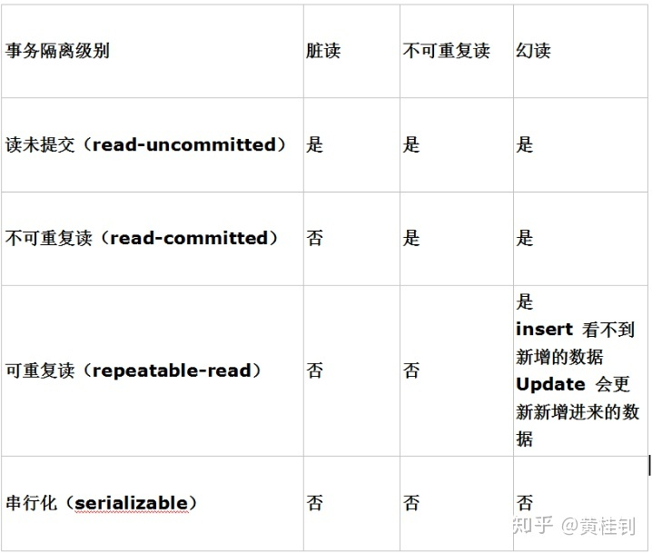

# MySql 相关知识

## 谈谈事务的隔离级别

有以下4个级别：
> READ UNCOMMITTED 读未提交，脏读、不可重复读、幻读有可能发生。
>  
> READ COMMITTED 读已提交，可避免脏读的发生，但不可重复读、幻读有可能发生。
>  
> REPEATABLE READ 可重复读，可避免脏读、不可重复读的发生，但幻读有可能发生。
>  
> SERIALIZABLE 串行化，可避免脏读、不可重复读、幻读的发生，但性能会影响比较大。

特别说明：

幻读，是指在本地事务查询数据时只能看到3条，但是当执行更新时，却会更新4条，所以称为幻读

来一张汇总表：
  

## 谈谈事务的特点

原子性是基础，隔离性是手段，一致性 是约束条件，而持久性是我们的目的。

简称，ACID

***原子性（ Atomicity ）、一致性（ Consistency ）、隔离性（ Isolation ）和持久性（ Durability ）***

原子性：

事务是数据库的逻辑工作单位，事务中包含的各操作要么都完成，要么都不完成

(要么一起成功，要么一起失败)

一致性：

事务一致性是指数据库中的数据在事务操作前后都必须满足业务规则约束。

比如A转账给B，那么转账前后，AB的账户总金额应该是一致的。

隔离性：

一个事务的执行不能被其它事务干扰。即一个事务内部的操作及使用的数据对其它并发事务是隔离的，并发执行的各个事务之间不能互相干扰。

(设置不同的隔离级别，互相干扰的程度会不同)

持久性：

事务一旦提交，结果便是永久性的。即使发生宕机，仍然可以依靠事务日志完成数据的持久化。

日志包括回滚日志（undo）和重做日志(redo)，当我们通过事务修改数据时，首先会将数据库变化的信息记录到重做日志中，然后再对数据库中的数据进行修改。这样即使数据库系统发生奔溃，我们还可以通过重做日志进行数据恢复。

## 左连接，右连接，内连接，如何编写SQL，他们的区别是什么

左连接：以左表为主

```sql
select a.*,b.* from a left join b on a.b_id = b.id;
```

右连接：以右表为主

```sql
select a.*,b.* from a right join b on a.b_id = b.id;
```

内连接：只列出两张表关联查询符合条件的记录

```sql
select a.*,b.* from a inner join b on a.b_id = b.id;
```

## 说说常用的聚合函数有哪些及作用

列表如下：

|         |函数名称  |描述  |
|---------|---------|---------|
|1     |    COUNT(*\|列)     |     求出全部记录数    |
|2     |    SUM(列)     |     求和    |
|3     |     AVG(列)    |      平均值   |
|4     |    MAX(列)     |     最大值    |
|5     |     MIN(列)    |     最小值    |

基本使用语法：

```sql
select max(age) from t_student;
select min(age) from t_student;
```

聚合函数经常会结合分组查询，出现在众多的SQL笔试题中，对于SQL笔试题，唯有多练

## 谈谈数据库设计的三大范式及反范式

## 1. 数据库的三大范式

- 第一范式：列不可分
- 第二范式：要有主键
- 第三范式：不可存在传递依赖

比如商品表里面关联商品类别表，那么只需要一个关联字段product_type_id即可，其他字段信息可以通过表关联查询即可得到

如果商品表还存在一个商品类别名称字段，如product_type_name，那就属于存在传递依赖的情况，第三范式主要是从空间的角度来考虑，避免产生冗余信息，浪费磁盘空间

## 2. 反范式设计：(第三范式)

为什么会有反范式设计？

***原因一：提高查询效率（读多写少）***

比如上述的描述中，显示商品信息时，经常需要伴随商品类别信息的展示，

所以这个时候，为了提高查询效率，可以通过冗余一个商品名称字段，这个可以将原先的表关联查询转换为单表查询

***原因二：保存历史快照信息***

比如订单表，里面需要包含收货人的各项信息，如姓名，电话，地址等等，这些都属于历史快照，需要冗余保存起来，

不能通过保存用户地址ID去关联查询，因为用户的收货人信息可能会在后期发生变更
