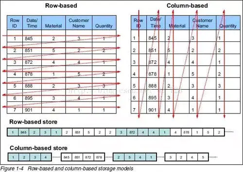
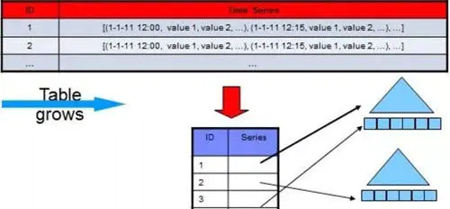
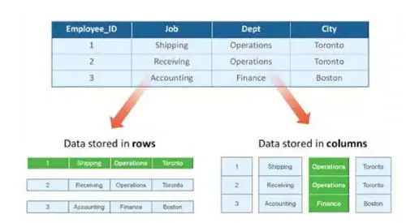
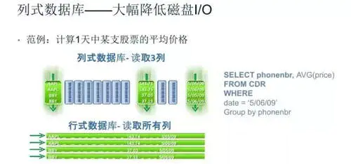

# “行式存储”和“列式存储”的区别

我们知道，当今的数据处理大致可分为两大类

- **联机事务处理 OLTP** (on-line transaction processing)
- **联机分析处理 OLAP** (On-Line Analytical Processing)

**OLTP**是传统关系型数据库的主要应用用来执行一些基本的、日常的事务处理比如数据库记录的增、删、改、查等等，而**OLAP**则是分布式数据库的主要应用 它对实时性要求不高，但处理的数据量大通常应用于复杂的动态报表系统上

| 数据处理类型   | OLTP                   | OLAP                     |
| -------------- | ---------------------- | ------------------------ |
| 主要的面向对象 | 业务开发人员           | 分析决策人员             |
| 功能实现       | 日常事务处理           | 面向分析决策             |
| 数据模型       | 关系模型               | 多维模型                 |
| 处理的数据量   | 通常为几条或几十条记录 | 通常要达到百万千万条记录 |
| 操作类型       | 查询、插入、更新、删除 | 查询为主                 |
**OLTP与OLAP的主要区别**

OLTP与OLAP在数据库的应用类别方面为何会出现显著差别呢? 其实，这是因数据库存储模式不同而造成的

## 行式存储和列式存储

传统的关系型数据库，如 Oracle、DB2、MySQL、SQL SERVER 等采用行式存储法(Row-based)，在基于行式存储的数据库中， 数据是按照行数据为基础逻辑存储单元进行存储的， **一行中的数据在存储介质中以连续存储形式存在**。

列式存储(Column-based)是相对于行式存储来说的，新兴的 Hbase、HP Vertica、EMC Greenplum 等分布式数据库均采用列式存储。在基于列式存储的数据库中， 数据是按照列为基础逻辑存储单元进行存储的，**一列中的数据在存储介质中以连续存储形式**存在。

## 行式存储的适用场景包括

1. 适合随机的增删改查操作;
1. 需要在行中选取所有属性的查询操作;
1. 需要频繁插入或更新的操作，其操作与索引和行的大小更为相关。

实操中我们会发现， 行式数据库在读取数据的时候会存在一个固有的"缺陷"。 比如，所选择查询的目标即使只涉及少数几项属性
但由于这些目标数据埋藏在各行数据单元中， 而行单元往往又特别大， 应用程序必须读取每一条完整的行记录 从而使得读取效率大大降低。 对此，行式数据库给出的优化方案是加"索引"， 在OLTP类型的应用中， 通过索引机制或给表分区等手段， 可以简化查询操作步骤，并提升查询效率。

但针对海量数据背景的OLAP应用 (例如分布式数据库、数据仓库等等)， 行式存储的数据库就有些"力不从心"了。
行式数据库建立索引和物化视图，需要花费大量时间和资源，因此还是得不偿失，无法从根本上解决查询性能和维护成本等问题，
也不适用于数据仓库等应用场景，所以后来出现了基于列式存储的数据库。

对于数据仓库和分布式数据库来说，大部分情况下它会从各个数据源汇总数据。然后进行分析和反馈，其操作大多是围绕同一列属性的数据进行的，而当查询某属性的数据记录时，列式数据库只需返回与列属性相关的值。在大数据量查询场景中，列式数据库可在内存中高效组装各列的值，最终形成关系记录集，因此可以显著减少IO消耗，并降低查询响应时间，非常适合数据仓库和分布式的应用。

## 列式存储引擎的适用场景包括

1. 查询过程中，可针对各列的运算并发执行(SMP)，最后在内存中聚合完整记录集，最大可能降低查询响应时间;
1. 可在数据列中高效查找数据，无需维护索引(任何列都能作为索引)，查询过程中能够尽量减少无关IO，避免全表扫描;
1. 因为各列独立存储，且数据类型已知，可以针对该列的数据类型、数据量大小等因素动态选择压缩算法，以提高物理存储利用率;如果某一行的某一列没有数据，那在列存储时，就可以不存储该列的值，这将比行式存储更节省空间。

当然，跟行数据库一样, 列式存储也有不太适用的场景。主要包括：

- 数据需要频繁更新的交易场景
- 表中列属性较少的小量数据库场景
- 不适合做含有删除和更新的实时操作
