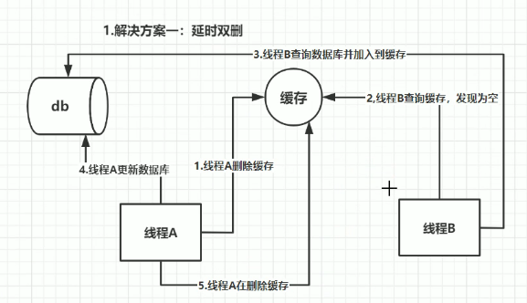

# Redis

## 缓存穿透，缓存击穿，缓存雪崩指什么，怎样防止

缓存穿透指查询数据和缓存都没有的数据。

- 解决方案：缓存空对象，布隆过滤器，入口业务检查过滤。

缓存击穿（热点数据）指数据库有数据，缓存没有或数据刚好失效。

- 解决方案：分布式锁。

缓存雪崩指的缓存在同一时间过期。

- 解决方案：redis高可用，错开数据时间，降级。

[引用](https://blog.csdn.net/zeb_perfect/article/details/54135506)

## 红锁

解决以下问题

- 当master宕机，应用请求锁时会从slave上获取锁，导致同一锁获取多次。

原理

1. 获取当前的时间（单位是毫秒）。
2. 使用相同的key和随机值在N个节点上请求锁。这里获取锁的尝试时间要远远小于锁的超时时间，防止某个masterDown了，我们还在不断的获取锁，而被阻塞过长的时间。
3. 只有在大多数节点上获取到了锁，而且总的获取时间小于锁的超时时间的情况下，认为锁获取成功了。
4. 如果锁获取成功了，锁的超时时间就是最初的锁超时时间进去获取锁的总耗时时间。
5. 如果锁获取失败了，不管是因为获取成功的节点的数目没有过半，还是因为获取锁的耗时超过了锁的释放时间，都会将已经设置了key的master上的key删除。

## 缓存数据不一致问题是怎么解决的

- 延时双删，确保最后一步成功，若不成功采用重试机制和记日志的方式最终解决。
    

- 串行化
    
