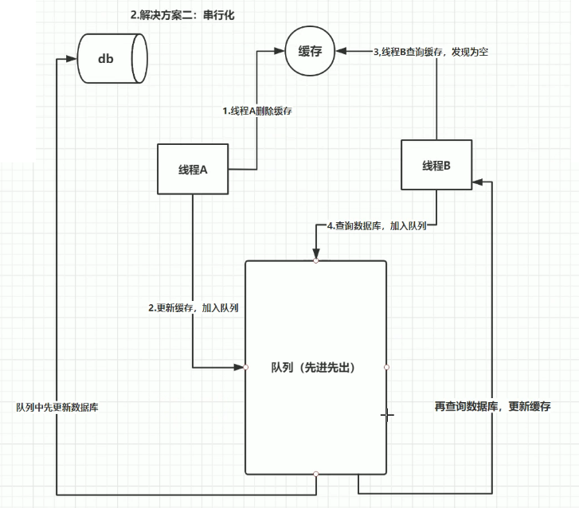

# redis知识点总结

## 缓存穿透，缓存击穿，缓存雪崩指什么，怎样防止

缓存**穿**透指查询数据和缓存都没有的数据。

- 解决方案：缓存空对象，布隆过滤器，入口业务检查过滤。

缓存**击**穿（**热点**数据）指数据库有数据，缓存没有或数据刚好失效。

- 解决方案：分布式锁。

缓存雪崩指的缓存在同一时间过期。

- 解决方案：redis高可用，错开数据时间，降级。

[引用](https://blog.csdn.net/zeb_perfect/article/details/54135506)

## 红锁

解决以下问题

- 当master宕机，应用请求锁时会从slave上获取锁，导致同一锁获取多次。

原理

1. 获取当前的时间（单位是毫秒）。
2. 使用相同的key和随机值在N个节点上请求锁。这里获取锁的尝试时间要远远小于锁的超时时间，防止某个masterDown了，我们还在不断的获取锁，而被阻塞过长的时间。
3. 只有在大多数节点上获取到了锁，而且总的获取时间小于锁的超时时间的情况下，认为锁获取成功了。
4. 如果锁获取成功了，锁的超时时间就是最初的锁超时时间进去获取锁的总耗时时间。
5. 如果锁获取失败了，不管是因为获取成功的节点的数目没有过半，还是因为获取锁的耗时超过了锁的释放时间，都会将已经设置了key的master上的key删除。

## 缓存数据不一致问题是怎么解决的

- 延时双删，确保最后一步成功，若不成功采用重试机制和记日志的方式最终解决。
    

- 串行化
    

## 什么是redis

Redis（Remote Dictionary Server）是一种开源的**内存数据结构存储**系统，主要用作缓存、数据库和消息代理。它以键-值（key-value）形式存储数据，并支持多种数据结构，如字符串、列表、集合、哈希和有序集合等。由于数据存储在内存中，Redis 的数据访问速度极快，适合需要高性能读写的数据场景。

### 一、Redis的主要特点

1. **丰富的数据结构**：支持字符串、列表、集合、有序集合、哈希、位图、HyperLogLog 和地理空间索引等数据结构。
2. **持久化**：Redis 提供两种持久化方式：
   - RDB（Redis Database）快照：将数据定时快照保存到磁盘。
   - AOF（Append Only File）日志：通过追加日志的方式记录每次写操作。
3. **高可用和分布式**：支持主从复制，通过 Redis Sentinel 实现高可用，还可以通过 Redis Cluster 实现分布式和自动分片。
4. **高性能**：由于数据存储在内存中，Redis 提供了亚毫秒级的延迟，支持每秒数百万次的读写操作。
5. **事务支持**：通过 `MULTI`、`EXEC`、`WATCH` 等命令，支持简单的事务操作。
6. **Lua脚本**：Redis 支持 Lua 脚本，允许用户在服务器端执行多个命令，减少网络往返时间。

### 二、Redis的常见应用场景

- **缓存**：将热点数据存储在 Redis 中，加速访问。
- **会话管理**：存储用户会话信息，适合用于分布式系统。
- **排行榜和计数器**：利用有序集合和计数器实现排行榜和快速计数。
- **消息队列**：利用 Redis 的发布/订阅（pub/sub）机制构建消息队列，实现任务异步处理。

### 三、Redis的使用限制

Redis 的数据存储在内存中，因此适用于中小规模的数据存储，对于超大规模的数据，需要更多的内存，成本较高。

## 为什么redis需要把所有数据放到内存中

Redis为了达到最快的读写速度将数据都读到内存中，并通过异步的方式将数据写入磁盘。所以redis具有快速和数据持久化的特征。如果不将数据放在内存中，磁盘I/O速度为严重影响redis的性能。在内存越来越便宜的今天，redis将会越来越受欢迎。

如果设置了最大使用的内存，则数据已有记录数达到内存限值后不能继续插入新值。

## Redis是单进程单线程的

redis利用队列技术将并发访问变为串行访问，消除了传统数据库串行控制的开销

## 虚拟内存

当你的key很小而value很大时,使用VM的效果会比较好.因为这样节约的内存比较大.
当你的key不小时,可以考虑使用一些非常方法将很大的key变成很大的value,比如你可以考虑将key,value组合成一个新的value.

vm-max-threads这个参数,可以设置访问swap文件的线程数,设置最好不要超过机器的核数,如果设置为0,那么所有对swap文件的操作都是串行的.可能会造成比较长时间的延迟,但是对数据完整性有很好的保证.

自己测试的时候发现用虚拟内存性能也不错。如果数据量很大，可以考虑分布式或者其他数据库

## 分布式

redis支持主从的模式。原则：Master会将数据同步到slave，而slave不会将数据同步到master。Slave启动时会连接master来同步数据。

这是一个典型的分布式读写分离模型。我们可以利用master来插入数据，slave提供检索服务。这样可以有效减少单个机器的并发访问数量

## 读写分离模型

通过增加Slave DB的数量，读的性能可以线性增长。为了避免Master DB的单点故障，集群一般都会采用两台Master DB做双机热备，所以整个集群的读和写的可用性都非常高。

读写分离架构的缺陷在于，不管是Master还是Slave，每个节点都必须保存完整的数据，如果在数据量很大的情况下，集群的扩展能力还是受限于单个节点的存储能力，而且对于Write-intensive类型的应用，读写分离架构并不适合。

## 数据分片模型

为了解决读写分离模型的缺陷，可以将数据分片模型应用进来。

可以将每个节点看成都是独立的master，然后通过业务实现数据分片。

结合上面两种模型，可以将每个master设计成由一个master和多个slave组成的模型。

## Redis的回收策略

1. volatile-lru：从已设置过期时间的数据集（server.db[i].expires）中挑选最近最少使用的数据淘汰
1. volatile-ttl：从已设置过期时间的数据集（server.db[i].expires）中挑选将要过期的数据淘汰
1. volatile-random：从已设置过期时间的数据集（server.db[i].expires）中任意选择数据淘汰
1. allkeys-lru：从数据集（server.db[i].dict）中挑选最近最少使用的数据淘汰
1. allkeys-random：从数据集（server.db[i].dict）中任意选择数据淘汰
1. no-enviction（驱逐）：禁止驱逐数据

## 使用Redis有哪些好处

1. 速度快，因为数据存在内存中，类似于HashMap，HashMap的优势就是查找和操作的时间复杂度都是O(1)
1. 支持丰富数据类型，支持string，list，set，sorted set，hash
1. 支持事务，操作都是原子性，所谓的原子性就是对数据的更改要么全部执行，要么全部不执行
1. 丰富的特性：可用于缓存，消息，按key设置过期时间，过期后将会自动删除

## redis相比memcached有哪些优势

1. memcached所有的值均是简单的字符串，redis作为其替代者，支持更为丰富的数据类型
1. redis的速度比memcached快很多（补充：在key-value操作中一般是memcached快）
1. redis可以持久化其数据（补充：redis替代memcached成为主流缓存数据库的最主要原因）

## redis常见性能问题和解决方案

1. Master最好不要做任何持久化工作，如RDB内存快照和AOF日志文件
1. 如果数据比较重要，某个Slave开启AOF备份数据，策略设置为每秒同步一次
1. 为了主从复制的速度和连接的稳定性，Master和Slave最好在同一个局域网内
1. 尽量避免在压力很大的主库上增加从库
1. 主从复制不要用图状结构，用单向链表结构更为稳定，即：Master <- Slave1 <- Slave2 <- Slave3... 这样的结构方便解决单点故障问题，实现Slave对Master的替换。如果Master挂了，可以立刻启用Slave1做Master，其他不变。

## MySQL里有2000w数据，redis中只存20w的数据，如何保证redis中的数据都是热点数据

redis 内存数据集大小上升到一定大小的时候，就会施行数据淘汰策略。redis 提供 6种数据淘汰策略：

1. voltile-lru：从已设置过期时间的数据集（server.db[i].expires）中挑选最近最少使用的数据淘汰
1. volatile-ttl：从已设置过期时间的数据集（server.db[i].expires）中挑选将要过期的数据淘汰
1. volatile-random：从已设置过期时间的数据集（server.db[i].expires）中任意选择数据淘汰
1. allkeys-lru：从数据集（server.db[i].dict）中挑选最近最少使用的数据淘汰
1. allkeys-random：从数据集（server.db[i].dict）中任意选择数据淘汰
1. no-enviction（驱逐）：禁止驱逐数据

## Memcache与Redis的区别都有哪些

1. 存储方式

    Memecache把数据全部存在内存之中，断电后会挂掉，数据不能超过内存大小。
    Redis有部份存在硬盘上，这样能保证数据的持久性。

1. 数据支持类型

    Memcache对数据类型支持相对简单。
    Redis有复杂的数据类型。

1. 使用底层模型不同

    它们之间底层实现方式 以及与客户端之间通信的应用协议不一样。
    Redis直接自己构建了VM 机制 ，因为一般的系统调用系统函数的话，会浪费一定的时间去移动和请求。

1. value大小

    redis最大可以达到1GB，而memcache只有1MB

## Redis 常见的性能问题都有哪些？如何解决

1. Master写内存快照，save命令调度rdbSave函数，会阻塞主线程的工作，当快照比较大时对性能影响是非常大的，会间断性暂停服务，所以Master最好不要写内存快照。
2. Master AOF持久化，如果不重写AOF文件，这个持久化方式对性能的影响是最小的，但是AOF文件会不断增大，AOF文件过大会影响Master重启的恢复速度。Master最好不要做任何持久化工作，包括内存快照和AOF日志文件，特别是不要启用内存快照做持久化,如果数据比较关键，某个Slave开启AOF备份数据，策略为每秒同步一次。
3. Master调用BGREWRITEAOF重写AOF文件，AOF在重写的时候会占大量的CPU和内存资源，导致服务load过高，出现短暂服务暂停现象。
4. Redis主从复制的性能问题，为了主从复制的速度和连接的稳定性，Slave和Master最好在同一个局域网内

## redis 最适合的场景

Redis最适合所有数据in-momory的场景，虽然Redis也提供持久化功能，但实际更多的是一个磁盘备份（disk-backed）的功能，跟传统意义上的持久化有比较大的差别，那么可能大家就会有疑问，似乎Redis更像一个加强版的Memcached，那么何时使用Memcached,何时使用Redis呢?

如果简单地比较Redis与Memcached的区别，大多数都会得到以下观点：

- Redis不仅仅支持简单的k/v类型的数据，同时还提供list，set，zset，hash等数据结构的存储。
- Redis支持数据的备份，即master-slave模式的数据备份。
- Redis支持数据的持久化，可以将内存中的数据保持在磁盘中，重启的时候可以再次加载进行使用。

1. **会话缓存（Session Cache）**

    最常用的一种使用Redis的情景是会话缓存（session cache）。用Redis缓存会话比其他存储（如Memcached）的优势在于：Redis提供持久化。当维护一个不是严格要求一致性的缓存时，如果用户的购物车信息全部丢失，大部分人都会不高兴的，现在，他们还会这样吗？

    幸运的是，随着 Redis 这些年的改进，很容易找到怎么恰当的使用Redis来缓存会话的文档。甚至广为人知的商业平台Magento也提供Redis的插件。

2. **全页缓存（FPC）**

    除基本的会话token之外，Redis还提供很简便的FPC平台。回到一致性问题，即使重启了Redis实例，因为有磁盘的持久化，用户也不会看到页面加载速度的下降，这是一个极大改进，类似PHP本地FPC。

    再次以Magento为例，Magento提供一个插件来使用Redis作为全页缓存后端。

    此外，对WordPress的用户来说，Pantheon有一个非常好的插件  wp-redis，这个插件能帮助你以最快速度加载你曾浏览过的页面。

3. **队列**

    Reids在内存存储引擎领域的一大优点是提供 list 和 set 操作，这使得Redis能作为一个很好的消息队列平台来使用。Redis作为队列使用的操作，就类似于本地程序语言（如Python）对 list 的 push/pop 操作。

    如果你快速的在Google中搜索"Redis queues"，你马上就能找到大量的开源项目，这些项目的目的就是利用Redis创建非常好的后端工具，以满足各种队列需求。例如，Celery有一个后台就是使用Redis作为broker，你可以从这里去查看。

4. **排行榜/计数器**

    Redis在内存中对数字进行递增或递减的操作实现的非常好。集合（Set）和有序集合（Sorted Set）也使得我们在执行这些操作的时候变的非常简单，Redis只是正好提供了这两种数据结构。所以，我们要从排序集合中获取到排名最靠前的10个用户--我们称之为"user_scores"，我们只需要像下面一样执行即可：

    当然，这是假定你是根据你用户的分数做递增的排序。如果你想返回用户及用户的分数，你需要这样执行：

    ZRANGE user_scores 0 10 WITHSCORES

    Agora Games就是一个很好的例子，用Ruby实现的，它的排行榜就是使用Redis来存储数据的，你可以在这里看到。

5. **发布/订阅**

    最后（但肯定不是最不重要的）是Redis的发布/订阅功能。发布/订阅的使用场景确实非常多。我已看见人们在社交网络连接中使用，还可作为基于发布/订阅的脚本触发器，甚至用Redis的发布/订阅功能来建立聊天系统！（不，这是真的，你可以去核实）。

    Redis提供的所有特性中，我感觉这个是喜欢的人最少的一个，虽然它为用户提供如果此多功能。
