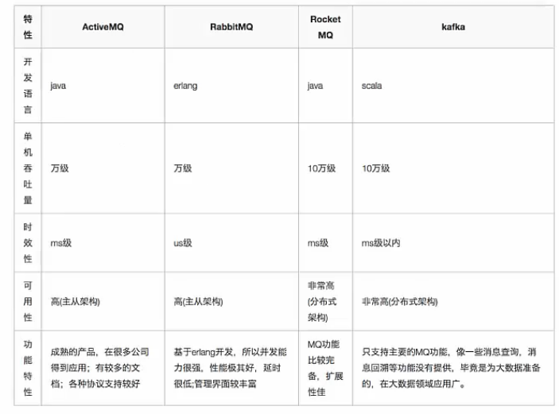
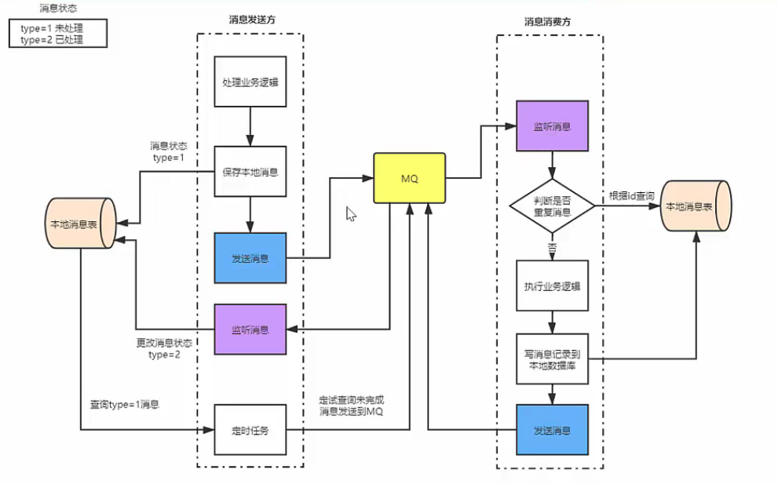

# 队例

## 为什么要用消息队列

消息队列是一种“先进先出”的数据结构。常用于解耦、异步、削峰（还有经济考量）。

## 各种消息队列产品的比较

  

## 消息队列的优点和缺点

优点：解耦、异步、削峰。

缺点：系统可用性降低、系统复杂度提高、一致性问题。

## 如何保证消息队列的高可用

RabbitMQ镜像集群。RocketMQ双主双从。

## 如何保证消息不丢失

消息丢失原因有以下几种情况：

1. 生产都没有成功发送到MQ。
2. MQ宕机导致内存消息丢失。
3. 消费者获取到消息，但还没真正处理宕机了，但MQ中已删除，消费者重启后不能再消费之前的消息。要解决以上问题可以给出以下方案。生产者发送给MQ，须得到MQ确认；MQ收到消息后做持久化；消费者处理化消息后进行确认，MQ收到确认后删除持久化的消息。

## 如何保证消息不被重复消费？（消费的幂等性？）

重复消费的原因不可避免，网络不可达。消息携带全局唯一ID，消费方接到后先查判定是否重复操作再处理。

## 如何保证消息消费的顺序性

消息的顺序消费是指按照消息发送的顺序进行消费，分为全局消息和局部消息，局部顺序消费更常见。

对于全局顺序消息

- 生产者：MQ：消费都=1：1：1。

对于局部顺序消息：

- 生产者将同一组消息发送到单个队列；
- 多个消费者并行对消息进行消费；
- 队列通过分段锁保证消息消费的顺序性。

## 基于MQ的分布式事务实现

消息发送方：

1. 处理业务逻辑；
2. 保存消息到本地数据库；
3. 发送消息给MQ；
4. 监听MQ消息方通知消息，更改消息状态为已处理；
5. 定时任务将长期未处理消息得新发送到MQ。

消息消费方：

1. 监听MQ中间件消息；
2. 判断消息是否得复，重复就丢弃；
3. 消息未重复，执行本地业务；
4. 业务处理完毕，写消息记录到本地数据库；
5. 发送通知消息到MQ。

  

[引用](https://www.bilibili.com/video/BV1tK411p71q?from=search&seid=11076650873668614869)