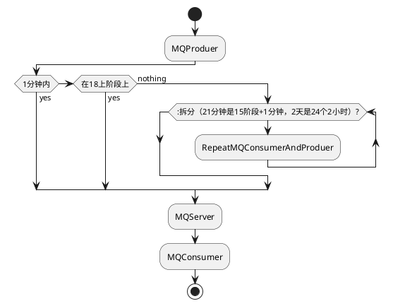

# 延时队列

**延时队列**是一种特殊的消息队列，能够让消息在指定的延时后才被消费，用于需要**延迟执行**的场景。例如订单超时取消、活动延迟开始、延迟通知等。

## 1. 延时队列的工作原理

延时队列的核心是将消息存储在队列中，并在消息创建时设置**延迟时间**。在延时结束后，消息才会被投递给消费者。很多消息中间件原生支持延时队列功能，比如 RabbitMQ 的延时插件、Kafka 的定时消息、Redis 的 ZSet 等。

## 2. 延时队列的实现方式

### 2.1. 使用 RabbitMQ 的延时插件

RabbitMQ 可以通过**TTL（Time-To-Live）**和**死信交换器（Dead Letter Exchange, DLX）**实现延时队列。具体实现如下：

- **TTL（消息生存时间）**：设置队列或消息的 TTL，使消息在指定时间后过期。
- **DLX（死信交换器）**：当消息过期后自动转发到死信交换器，由另一个消费者消费。

**实现步骤**：

1. 创建一个具有 TTL 设置的普通队列，例如 `delay_queue`，将其消息的 TTL 设置为延迟时间。
2. 设置 `delay_queue` 的 DLX 为目标交换器（例如 `dlx_exchange`）。
3. 在 `dlx_exchange` 上创建一个正常队列 `process_queue`，用于消费过期消息。

代码示例：

```java
// 设置 delay_queue 的 TTL 和 DLX 参数
Map<String, Object> args = new HashMap<>();
args.put("x-message-ttl", 60000); // 消息延迟 60 秒
args.put("x-dead-letter-exchange", "dlx_exchange");

Channel channel = connection.createChannel();
channel.queueDeclare("delay_queue", true, false, false, args);
channel.exchangeDeclare("dlx_exchange", "direct");
channel.queueDeclare("process_queue", true, false, false, null);
channel.queueBind("process_queue", "dlx_exchange", ""); // 绑定队列
```

这样，消息将在 `delay_queue` 中停留 60 秒后转发到 `dlx_exchange`，并最终进入 `process_queue` 进行消费。

### 2.2. 使用 Redis 的 ZSet

Redis 的 **ZSet（有序集合）** 也可以作为延时队列。将每条消息存储在 ZSet 中，并使用**时间戳**作为分数，表示消息的到期时间。消费者定期从 ZSet 中检查到期的消息并处理。

```java
// 添加消息到延时队列
long delay = 60000; // 60秒
long timestamp = System.currentTimeMillis() + delay;
redisTemplate.opsForZSet().add("delay_queue", message, timestamp);

// 定期轮询消费到期消息
Set<Object> messages = redisTemplate.opsForZSet().rangeByScore("delay_queue", 0, System.currentTimeMillis());
for (Object msg : messages) {
    // 处理消息
    processMessage(msg);
    redisTemplate.opsForZSet().remove("delay_queue", msg);
}
```

### 2.3. 使用 Kafka 的定时消息

Kafka 支持**延时投递**，可以通过设置**定时消息**或借助外部调度器（如 Kafka Streams 或定时任务）来实现。Kafka 的每条消息可以设定延迟时间，从而延迟消息的消费。

### 2.4. 使用rocketmq的延迟消息

本想使用rocketmq的延迟消息特性，但延迟的范围有限，仅支持
1s 5s 10s 30s
1m 2m 3m 4m
5m 6m 7m 8m
9m 10m 20m 30m
1h 2h
这18个等级，之外的延迟时间不支持，本文是为了说明如何利用rocketmq的延迟消息实现任意时间的消息延迟，如何进行扩展的



## 3. 应用场景

- **订单超时取消**：电商订单支付超时自动取消。
- **活动延迟开始**：活动开始前延迟推送通知，活动结束后自动清理数据。
- **延迟重试**：消息消费失败后延迟重试，避免因系统故障导致频繁重试。

## 4. 延时队列的优缺点

### 优点

- **降低系统压力**：避免频繁轮询，在恰当的时间触发操作。
- **简化异步操作**：满足业务的异步需求，适合用于定时任务和超时处理。

### 缺点

- **时间精度受限**：延时的精确性依赖于中间件的时间粒度。
- **数据积压风险**：如果队列中延迟消息大量堆积，可能导致内存和磁盘压力。

## 总结

延时队列在消息延迟处理方面非常有效，通过 RabbitMQ、Redis、Kafka 等实现可以灵活应用于不同场景。选择合适的延时队列方案时，应结合消息量、延迟精度要求以及系统资源情况，确保系统的稳定性和高效性。
