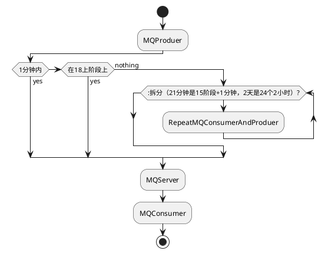

# 延时队列

## 背景

业务中会有很多定时执行的任务，如定时生日提醒，定时促销推广或是业务要求更高的定时发布产品，定时回复。

传统的定时任务一般的job就能解决，丢消息也可以接受，如促销推广，但对于产品发布和定时回复则要求更高，所以需要满足量大，高性能，可靠等必要条件。

## 可能的方案

- 使用数据库定时任务，每隔几秒扫描数据表，找出符合延迟条件的消息处理。
- 使用spring的@Scheduled注解启动定时任务或者使用Quartz任务管理器，定时触发任务，处理延迟消息。
- 使用消息中间件，ActiveMQ或者RocketMQ 都提供了延迟消息队列，下单后往延迟消息队列中发消息，超时后，消费端会接收到一条延迟的消息，并做相应处理。
- 在用户查询的时候，检测延迟消息进处处理。
- 使用DelayQueue来实现。
- 其他方式。

## 架构

本想使用rocketmq的延迟消息特性，但延迟的范围有限，仅支持
1s 5s 10s 30s
1m 2m 3m 4m
5m 6m 7m 8m
9m 10m 20m 30m
1h 2h
这18个等级，之外的延迟时间不支持，本文是为了说明如何利用rocketmq的延迟消息实现任意时间的消息延迟，如何进行扩展的

[1]: RocketMQ如何做延时队列 https://zhuanlan.zhihu.com/p/142441996
[2]: RocketMQ做任何时段的延时队列方案 https://blog.csdn.net/qq_16485855/article/details/1064521386