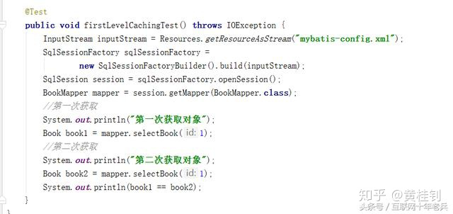
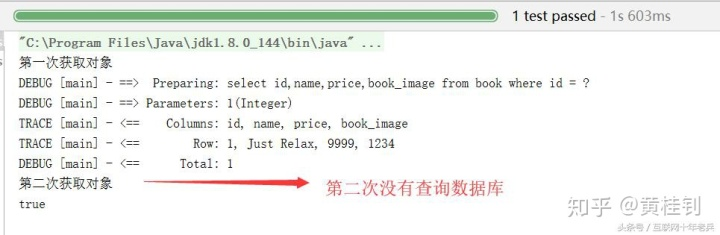
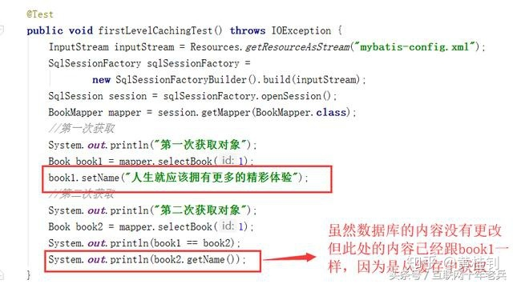
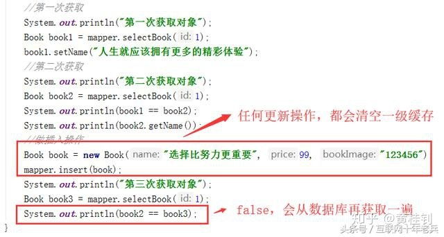
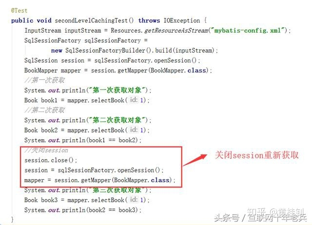
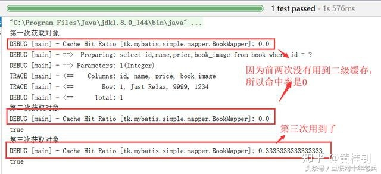

# Mybatis

## mybatis加载mappers文件有几种方式

有resource, url, class, package4种，package优先级最高。

## mybatis有几种执行器

有3种，分别是simple，reuse,  batch。

## SqlSession是线程安全的吗

本身不是线程安全的，但在Spring环境下是线程安全的。Spring通过ThreadLocal，确切的说是通过对象ThreadLocal<Map<SqlSessionFactory,SqlSessionHolder>>来实现线程安全。

## 说说MyBatis分页插件的原理是什么

首先，在MyBatis内部定义了一个拦截器接口

所有的插件都要实现该接口，看看这个接口的定义

```java
public interface Interceptor {
    Object intercept(Invocation invocation) throws Throwable;
    Object plugin(Object target);
    void setProperties(Properties properties);
}
```

那么其中一个关键的方法就是intercept，从而实现拦截

分页插件的原理就是使用MyBatis提供的插件接口，实现自定义插件，在插件的拦截方法内，拦截待执行的SQL，然后根据设置的dialect（方言），和设置的分页参数，重写SQL ，生成带有分页语句的SQL，执行重写后的SQL，从而实现分页。

所以***原理还是基于拦截器***。

## MyBatis有哪些分页方式

***逻辑分页***，是指使用MyBatis自带的RowBounds进行分页，它会一次性查出多条数据，然后再检索分页中的数据，具体一次性查询多少条数据，受封装jdbc配置的fetch-size决定。

而***物理分页***，是从数据库中查询指定条数的数据，而我们用的分页插件PageHelper实现的就是物理分页。

## MyBatis的XML映射文件都有哪些标签

这道题，主要是看看你是否知道常用的标签，如果没记住，不用慌，翻开XML文件看看即可。

来，我们罗列下：

1. 基本的CRUD标签，select|insert|updae|delete

2. <resultMap>、<parameterMap>、<sql>、<include>、<selectKey>

3. 动态SQL标签：trim | where | set | foreach | if | choose | when | otherwise | bind等，其中<sql>为sql片段标签，通过<include>标签引入sql片段

## MyBatis-缓存机制，从一级缓存到二级缓存

缓存，主要作用是提高了查询性能，减少了跟数据库交互的次数，从而也减轻了数据库承受的压力。

适用于读多写少的场景，如果数据变化频率非常高，则不适用。

MyBatis的缓存分为一级缓存和二级缓存。

下面，我们通过做实验，来掌握MyBatis的一级缓存和二级缓存的特点：

1. 来，关门，上一级缓存

  

观察执行结果：
  

再做一次实验，中间修改对象的信息
  

再做一次实验，中间新增记录
  

一级缓存总结：

1. 一级缓存模式是开启状态

2. 一级缓存作用域在于SqlSession（大家可以关闭SqlSession，然后创建一个新的，再获取对象，观察实验结果）

3. 如果中间有对数据的更新操作，则将清空一级缓存。

下面，我们来看***二级缓存***（重点）

要使用二级缓存，需要经历两个步骤

   1. 开启二级缓存（默认处于开启状态）

        <setting name="cacheEnabled" value="true"/>

   2. 在Mapper.xml中，配置二级缓存（也支持在接口配置）

       在标签<mapper>下面添加<cache/>标签即可

       默认的二级缓存配置会有如下特点：

       2.1 所有的Select语句将会被缓存

       2.2 所有的更新语句（insert、update、delete）将会刷新缓存

       2.3 缓存将采用LRU（Least Recently Used 最近最少使用）算法来回收

       2.4 缓存会存储1024个对象的引用

       回收算法建议采用LRU，当然，还提供了FIFO（先进先出），SOFT（软引用），WEAK（弱引用）等其他算法。

   3. 做实验，验证二级缓存的效果：

  

观察结果：
  

二级缓存关键说明：

当关闭了SqlSession之后，才会将查询数据保存到二级缓存中（SqlSessionFactory）中，所以才有了上述的缓存命中率。MyBatis的二级缓存默认采用的是Map的实现。

4. 衍生

其实，我们在开发中，可以集成第三方的缓存来保存MyBatis的二级缓存，常用的有EhCache和Redis

1. EhCache

    MyBatis提供了一个项目实现，ehcache-cache

    学习地址：https://github.com/mybatis/ehcache-cache

    ehcache的配置可以参照：http://www.ehcache.org/ehcache.xml

2. 整合Redis

    同样，也提供了项目：https://github.com/mybatis/redis-cache

    不过，目前还只有测试版本，等有稳定版了，推荐采用Redis的方式。

## 谈谈MyBatis跟Hibernate的区别

1. ***灵活性***，MyBatis我们一般是自己写SQL，所以更灵活，更方便做优化
2. ***可移植性***，正因为MyBatis我们是自己写SQL，而每个数据库都有自己的SQL扩展，所以在可移植性方面，MyBatis会较差

所以，在技术的选型上，其实，有时候就是一种取舍。

一般，我们在追求性能的方面会更倾向选择MyBatis。

## hibernate的对象有几种状态

1. 瞬时状态，刚new出来的对象，该对象没有被持久化，也不受session管理
2. 持久状态，比如，当调用了session的save方法之后
3. 游离状态，当session关闭之后

## 谈谈hibernate的缓存机制

一级缓存：session级别的缓存，也称为线程级别的缓存，只在session的范围内有效

二级缓存：sessionFactory级别的缓存，也称为进程级别的缓存，在所有的session中都有效

一般需要配置第三方的缓存支持，比如EhCache

查询缓存：依赖于二级缓存，在HQL的查询语句中生效

## 如何解决SQL注入

1. SQL注入，是指通过字符串拼接的方式构成了一种特殊的查询语句

    比如：select * from t_user where usename='' and password=''

    ' or 1=1 #

    select * from t_user where usename='' or 1=1 # ' and password=''

2. 解决方案

    采用预处理对象，采用PreparedStatement对象，而不是Statement对象

    可以解决SQL注入的问题

    另外也可以提高执行效率，因为是预先编译执行

    SQL执行过程（语法校验->编译->执行）

    延伸

    MyBatis如何解决了SQL注入的问题？采用#

    MyBatis的#和$的差异，#可以解决SQL注入，而？号不能解决。
