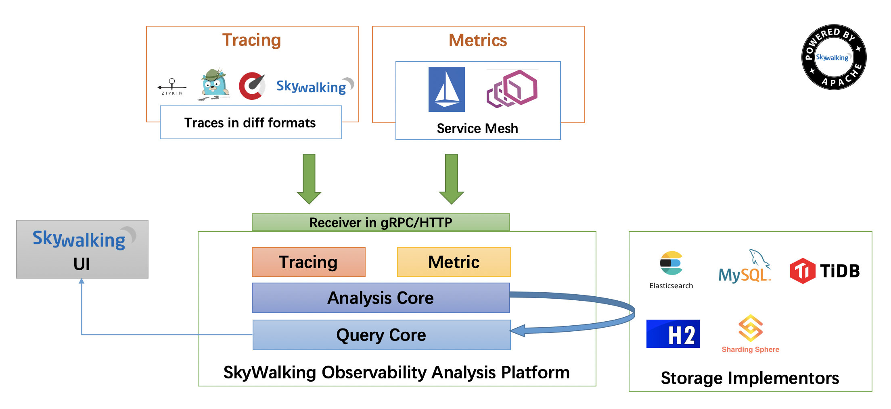

# SkyWalking

## 概述

### 概念

SkyWalking 是什么？

FROM http://skywalking.apache.org/

分布式系统的应用程序性能监视工具，专为微服务、云原生架构和基于容器（Docker、K8s、Mesos）架构而设计。

提供分布式追踪、服务网格遥测分析、度量聚合和可视化一体化解决方案。

### 功能列表

SkyWalking 有哪些功能？

FROM http://skywalking.apache.org/

多种监控手段。可以通过语言探针和 service mesh 获得监控是数据。
多个语言自动探针。包括 Java，.NET Core 和 Node.JS。
轻量高效。无需大数据平台，和大量的服务器资源。
模块化。UI、存储、集群管理都有多种机制可选。
支持告警。
优秀的可视化解决方案。

### 整体架构

SkyWalking 整体架构如何？

FROM http://skywalking.apache.org/

架构图

整个架构，分成上、下、左、右四部分：

考虑到让描述更简单，我们舍弃掉 Metric 指标相关，而着重在 Tracing 链路相关功能。

上部分 Agent ：负责从应用中，收集链路信息，发送给 SkyWalking OAP 服务器。目前支持 SkyWalking、Zikpin、Jaeger 等提供的 Tracing 数据信息。而我们目前采用的是，SkyWalking Agent 收集 SkyWalking Tracing 数据，传递给服务器。
下部分 SkyWalking OAP ：负责接收 Agent 发送的 Tracing 数据信息，然后进行分析(Analysis Core) ，存储到外部存储器( Storage )，最终提供查询( Query )功能。
右部分 Storage ：Tracing 数据存储。目前支持 ES、MySQL、Sharding Sphere、TiDB、H2 多种存储器。而我们目前采用的是 ES ，主要考虑是 SkyWalking 开发团队自己的生产环境采用 ES 为主。
左部分 SkyWalking UI ：负责提供控台，查看链路等等。

### 官方文档

英文文档：https://github.com/apache/skywalking/tree/master/docs 

中文文档：https://github.com/SkyAPM/document-cn-translation-of-skywalking 

这里推荐阅读两篇文章：

- [《OpenTracing 官方标准 —— 中文版》](https://github.com/opentracing-contrib/opentracing-specification-zh)
- Google 论文 [《Dapper，大规模分布式系统的跟踪系统》](https://bigbully.github.io/Dapper-translation/)

## Docker方式搭建

docker images | grep -E "elasticsearch|skywalking"

docker run -d --name=es7 --restart=always -p 9200:9200 -p 9300:9300 -e "discovery.type=single-node" -v /home/jes/data/elasticsearch/data:/usr/share/elasticsearch/data -v /home/jes/data/elasticsearch/logs:/usr/share/elasticsearch/logs elasticsearch:7.5.1

docker run --name oap --restart always -d --restart=always -e TZ=Asia/Shanghai -p 12800:12800 -p 11800:11800 --link es7:es7 -e SW_STORAGE=elasticsearch -e SW_STORAGE_ES_CLUSTER_NODES=es7:9200 apache/skywalking-oap-server:6.6.0-es7

docker run -d --name skywalking-ui --restart=always -e TZ=Asia/Shanghai -p 8088:8080 --link oap:oap -e SW_OAP_ADDRESS=oap:12800 apache/skywalking-ui:6.6.0

wsl2时区不一致

[SkyWalking 极简入门](https://skywalking.apache.org/zh/2020-04-19-skywalking-quick-start/)
[ik中文分词器](https://cloud.tencent.com/developer/article/1817667)