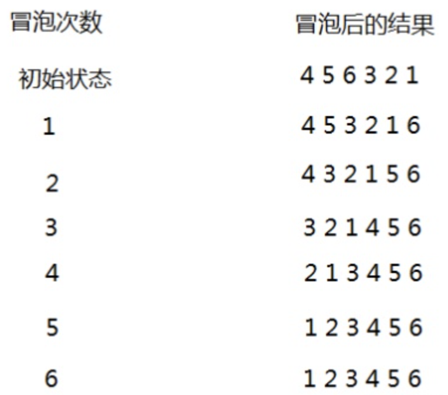

# 算法

## 算法题-求解斐波那切数列的第N个数字的值

```java
public static int getFeiBo(int i) {
    if (i < 0) {
        return -1;
    }
    if (i == 1 || i == 2) {
        return 1;
    }
    return getFeiBo(i-1) + getFeiBo(i -2);
}
```

## 算法题-求N的阶乘

递归

注意：如果递归太多层，或者没有正确结束递归，则会出现“栈内存溢出Error”！

```java
public static int getResult(int n) {
    if (n < 0) {
        throw new IllegalArgumentException("非法参数");
    }
    if (n == 0 || n == 1) {
        return 1;
    }
    return n * getResult(n - 1);
}
```

循环

```java
public static int getResult(int n) {
    if (n < 0) {
        throw new IllegalArgumentException("非法参数");
    }

    int result = 1;
    if (n == 0 || n == 1) {
        return 1;
    }

    for (int i = 1; i <= n; i++) {
        result *= i;
    }

    return result;
}
```

## 冒泡排序

排序算法，一般来说，让面试者当场手写还是挺考验功底的。

### 1. 首先，冒泡排序的定义

每次冒泡排序都会对相邻的两个元素进行比较，

如果前面的元素比后面的元素大，则进行互换，

一次冒泡会至少让一个元素移动到它应该在的位置。

重复n次，就完成n个元素的排序工作。

## 2. 图例

  

### 3. 关于上面的优化思考

其实，当某次冒泡操作没有数据交换时，说明已经达到了完全有序，

不用再继续后续的冒泡操作。

## 4. 所以，我们最终的冒泡排序可以这么写

```java
public void bubbleSort(int[] array){
    if(array.length <= 1){
        return;
    }
    //重复n次冒泡
    for(int i=0;i<array.length;i++){
        //是否可以提交退出冒泡的标记
        boolean flag = false;
        //相邻之间两两比较，并且每次减少一位参与比较
        for(int j=0;j<array.length-i-1;j++){
            if(array[j] > array[j+1]){
                //需要交换
                int temp = array[j];
                array[j] = array[j+1];
                array[j+1] = temp;
                //
                flag = true;//有数据交换，不能提前退出
            }
        }

        if(!flag){
            //没有数据交换，提前退出冒泡比较
            break;
        }
    }
}
```
