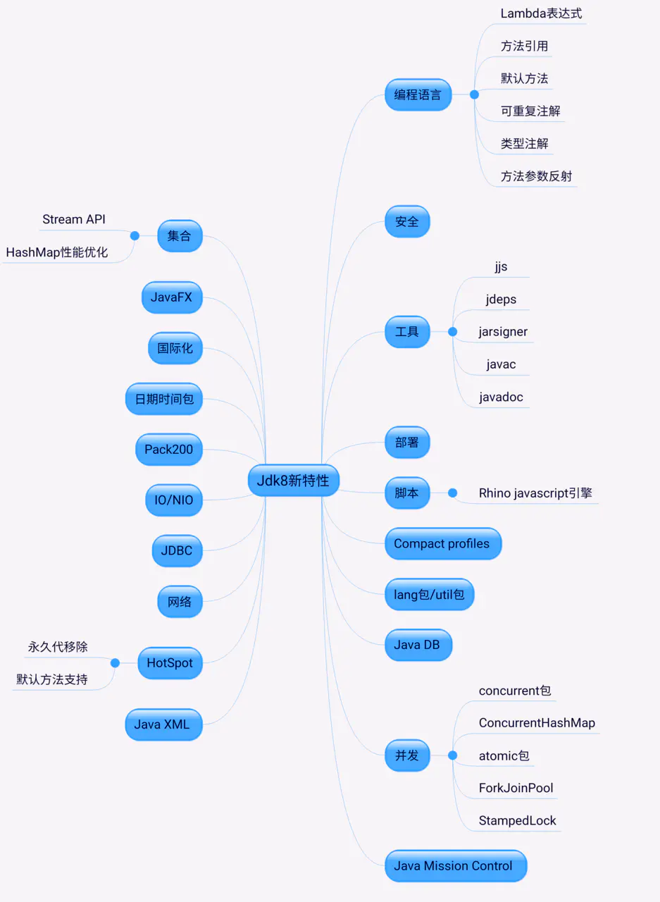

# Java基础结构

## jdk1.7和1.8的区别

1. 增加了stream特，主要基于fork-join框架构，可以在并行流和顺序流之间进行切换。
1. Hashmap性能优化。
1. 永久代移变成元空间。
1. lamda表达式。
1. 并发：LongAdder(AtomicLong 的并发进化版)
1. CompletableFuture。
1. StampedLock。
1. ConcurreentHashmap
1. fork-join框架的优化
   

[引用](https://juejin.im/post/6844904122169196552)

## 深拷贝和浅拷贝的区别是什么

深拷贝：除了对象本身被复制外，对象所包含的所有成员变量都会被复制，包括引用类型的成员对象。

浅拷贝：只复制对象其中包含的值类型的成员变量，而引用类型的成员对象没有被复制。

## 什么是反射？可以解决什么问题

反射是指程序在运行状态中，

1. 可以对任意一个类，都能够获取到这个类的所有属性和方法。
2. 对于任意一个对象，都可以调用它的任意一个方法和属性

反射是一种能力

一种在程序运行时，动态获取当前类对象的所有属性和方法的能力，可以动态执行方法，给属性赋值等操作的能力

Class代表的就是所有的字节码对象的抽象，类

反射，让我们的java程序具备动态性

这种动态获取类信息及调用对象方法的功能称为反射

在java中，Class类就是关键API

```java
public class Reflection {
        public static void main(String[] args) throws ClassNotFoundException, NoSuchFieldException, NoSuchMethodException {
        //1.以class对象为基础
        Class<?> clazz = Class.forName("com.hgz.reflection.Student");
        System.out.println(clazz);
        //2.类中每一部分，都有对应的类与之匹配
        //表示属性的类
        Field nameField = clazz.getField("name");
        //表示方法的类
        Method helloMethod = clazz.getDeclaredMethod("hello", String.class);
        //表示构造方法的类
        Constructor<?>[] constructors = clazz.getConstructors();
    }
}
```

这种能力带来很多的好处，在我们的许多框架的背后实现上，都采用了反射的机制来实现动态效果。

框架是提供一种编程的约定

比如@Autowrie 就能实现自动注入

@Autowrie

private IUserService userService;

注解的解析程序，来扫描当前的包下面有哪些属性加了这个注解，一旦有这个注解，就要去容器里面获取对应的类型的实现，然后给这个属性赋值。

思考题：如何实现一个IOC容器？

## 方法的重写和重载的区别

一般出现在（笔试题-选择题），下面我们说下重点

- 重载：发生在一个类里面，方法名相同，参数列表不同（混淆点：跟返回类型没关系）
- 重写：发生在父类子类之间的，方法名相同，参数列表相同

以下输出为什么？

```java

/**
 * 重载方法按声明调用
 * 实例方法按实例对应实例化调用
 */
public class ClassExtensionDemo {
    public static void main(String[] args) {
        Father f = new Son();
        print(f);
    }
    static void print(Father o) {
        System.out.println("static father method print");
        o.print();
    }
    static void print(Son o) {
        System.out.println("static son method print");
        o.print();
    }
}

class Father {
    public void print() {
        System.out.println("Father print");
    }
}

class Son extends Father {
    public void print() {
        System.out.println("Son print");
    }
}
```

结果为

```bash
static father method print
Son print
```

## Int和Integer的区别（重点）

1 来，先来一道考题，你看做对了吗？

```java
    Integer i1 = new Integer(12);
    Integer i2 = new Integer(12);
    System.out.println(i1 == i2);

    Integer i3 = 126;
    Integer i4 = 126;
    int i5 = 126;
    System.out.println(i3 == i4);
    System.out.println(i3 == i5);

    Integer i6 = 128;
    Integer i7 = 128;
    int i8 = 128;
    System.out.println(i6 == i7);
    System.out.println(i6 == i8);
```

false
true
true
false
true


分情况来比较

- 都定义为Integer的比较：

    > new：一旦new，就是开辟一块新内存，结果肯定是false
    >
    > 不new 看范围
    >
    > ***Integer做了缓存，范围为-128至127***，当你取值在这个范围的时候，会采用缓存的对象，所以会相等
    >
    > 当不在这个范围，内部创建新的对象，此时不相等

- Integer和int的比较：

    > 实际比较的是数值，Integer会做拆箱的动作，来跟基本数据类型做比较
    >
    > 此时跟是否在缓存范围内或是否new都没关系

## 什么是向上转型？什么是向下转型

举例说明即可：

向上转型：Person person = new Student(); 安全的

向下转型：Teacher teacher = (Teacher)person; 不安全的

## 接口和抽象类的区别

JDK1.8之前：

语法：

- 抽象类：方法可以有抽象的，也可以有非抽象, 有构造器
- 接口：方法都是抽象，属性都是常量，默认有public static final修饰

设计：

- 抽象类：同一类事物的抽取，比如针对Dao层操作的封装，如，BaseDao，BaseServiceImpl
- 接口：通常更像是一种标准的制定，定制系统之间对接的标准
- 这两个角色之间的纽带，依然是接口
- 接口可以多继承，类只支持单继承

 JDK1.8之后：

- 接口里面可以有实现的方法，注意要在方法的声明上加上default或者static


## final的作用


final修饰类，表示类不可变，不可继承

比如，String，不可变性

final修饰方法，表示该方法不可重写

比如模板方法，可以固定我们的算法

final修饰变量，这个变量就是常量

注意：

修饰的是基本数据类型，这个值本身不能修改

修饰的是引用类型，引用的指向不能修改

比如下面的代码是可以的

final Student student = new Student(1,"Andy");

student.setAge(18);//注意，这个是可以的！


## ==和equals的区别

== 比较的是值

- 比较基本的数据类型，比较的是数值
- 比较引用类型：比较引用指向的值（地址）

equals

- 默认比较也是地址，因为这个方法的最初定义在Object上，默认的实现就是比较地址
- 自定义的类，如果需要比较的是内容，那么就要学String，重写equals方法

## Java的基本数据类型有哪些

boolean,char,byte,short,int,long,float,double

注意：String是引用类型
