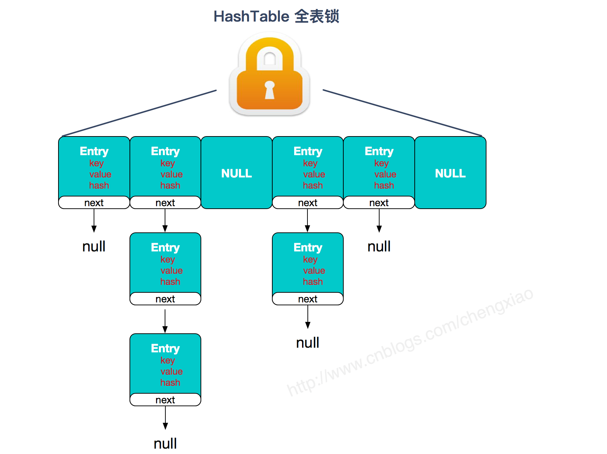
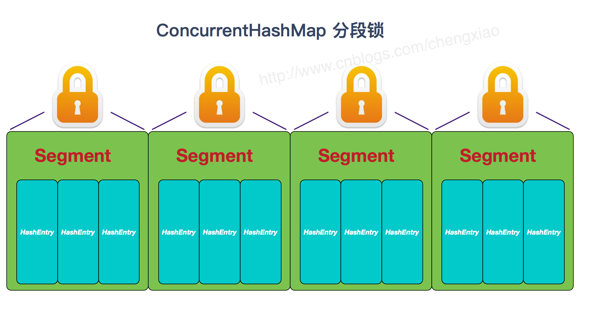

# 并发集合

## Jdk1.7和1.8中的ConcurrentHashMap有什么差别，为什么1.8要采用这种设计

1. 整体结构
    - § 1.7：Segment + HashEntry + Unsafe
    - § 1.8: 移除Segment，使锁的粒度更小，Synchronized + CAS + Node + Unsafe

2. put（）

    - § 1.7：先定位Segment，再定位桶，put全程加锁，没有获取锁的线程提前找桶的位置，并最多自旋64次获取锁，超过则挂起。
    - § 1.8：由于移除了Segment，类似HashMap，可以直接定位到桶，拿到first节点后进行判断，1、为空则CAS插入；2、为-1则说明在扩容，则跟着一起扩容；3、else则加锁put（类似1.7）

3. get（）
   - § 基本类似，由于value声明为volatile，保证了修改的可见性，因此不需要加锁。

4. resize（）
    - § 1.7：跟HashMap步骤一样，只不过是搬到单线程中执行，避免了HashMap在1.7中扩容时死循环的问题，保证线程安全。
    - § 1.8：支持并发扩容，HashMap扩容在1.8中由头插改为尾插（为了避免死循环问题），ConcurrentHashmap也是，迁移也是从尾部开始，扩容前在桶的头部放置一个hash值为-1的节点，这样别的线程访问时就能判断是否该桶已经被其他线程处理过了。

5. size（）
    - § 1.7：很经典的思路：计算两次，如果不变则返回计算结果，若不一致，则锁住所有的Segment求和。
    - § 1.8：用baseCount来存储当前的节点个数，这就设计到baseCount并发环境下修改的问题

## ConcurrentHashMap某节点数量超过8会树化，在什么情况下超过8个节点不会树化

只有节点大于8，数组大于或等于64才会树化。

## ConcurrentHasMap和HashTable的区别

- 数据结构：JDK1.7中ConcurrentHashMap使用分段数组+链表结构，HashTable使用数组+链表结构。链表主要是为解决哈希冲突而存在。到了JDK1.8时ConcurrentHashMap采用Node数组+链表+红黑树的结构。
- 线程安全的实现方式：在JDK1.7时，ConcurrentHashMap使用分段锁对整个桶数组进行分段，多线程访问不同数组段就不存在锁竞争，提高了并发效率。到了JDK1.8时直接用Node数组+链表+红黑树实现，并发使用synchronized和CAS来操作。JDK1.8可以看到Segment结构是为了兼容旧版。HashTable是使用synchronized来保证线程安全，效率较低，高并发时可能会进入阻塞和轮询状态。

  
   

## CopyOnWriteArrayList是如何做到读取完全不用加锁，而且写入不阻塞读取操作的呢

读取不会修改数据，因此没有进行同步控制或加锁操作，通过volatile保证可见性。写入的时候加了ReentrantLock可重入锁来保证同步，避免多线写的时候拷贝多个副本。

## 为什么HashMap线程不安全，ConcurrentHashMap线程安全
