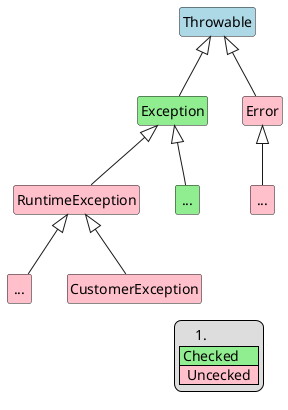

# 异常处理

## 请描述下Java的异常体系``

异常体系如下：



Error是虚拟机内部错误

> 栈内存溢出错误：StackOverflowError(递归，递归层次太多或递归没有结束)
>
> 堆内存溢出错误：OutOfMemoryError(堆创建了很多对象)

Exception是我们编写的程序错误

> RuntimeException：也称为LogicException
>
> 为什么编译器不会要求你去try catch处理？
>
> 本质是逻辑错误，比如空指针异常，这种问题是编程逻辑不严谨造成的
>
> 应该通过完善我们的代码编程逻辑，来解决问题

非RuntimeException：

> 编译器会要求我们try catch或者throws处理
>
> 本质是客观因素造成的问题，比如FileNotFoundException
>
> 写了一个程序，自动阅卷，需要读取答案的路径（用户录入），用户可能录入是一个错误的路径，所以我们要提前预案，写好发生异常之后的处理方式，这也是java程序健壮性的一种体现

## 当finally块具有return语句时会发生什么

返回的值将覆盖相应的try块返回的任何值。

## throw跟throws的区别

- throw，作用于方法内，用于主动抛出异常

- throws, 作用于方法声明上，声明该方法有可能会抛些某些异常

针对项目中，异常的处理方式，我们一般采用层层往上抛，最终通过异常处理机制统一处理（展示异常页面，或返回统一的json信息），自定义 异常一般继承RunntimeException，我们去看看Hibernate等框架，他们的异常体系都是最终继承自RunntimeException

## 罗列常见的5个非运行时异常

IOException

SQLException

FileNotFoundException

NoSuchFileException

NoSuchMethodException

## 罗列常见的5个运行时异常

此类异常，编译时没有提示做异常处理，因此通常此类异常的正确理解应该是“逻辑错误”

算数异常，

空指针，

类型转换异常，

数组越界，

NumberFormateException（数字格式异常，转换失败，比如“a12”就会转换失败）

## Java中的异常什么?

简单来说，异常是Java传达给你的系统和程序错误的方式。在java中，异常功能是通过实现比如Throwable，Exception，RuntimeException之类的类，然后还有一些处理异常时候的关键字，比如throw，throws，try，catch，finally之类的。 所有的异常都是通过Throwable衍生出来的。Throwable把错误进一步划分为 java.lang.Exception 和 java.lang.Error.  java.lang.Error 用来处理系统错误，例如java.lang.StackOverFlowError 或者 Java.lang.OutOfMemoryError 之类的。然后 Exception用来处理程序错误，请求的资源不可用等等。

## Java中的检查型异常和非检查型异常有什么区别？

检查型异常和非检查型异常的主要区别在于其处理方式。检查型异常需要使用try, catch和finally关键字在编译期进行处理，否则编译器会报错。对于非检查型异常则不需要这样做。Java中所有继承自java.lang.Exception类的异常都是检查型异常，所有继承自RuntimeException的异常都被称为非检查型异常。参考上面异常体系图。 

## Java中的NullPointerException和ArrayIndexOutOfBoundException之间有什么相同之处？

两个异常都是非检查型异常，都继承自RuntimeException。该问题可能会引出另一个问题，即Java和C的数组有什么不同之处，因为C里面的数组是没有大小限制的，绝对不会抛出ArrayIndexOutOfBoundException。

## 在Java异常处理的过程中，你遵循的最佳实践有哪些？

1. 调用方法的时候返回Optinal来代替返回null，这样可以 NullPointerException。
2. catch中不要吞并异常，至少要做log异常或throw更加具体的带上堆栈记录的异常。不同时做log和throw,因为如此一来外层日志可能变得复杂而不好排查问题。
3. 能try catch受检查的异常（checked Exception）就尽量不throws出来，可以消除代码重复率，提高代码可读性。
4. 资源迟早在在finally块中释放。

## 既然我们可以用RuntimeException来处理错误，那么你认为为什么Java中还存在检查型异常?

声明为检查型异常，Java确保了你能够优雅的对异常进行处理。另一个可能的理由是，可以使用catch或finally来确保数量受限的系统资源（比如文件描述符）在你使用后尽早得到释放。

Joshua Bloch编写的 [Effective Java 一书](http://www.amazon.com/dp/0321356683/?tag=javamysqlanta-20) 中多处涉及到了该话题。

## throw 和 throws这两个关键字在java中有什么不同?

throws总是出现在一个函数头中，用来标明该成员函数可能抛出的各种异常, 你也可以申明未检查的异常，但这不是编译器强制的。如果方法抛出了异常那么调用这个方法的时候就需要将这个异常处理。

throw 是用来抛出任意异常的，按照语法你可以抛出任意 Throwable (i.e. Throwable 或任何Throwable的衍生类) , throw可以中断程序运行，因此可以用来代替return . 最常见的例子是用 throw 在一个空方法中需要return的地方抛出 UnSupportedOperationException 代码如下 :

```java
private static void show() {
     throw new UnsupportedOperationException("Not yet implemented");
 }
```

可以看下这篇 [文章](http://javarevisited.blogspot.com/2012/02/difference-between-throw-and-throws-in.html)查看这两个关键字在java中更多的差异 。

## 什么是"异常链"?

"异常链"是Java中非常流行的异常处理概念，是指在进行一个异常处理时抛出了另外一个异常，由此产生了一个异常链条。该技术大多用于将" 受检查异常" （ checked exception）封装成为"非受检查异常"（unchecked exception)或者RuntimeException。顺便说一下，如果因为因为异常你决定抛出一个新的异常，你一定要包含原有的异常，这样，处理程序才可以通过getCause()和initCause()方法来访问异常最终的根源。

## 你曾经自定义实现过异常吗？怎么写的?*

很显然，我们绝大多数都写过自定义或者业务异常，像AccountNotFoundException。在面试过程中询问这个Java异常问题的主要原因是去发现你如何使用这个特性的。这可以更准确和精致的去处理异常，当然这也跟你选择checked 还是unchecked exception息息相关。通过为每一个特定的情况创建一个特定的异常，你就为调用者更好的处理异常提供了更好的选择。相比通用异常（general exception)，我更倾向更为精确的异常。大量的创建自定义异常会增加项目class的个数，因此，在自定义异常和通用异常之间维持一个平衡是成功的关键。

## JDK7中对异常处理做了什么改变？

JDK7中对错误(Error)和异常(Exception)处理主要新增加了2个特性，一是在一个catch块中可以处理多个异常，就像原来用多个catch块一样。另一个是自动化资源管理(ARM), 也称为try-with-resource块。这2个特性都可以在处理异常时减少代码量，同时提高代码的可读性。

## 你遇到过 OutOfMemoryError错误嘛？你是怎么搞定的？

你们也可以到 [how to fix java.lang.OutOfMemoryError](http://javarevisited.blogspot.com/2011/09/javalangoutofmemoryerror-permgen-space.html)去看看我写的另一篇关于这个问题更详细细节的文章

## 如果执行finally代码块之前方法返回了结果，或者JVM退出了，finally块中的代码还会执行吗？

这个问题也可以换个方式问："如果在try或者finally的代码块中调用了System.exit()，结果会是怎样"。了解finally块是怎么执行的，即使是try里面已经使用了return返回结果的情况，对了解Java的异常处理都非常有价值。只有在try里面是有System.exit(0)来退出JVM的情况下finally块中的代码才不会执行。

## Java中final,finalize,finally关键字的区别

final和finally是Java的关键字，而finalize则是方法。final关键字在创建不可变的类的时候非常有用，只是声明这个类是final的。而finalize()方法则是垃圾回收器在回收一个对象前调用，但也Java规范里面没有保证这个方法一定会被调用。finally关键字是唯一一个和这篇文章讨论到的异常处理相关的关键字。在你的产品代码中，在关闭连接和资源文件的是时候都必须要用到finally块。更多看[here](http://javarevisited.blogspot.com/2012/11/difference-between-final-finally-and-finalize-java.html)

## 下面的代码都有哪些错误

```java
 public static void start() throws IOException, RuntimeException{

    throw new RuntimeException("Not able to Start");
 }

 public static void main(String args[]) {
    try {
          start();
    } catch (Exception ex) {
            ex.printStackTrace();
    } catch (RuntimeException re) {
            re.printStackTrace();
    }
 }
```

这段代码会在捕捉异常代码块的RuntimeException类型变量"re"里抛出编译异常错误。因为Exception是RuntimeException的超类，在start方法中所有的RuntimeException会被第一个捕捉异常块捕捉，这样就无法到达第二个捕捉块，这就是抛出"*exception **java.lang.RuntimeException* *has already been caught*"的编译错误原因。

## 下面的Java代码都有哪些错误

```java
public class SuperClass {
    public void start() throws IOException{
        throw new IOException("Not able to open file");
    }
}

public class SubClass extends SuperClass{
    public void start() throws Exception{
        throw new Exception("Not able to start");
    }
}
```

这段代码编译器将对子类覆盖start方法产生不满。因为每个Java中方法的覆盖是有规则的，一个覆盖的方法不能抛出的异常比原方法继承关系高。因为这里的start方法在超类中抛出了IOException，所有在子类中的start方法只能抛出要么是IOExcepition或是其子类，但不能是其超类，如Exception。

## 下面的Java异常代码有什么错误

```java
public static void start(){
   System.out.println("Java Exception interivew question Answers for Programmers");
}

public static void main(String args[]) {
   try{
      start();
   }catch(IOException ioe){
      ioe.printStackTrace();
   }
}
```

上面的Java异常例子代码中，编译器将在处理IOException时报错，因为IOException是受检查异常，而start方法并没有抛出IOException，所以编译器将抛出"异常， java.io.IOException 不会在try语句体中抛出"，但是如果你将IOException改为Exception，编译器报错将消失，因为Exception可以用来捕捉所有运行时异常，这样就不需要声明抛出语句。

你也可以在 [Joshua Bloach和Neil Gafter的Java谜题](http://www.amazon.com/dp/032133678X/?tag=javamysqlanta-20)中找到一些有关Java错误和异常的具有迷惑性问题。
