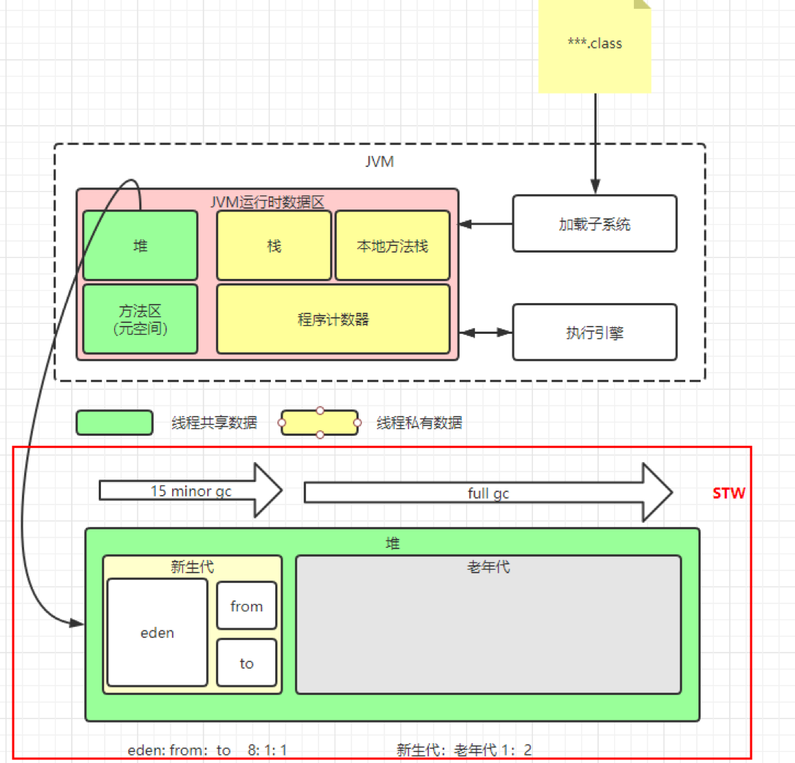
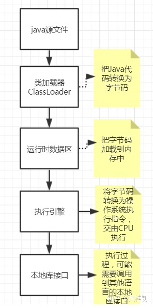
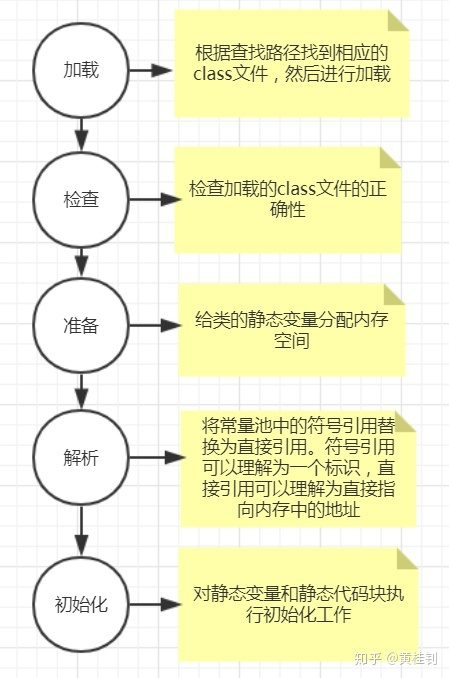

# Java虚拟机

## JDK，JRE，JVM有什么区别

JDK：Java Development Kit，Java开发工具包，提供了Java的开发环境和运行环境。包含了编译Java源文件的编译器Javac，还有调试和分析的工具。

JRE：Java Runtime Environment，Java运行环境，包含Java虚拟机及一些基础类库

JVM：Java Virtual Machine，Java虚拟机，提供执行字节码文件的能力

所以，如果***只是运行Java程序，只需要安装JRE即可***。

另外注意，J***VM是实现Java跨平台的核心，但JVM本身并不是跨平台***的，
不同的平台需要安装不同的JVM

## JVM堆内存模型



## 说说JVM的主要组成部分

主要分为4部分：

1. 类加载器
2. 运行时数据区
3. 执行引擎
4. 本地库接口

这几个分别的作用，我们用一张图来描述下：

  

## 谈谈类的装载步骤

总共分为：加载，检查，准备，解析，初始化五个步骤

  

引用孙卫琴《Java面向对象编程》的一段描述，帮助大家更好理解符号引用和直接引用的区别

在类的加载过程中的解析阶段，Java虚拟机会把类的二进制数据中的符号引用 替换为 直接引用，如Worker类中一个方法：

```java
public class Worker{
    public void gotoWork(){
        car.run(); //这段代码在Worker类中的二进制表示为符号引用
    }
}
```

在Worker类的二进制数据中，包含了一个对Car类的run()方法的符号引用，它由run()方法的全名和相关描述符组成。在解析阶段，Java虚拟机会把这个符号引用替换为一个指针，该指针指向Car类的run()方法在方法区的内存位置，这个指针就是直接引用。

## 谈谈类加载过程的双亲委托机制

### 面试场景

面试官第一问：
> 请问，我现在编写一个类，类全名如下：java.lang.String,
> 我们知道JDK也给我们听过了一个java.lang.String，
> 那么，我们编写的这个String类能否替换到JDK默认提供，也就是说程序实际运行的时候，会加载我们的String还是JDK的String？为什么？

如果，你无法确定？那么第二问：
>了解类的加载机制吗？知道JDK的类加载器吗？双亲委托机制说说看

如果，你还不了解，那么我们聊聊今天的天气吧！

### 1. 什么是类的加载机制

JVM使用Java类的流程如下：

1. Java源文件----编译---->class文件

2. 类加载器ClassLoader会读取这个.class文件，并将其转化为java.lang.Class的实例。有了该实例，JVM就可以使用他来创建对象，调用方法等操作了。

    那么ClassLoader是以一种什么机制来加载Class的？

    这就是我们要谈的类的加载机制！

### 2. 搞清楚这个问题，首先要知道，我们用到的Class文件都有哪些来源

 1. Java内部自带的核心类，位于$JAVA_HOME/jre/lib，其中最著名的莫过于rt.jar

 2. Java的扩展类，位于$JAVA_HOME/jre/lib/ext目录下

 3. 我们自己开发的类或项目开发用到的第三方jar包，位于我们项目的目录下，比如WEB-INF/lib目录

### 3. 那么，针对这些Class，JDK是怎么分工的？谁来加载这些Class

针对不同的来源，Java分了不同的ClassLoader来加载

1. Java核心类，这些Java运行的基础类，由一个名为BootstrapClassLoader加载器负责加载。这个类加载器被称为“根加载器或引导加载器”

    注意：BootstrapClassLoader不继承ClassLoader，是由JVM内部实现。法力无边，所以你通过java程序访问不到，得到的是null。

2. Java扩展类，是由ExtClassLoader负责加载，被称为“扩展类加载器”。

3. 项目中编写的类，是由AppClassLoader来负责加载，被称为“系统类加载器”。

4. 那凭什么，我就知道这个类应该由老大BootStrapClassLoader来加载？

    这里面就要基于双亲委托机制？

    所谓***双亲委托机制***，就是加载一个类，会先获取到一个系统类加载器AppClassLoader的实例，然后往上层层请求，先由BootstarpClassLoader去加载，如果BootStrapClassLoader发现没有，再下发给ExtClassLoader去加载，还是没有，才由AppClassLoader去加载。

    如果还是没有，则报错

5. 所以，上述问题的答案你清楚了吗？

    JDK提供java.lang.String类，默认在rt.jar这个包里面，所以，默认会由BootstarpClassLoader加载，

    所以，我们自己编写的java.lang.String，都没有机会被加载到

6. 给两段程序看看，类加载器的关系

    案例1：创建一个自己的类，然后打印其类加载器

    ```java
    public class ClassLoaderTest {
        public static void main(String[] args) throws ClassNotFoundException {
            Class<?> clazz = Class.forName("com.huangguizhao.thread.client.Programmer");
            ClassLoader classLoader = clazz.getClassLoader();
            System.out.println(classLoader.getClass().getSimpleName());
        }
    }
    ```

    案例2：打印其双亲类加载器信息

    ```java
    while(classLoader.getParent() != null){
        classLoader = classLoader.getParent();
        System.out.println("-->"+classLoader.getClass().getSimpleName());

    }
    ```

## 说说JVM的运行时数据区

具体来说，每个虚拟机在实际实现时，略有不同。

不过基本都符合虚拟机的规范，虚拟机规范将这个区域划分为5部分：

1. Java虚拟机栈
    >存储局部变量，操作数栈，方法出口等，为每个被执行的方法创建一个栈帧，是线程私有的，这一点跟堆是不同的

2. java堆
    >java虚拟机中内存最大的一块，所有new的对象，都在这里分配内存，被所有线程共享。

3. 程序计数器
    > 保存当前线程执行的字节码行号指示器，通过改变该值，来实现执行下一条字节码指令。
    >
    >分支，循环，线程恢复等操作，都需要依赖这个计数器来实现。

4. 方法区
    > 存储类信息，常量，静态变量，即时编译的代码等数据

5. 本地方法栈
    > 与java虚拟机栈类似，只不过java虚拟机栈是服务java方法的，本地方法区栈服务虚拟机调用Native方法的。

## OOM

原因：可使用内存太少；用的太多，用完没有释放（内存泄露，内存溢出）。
最常见的情况：OutOfMemoryError: Java heap space；OutOfMemoryError：MetaSpace；StackOverflowError ------> 不会抛OOM error，但也是比较常见的Java内存溢出。
排查手段：Dump分析。如果是内存溢出，调整-Xmx和-Xms。如果是内存泄露通过Jprofiler分析修复。

## 谈谈如何判断一个对象是否可以被回收

目前是两种方式：

1. 方式一：引用计数器

   为每个对象创建一个引用计数，当有对象引用时，计数器+1，当引用释放时，计数器-1，所以，当计数器为0时，就认为可以被回收。 但这种算法，存在一个问题，存在循环引用的问题。

    ```java
    public class Demo{
        public static void main(String[] args){
            One one = new One();
            Tow tow = new Tow();
            one.tow = tow;
            tow.one = one;
            one = null;
            tow = null;
        }
    }
    class One{
        public Tow tow;
    }
    class Tow{
        public One one;
    }
    ```

2. 方式二：可达性分析

    从GC Roots开始向下搜索，搜索所走过的路径称为引用链。 当一个对象到GC Roots没有任何引用链时，则认为此对象可以被回收。 大家可以认为就是一个树的根节点开始计算引用情况。

## 谈谈java的垃圾回收机制

我们通常指的垃圾回收，指的就是回收堆的内存。

我们创建的对象都保存在堆中，***java虚拟机通过垃圾自动回收机制，简称GC***，简化了程序员的工作。

在java中，我们可以调用System.gc()来表示要进行垃圾回收，不过不建议使用，因为使用之后，虽然不会立即触发Full GC（堆内存全扫描），而是由虚拟机来决定执行时机，但是一旦执行，还是会停止所有的活动（stop the world），对应用影响很大。

我们一般建议，在一个对象不需要再被使用时，将其设置为null，这样GC虽然不会立即回收该对象的内存，但是会在下一次GC循环中被回收。

最后，说说finalize()方法，它是在释放对象内存前，由GC调用，该方法有且仅被调用一次，一般不建议重写该方法。
