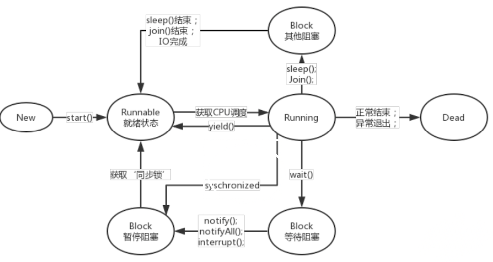

# 多线程

## 并发和并行的区别

并发：同一个CPU执行多个任务，按细分的时间片交替执行。

并行：在多个CPU上同时处理多个任务。

## 请描述线程的生命周期

线程状态转换图

  

下面详细说明下，线程共有6种状态：

new，runnable，blocked，waiting，timed waiting，terminated(dead)

1. 当进入synchronized同步代码块或同步方法时，且没有获取到锁，线程就进入了blocked状态，直到锁被释放，重新进入runnable状态

2. 当线程调用wait()或者join时，线程都会进入到waiting状态，当调用notify或notifyAll时，或者join的线程执行结束后，会进入runnable状态

3. 当线程调用sleep(time)，或者wait(time)时，进入timed waiting状态，
当休眠时间结束后，或者调用notify或notifyAll时会重新runnable状态。

4. 程序执行结束，线程进入terminated状态

案例篇

```java
public class ThreadStateTest {
    public static void main(String[] args) throws InterruptedException {
        Thread thread = new Thread(new Task());
        System.out.println(thread.getState());//NEW
        thread.start();
        System.out.println(thread.getState());//RUNNABLE
        //保险起见，让当前主线程休眠下
        Thread.sleep(10);
        System.out.println(thread.getState());//terminated
    }
}

class Task implements Runnable {
    @Override
    public void run() {
        for (int i = 0; i < 100; i++) System.out.println(i);
    }

}
```

```java
public class ThreadStateTest {
    public static void main(String[] args) throws InterruptedException {
        BlockTask task = new BlockTask();
        Thread t1 = new Thread(task);
        Thread t2 = new Thread(task);
        t1.start();
        t2.start();
        //从严谨的角度来说，t1线程不一定会先执行，此处是假设t1先执行
        System.out.println(t1.getState());//RUNNABLE
        System.out.println(t2.getState());//BLOCKED
        Thread.sleep(10);
        System.out.println(t1.getState());//TIMED_WAITING
        Thread.sleep(1000);
        System.out.println(t1.getState());//WAITING
    }
}

class BlockTask implements Runnable {
    @Override
    public void run() {
        synchronized (this) {
            //另一个线程会进入block状态
            try {
                //目的是让线程进入waiting time状态
                Thread.sleep(1000);
                //进入waiting状态
                wait();
            } catch (InterruptedException e) {
                e.printStackTrace();
            }
        }
    }
}
```

注意：

***blocked，waiting，timed waiting 我们都称为阻塞状态***

上述的就绪状态和运行状态，都表现为runnable状态

## 线程中的start和run的区别

启动一个线程，线程是就绪状态(runnable)，并没获得cpu。run时获得了cpu，线程处理运行状态(running)

## sleep和 wait的区别

1. sleep属于Thread静态方法，wait属于Object实例方法。
1. sleep时让出CPU给其他线程，不会释放锁，线程进入time-waiting状态，时间一到自动恢复运行状态；wait时，线程会放弃锁，当前线程进入waiting状态，只有等待另外线程的通知或被中断才会返回，获得对象锁进行运行状态。

## synchronized 关键字和 volatile 关键字的区别

1. 两者是互补存在，不是对立关系。
1. volatile关键字是线程同步的轻量级实现，所以volatile性能更好。但volatile只能修饰变量，synchronized用来修饰方法和代码块。synchronized关键字在jdk1.6之后为了减少获取和释放锁的性能消耗引入了偏向锁和轻量级锁以及各种优化之后执行效率显著提升。
1. 多线程访问volatile不会发生阻塞，而synchronized可能会。
1. volatile主要用于解决变量在多个线程中的可见性和有序性，而synchronized是 解决多个线程访问资源的同步性（原子性）。原子性、可见性和有序性为并发编程的三个重要特性。

## AtomicInteger类的原理

主要利用CAS(compare and swap), volatile和native方法保证原子操作。

## ThreadLocal理解和原理

ThreadLocal可以理解为线程的私有变量。如果创建了一个ThreadLocal变量，那么访问这个变量的每个线程都会有这个变量的本地副本。

ThreadLocal为ThreadLocalMap的封装，即最终的变量是放在ThreadLocalMap中。另因为ThreadLocalMap使用的key为ThreadLocal的弱引用，而value为强引用。尽管ThreadLocalMap考虑到了这可能会存在内存泄露问题，但我们使用完之后最好手动调用一下remove方法，清理key为null的记录。

## 谈谈你对ThreadLocal的理解

ThreadLocal解决了什么问题？内部源码是怎么样的？

### 作用

1. 为每个线程创建一个副本

1. 实现在线程的上下文传递同一个对象，比如connection

### 第一个问题：证明ThreadLocal为每个线程创建一个变量副本

```java
public class ThreadLocalTest {
    private static ThreadLocal<Long> threadLocal = new ThreadLocal<>();

    public static void main(String[] args) throws InterruptedException {
        //开启多个线程来执行任务
        Task task = new Task();
        new Thread(task).start();
        Thread.sleep(10);
        new Thread(task).start();
    }

    static class Task implements Runnable{
        @Override
        public void run() {
            Long result = threadLocal.get();
            if(result == null){
                threadLocal.set(System.currentTimeMillis());
                System.out.println(Thread.currentThread().getName()+"->"+threadLocal.get());
            }
        }
    }
}

```

输出的结果是不同的

### 问题二：为什么可以给每个线程保存一个不同的副本

那我们来分析源码

```java
public class ThreadLocal<T> {
    //****
    // Long result = threadLocal.get();
    public T get() {
        //1.获取当前线程
        Thread t = Thread.currentThread();
        //2，获取到当前线程对应的map
        ThreadLocalMap map = getMap(t);
        if (map != null) {
            //3.以threadLocal为key，获取到entry。 ThreadLocalMap.Entry为弱引用
            ThreadLocalMap.Entry e = map.getEntry(this);
            if (e != null) {
                @SuppressWarnings("unchecked")
                //4.获取对应entry的value，就是我们存放到里面的变量的副本
                T result = (T)e.value;
                return result;
            }
        }
        return setInitialValue();
    }
    //****
}
```

我们需要结合set方法的源码分析，才可以更好理解

```java

public class ThreadLocal<T> {
    //****
    // threadLocal.set(System.currentTimeMillis());

    public void set(T value) {
        // 1.获取到当前线程
        Thread t = Thread.currentThread();
        // 2.获取当前线程对应的map
        ThreadLocalMap map = getMap(t);
        if (map != null)
            // 3.往map存放一个键值对
            // this ThreadLocal
            // value 保存的副本
            map.set(this, value);
        else
            createMap(t, value);
    }
    //****
}
```

所以，我们得到结论：

***每个线程都会有对应的map，map来保存键值对***。

### 问题三：ThreadLocal这种特性，在实际开发中解决了什么问题

比如：hibernate管理session，mybatis管理sqlsession，其内部都是采用ThreadLocal来实现的。

前提知识：不管是什么框架，最本质的操作都是基于JDBC，当我们需要跟数据库打交道的时候，都需要有一个connection。

那么，当我们需要在业务层实现事务控制时，该如何达到这个效果？

我们构建下代码如下：

```java
public class UserService {
    //省略接口的声明
    private UserDao userDao = new UserDao();
    private LogDao logDao = new LogDao();
    //事务的边界放在业务层
    //JDBC的封装，connection
    public void add(){
        userDao.add();
        logDao.add();
    }
}

public class UserDao {
    public void add(){
        System.out.println("UserDao add。。。");
        //创建connection对象
        //connection.commit();
        //connection.rollback();
    }
}

public class LogDao {
    public void add(){
        System.out.println("LogDao add。。。");
        //创建connection对象
        //connection.commit();
        //connection.rollback();
    }
}
```

如果代码按上面的方式来管理connection，我们还可以保证service的事务控制吗？

这是不行的，假设第一个dao操作成功了，那么它就提交事务了，而第二个dao操作失败了，它回滚了事务，但不会影响到第一个dao的事务，因为上面这么写是两个独立的事务

那么怎么解决。

上面的根源就是***两个dao操作的是不同的connection***

所以，我们保证是同个connection即可

```java
//事务的边界放在业务层
//JDBC的封装，connection
public void add(){
    Connection connection = new Connection();
    userDao.add(connection);
    logDao.add(connection);
}
```

上面的方式代码不够优雅

```java
public class ConnectionUtils {

    private static ThreadLocal<Connection> threadLocal = new ThreadLocal<>();

    public static Connection getConnection(){
        Connection connection = threadLocal.get();
        if(connection == null){
            connection = new Connection();
            threadLocal.set(connection);
        }
        return connection;
    }

}

public class UserDao {
    public void add(){
        System.out.println("UserDao add。。。");
        //创建connection对象
        //connection.commit();
        //connection.rollback();
        Connection connection = ConnectionUtils.getConnection();
        System.out.println("UserDao->"+connection);
    }
}

```

到此，我们可以保证两个dao操作的是同一个connection

## 谈谈你对线程安全的理解

### 如果这个是面试官直接问你的问题，你会怎么回答

> 一个专业的描述是，当多个线程访问一个对象时，如果不用进行额外的同步控制或其他的协调操作，调用这个对象的行为都可以获得正确的结果，我们就说这个对象是线程安全的

### 那么我们如何做到线程安全

> 实现线程安全的方式有多种，其中在源码中常见的方式是，采用synchronized关键字给代码块或方法加锁，比如StringBuffer
>
> 查看StringBuffer的源码，你会看到是这样的：

```java
public final class StringBuffer
    extends AbstractStringBuilder
    implements java.io.Serializable, CharSequence
{
    //*****
    @Override
    public synchronized int length() {
        return count;
    }

    @Override
    public synchronized int capacity() {
        return value.length;
    }
    //*****
}
```

那么，我们开发中，如果需要拼接字符串，使用StringBuilder还是StringBuffer？

场景一：

如果是多个线程访问同一个资源，那么就需要上锁，才能保证数据的安全性。

这个时候如果使用的是非线程安全的对象，比如StringBuilder，那么就需要借助外力，给他加synchronized关键字。或者直接使用线程安全的对象StringBuffer

场景二：

如果每个线程访问的是各自的资源，那么就不需要考虑线程安全的问题，所以这个时候，我们可以放心使用非线程安全的对象，比如StringBuilder

比如在方法中，创建对象，来实现字符串的拼接。

看场景，如果我们是在方法中使用，那么建议在方法中创建StringBuilder，这时候相当是每个线程独立占有一个StringBuilder对象，不存在多线程共享一个资源的情况，所以我们可以安心使用，虽然StringBuilder本身不是线程安全的。

### 什么时候需要考虑线程安全

1. 多个线程访问同一个资源。
2. 资源是有状态的。比如我们上述讲的字符串拼接，这个时候数据是会有变化的

## JDK提供的线程池有哪些？实际开发我们该怎么使用

### 1. JDK通过接口ExecutorService来表示线程池，通过工具类Executors来创建多种线程池对象

```java
ExecutorService threadPool1 = Executors.newFixedThreadPool(5); //一个银行5个办理柜台
ExecutorService threadPool2 = Executors.newSingleThreadExecutor(); //周末银行只开一个办理柜台
ExecutorService threadPool3 = Executors.newCachedThreadPool(); //周末银行突然很多人，行长叫了一些人来加班
ExecutorService threadPool4 = Executors.newScheduledThreadPool(2); //创建一个定长线程池，支持定时及周期性任务执行。
```

### 2. 各种线程池的特点如下

> newSingleThreadExecutor 创建一个单线程化的线程池，它只会用唯一的工作线程来执行任务，保证所有任务按照指定顺序(FIFO, LIFO, 优先级)执行。
>
> newFixedThreadPool 创建一个定长线程池，可控制线程最大并发数，超出的线程会在队列中等待。
>
> newCachedThreadPool创建一个可缓存线程池，如果线程池长度超过处理需要，可灵活回收空闲线程，若无可回收，则新建线程。
>
> newScheduledThreadPool 创建一个定长线程池，支持定时及周期性任务执行。

### 3. 在实际开发中，我们是怎么使用的？（重点）

实际开发中，**线程资源必须通过线程池提供，不允许在应用中自行显式创建线程**

> 使用线程池的好处是减少在创建和销毁线程上所花的时间以及系统资源的开销，解决资源不足的问题。
>
> 如果不使用线程池，有可能造成系统创建大量同类线程而导致消耗完内存或者“过度切换”的问题

实际开发中，**线程池不允许使用 Executors 去创建，而是通过 new ThreadPoolExecutor 的方式**

> FixedThreadPool 和 SingleThreadPool，允许的请求队列长度为 Integer.MAX_VALUE，可能会堆积大量的请求，从而导致 OOM。
>
> CachedThreadPool 和 ScheduledThreadPool，允许的创建线程数量为 Integer.MAX_VALUE，可能会创建大量的线程，从而导致 OOM

所以，***综上所述，我们都会采用底层的方式来创建线程池***，大家自己查阅各种线程池的源代码就可以看到他们都是采用了同一个类来创建。

自己查看，印象更深刻。

## 谈谈Sleep和wait的区别

### 1. 所属的类不同

sleep方法是定义在Thread上

wait方法是定义在Object上

### 2. 对于锁资源的处理方式不同

sleep不会释放锁

wait会释放锁

### 3. 使用范围

sleep可以使用在任何代码块

wait必须在同步方法或同步代码块执行

### 4. 与wait配套使用的方法

• void notify()

唤醒在此对象监视器上等待的单个线程

• void notifyAll()

唤醒在此对象监视器上等待的所有线程

• void wait( )

导致当前的线程等待，直到其他线程调用此对象的notify( ) 方法或 notifyAll( ) 方法

### 生命周期

1 当线程调用wait()或者join时，线程都会进入到waiting状态，当调用notify或notifyAll时，或者join的线程执行结束后，会进入runnable状态

2 当线程调用sleep(time)，或者wait(time)时，进入timed waiting状态，

### 最后，留下一个思考题，为什么wait要定义在Object中，而不定义在Thread中

来解释下，我们回想下，在同步代码块中，我们说需要一个**对象锁来实现多线程的互斥效果**，也就是说，***Java的锁是对象级别的，而不是线程级别的***。

### 为什么wait必须写在同步代码块中

原因是***避免CPU切换到其他线程***，而其他线程又提前执行了notify方法，那这样就达不到我们的预期（先wait再由其他线程来唤醒），所以需要一个同步锁来保护

## 一个普通main方法的执行，是单线程模式还是多线程模式？为什么

因为java有个重要的特性，叫**垃圾自动回收机制**，所以答案是多线程，这里面有两部分，**主线程（用户线程），垃圾回收线程GC（守护线程**）同时存在。

## 创建线程的方式

我们常说的方式有以下三种：

- 继承Thread
- 实现Runable接口
- 实现Callable接口（可以获取线程执行之后的返回值）

但实际后两种，更准确的理解是创建了一个可执行的任务，要采用多线程的方式执行，

还需要通过创建Thread对象来执行，比如 new Thread(new Runnable(){}).start();这样的方式来执行。

在实际开发中，我们通常采用线程池的方式来完成Thread的创建，更好管理线程资源。

案例：如何正确启动线程

```java
public class Test {
    public static void main(String[] args) {
        MyThread thread = new MyThread();
        //thread.run();//调用方法并非开启新线程

        //正确启动线程的方式
        thread.start();
    }
}

class MyThread extends Thread {
    @Override
    public void run() {
        System.out.println(Thread.currentThread().getName() + "：running.....");
    }
}
```

案例：实现runnable只是创建了一个可执行任务，并不是一个线程

```java

public class Test {
    public static void main(String[] args) {
        MyTask task = new MyTask();
        //task.start(); //并不能直接以线程的方式来启动

        //它表达的是一个任务，需要启动一个线程来执行
        new Thread(task).start();
    }
}


class MyTask implements Runnable {
    @Override
    public void run() {
        System.out.println(Thread.currentThread().getName() + ":running....");
    }
}
```

案例三：runnable vs callable

```java
class MyTask2 implements Callable<Boolean>{
    @Override
    public Boolean call() throws Exception {
        return null;
    }
}

```

明确一点：

**本质上来说创建线程的方式就是继承Thread**，就是线程池，内部也是创建好线程对象来执行任务。
