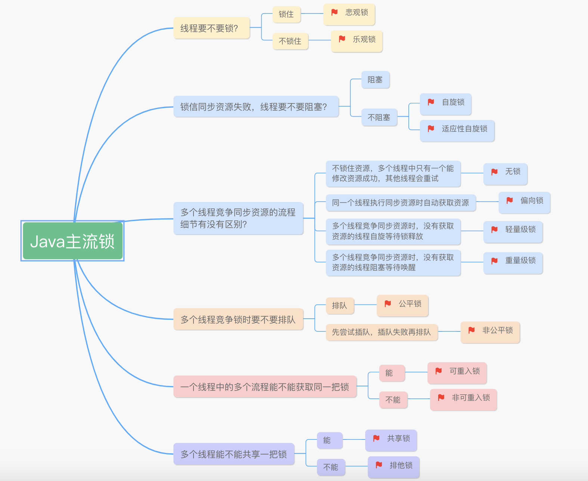

# 同步

## Java的锁有哪些

悲观锁，乐观锁；自旋锁，适应性自旋锁；无锁，偏向锁，轻级锁，重量级锁；公平锁，非公平锁；可重入锁，非可重入锁；共享锁，排他锁；闭锁等。
  

[Java主流锁原图](https://www.processon.com/mindmap/5f43286a5653bb57696cba##)  

[美团锁事](https://tech.meituan.com/2018/11/15/java-lock.html)

## 什么是死锁？如何防止死锁

### 1. 什么是死锁

死锁最初由一个悲惨的故事说起，话说一群哲学家一起聚餐，然后在每个人的左边和右边分别放着一根筷子，而只有同时抓到两根筷子，才能正常吃饭，于是，不幸的故事发生了，每位哲学家都只抓到一根筷子，且都不愿意释放手中的筷子，于是，最终一桌的饭菜就这么浪费了。

不知道这个故事是谁发明的，但确实形象说明了死锁的情况。

转换到线程的场景，就是线程A持有独占锁资源a，并尝试去获取独占锁资源b

同时，线程B持有独占锁资源b，并尝试去获取独占锁资源a

这样线程A和线程B相互持有对方需要的锁，从而发生阻塞，最终变为死锁。

```java
public class Deadlock {
    private static final Object a = new Object();
    private static final Object b = new Object();
    public static void main(String[] args){
        new Thread(new Task(true)).start();
        new Thread(new Task(false)).start();
    }
    static class Task implements Runnable{
    private boolean flag;
            public Task(boolean flag){
        this.flag = flag;
    }
    @Override
    public void run() {
        if(flag){
            synchronized (a){
                System.out.println(Thread.currentThread().getName()+"->获取到a资源");
                synchronized (b){
                    System.out.println(Thread.currentThread().getName()+"->获取到b资源");
                }
            }
        }else{
            synchronized (b){
                System.out.println(Thread.currentThread().getName()+"->获取到b资源");
                synchronized (a){
                    System.out.println(Thread.currentThread().getName()+"->获取到a资源");
                }
            }
        }
    }
}

//有可能会出现死锁，如果第一个线程已经走完，第二个线程才获取到执行权限，那么就不会出现死锁

```

### 2. 如何防止死锁？（重点）

减少同步代码块嵌套操作

降低锁的使用粒度，不要几个功能共用一把锁

尽量采用tryLock（timeout）的方法，可以设置超时时间，这样超时之后，就可以主动退出，防止死锁（关键）

## 什么是悲观锁，什么是乐观锁

1. 悲观锁是利用数据库本身的锁机制来实现，会锁记录。
    > 实现的方式为：select * from t_table where id = 1 for update

2. 乐观锁是一种不锁记录的实现方式，采用CAS模式，采用version字段来作为判断依据。

    > 每次对数据的更新操作，都会对version+1，这样提交更新操作时，如果version的值已被更改，则更新失败。

3. 乐观锁的实现为什么要选择version字段，如果选择其他字段，比如业务字段store（库存），那么可能会出现所谓的ABA问题。

    如下图所示：
      

## 说说synchronized的底层原理

synchronized是由一对monitorenter和monitorexit指令来实现同步的，在JDK6之前，monitor的实现是依靠操作系统内部的互斥锁来实现的，所以需要进行用户态和内核态的切换，所以此时的同步操作是一个重量级的操作，性能很低。

但是，JDK6带来了新的变化，提供了三种monitor的实现方式，分别是偏向锁，轻量级锁和重量级锁，即***锁会先从偏向锁再根据情况逐步升级到轻量级锁和重量级锁。 这就是锁升级***。

在锁对象的对象头里面有一个threadid字段，默认情况下为空，当第一次有线程访问时，则将该threadid设置为当前的线程id，我们称为让其获取***偏向锁***，当线程执行结束，则重新将threadid设置为空。

之后，如果线程再次进入的时候，会先判断threadid与该线程的id是否一致，如果一致，则可以获取该对象，如果不一致，则发生锁升级，从偏向锁升级为***轻量级锁***

轻量级锁的工作模式是通过自旋循环的方式来获取锁，看对方线程是否已经释放了锁，如果执行一定次数之后，还是没有获取到锁，则发生锁升级，从轻量级锁升级为***重量级锁***。

使用锁升级的目的是为了减少锁带来的性能消耗。

通过反编译查看字节码，就可以看到相关的指令

javap -verbose Test.class

源码：就是写了synchronized同步代码块控制线程安全

    ```
    Code:
        stack=2, locals=4, args_size=1
            0: new           #2                  // class java/lang/Object
            3: dup
            4: invokespecial #1                  // Method java/lang/Object."<init>":()V
            7: astore_1
            8: aload_1
            9: dup
            10: astore_2
            11: monitorenter
            12: getstatic     #3                  // Field java/lang/System.out:Ljava/io/PrintStream;
            15: ldc           #4                  // String 获得锁
            17: invokevirtual #5                  // Method java/io/PrintStream.println:(Ljava/lang/String;)V
            20: aload_2
            21: monitorexit
            22: goto          30
            25: astore_3
            26: aload_2
            27: monitorexit
            28: aload_3
            29: athrow
            30: return
    ```

**synchronized如何保证可见性的？**

首先，我们需要知道可见性原理。

两个线程如何保证变量信息的共享可见性？需要经历以下的流程：

线程A-》本地内存A（共享变量副本）-》主内存（共享变量）

如果有变更，需要将本地内存的变量写到主内存，对方才可以获取到更新。

这个是提前知识。

那么，synchronized是如何保证可见性的

就是***当获取到锁之后，每次读取都是从主内存读取，当释放锁的时候，都会将本地内存的信息写到主内存，从而实现可见性***

## synchronized与Lock的区别

1. 原始构成
    - synchronized是关键字属于JVM层面（ monitorenter， monitorexit）
    - Lock是具体类是API层的锁
2. 使用方法
    - synchronized不需要用户去手动释放锁，当synchronized代码执行完后系统会自动让线程释放对锁的占用
    - ReentrantLock则需要用户去手动释放锁，若没有主动释放锁，就可能导致出现死锁的现象。
        需要lock()各unlock()方法配合try/finally语句块来完成。
3. 等待是否可中断
    - synchronized不可中断，除非抛出异常或者正常运行完成
    - ReentrantLock可中断，
        1. 设置超时方法trylock(long timeout,TimeUnit unit)
        2. lockInterruptibly()放代码块中，调用interrput()方法中断
4. 加锁是否公平
    - synchronized非公平锁
    - ReentrantLock两者都可以，默认为非公平锁
5. 锁绑定多个条件Condition
    - synchronized没有
    - ReentrantLock用来实现分组唤醒的线程们，可以精确唤醒，而不是synchronized要么随机唤醒一个线程要么唤醒全部线程

## synchronized和volatile的区别

1. 作用的位置不同

    synchronized是修饰方法，代码块； volatile是修饰变量

2. 作用不同

    synchronized，可以保证变量修改的可见性及原子性，可能会造成线程的阻塞

    volatile仅能实现变量修改的可见性，但无法保证原子性，不会造成线程的阻塞

## 锁分段原理
