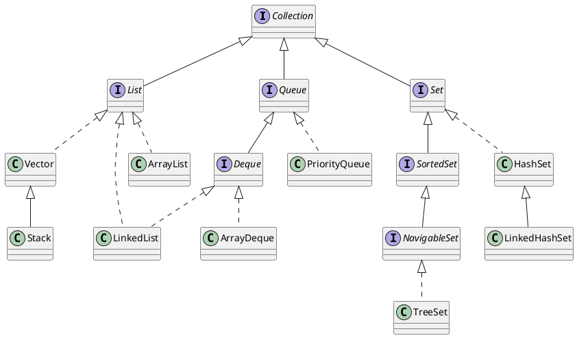
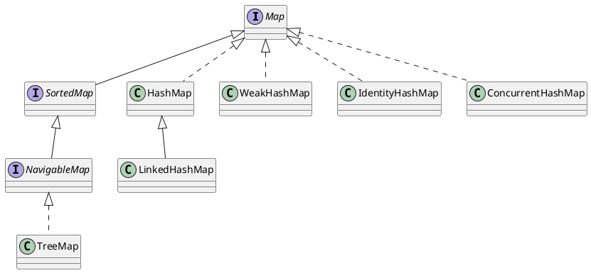
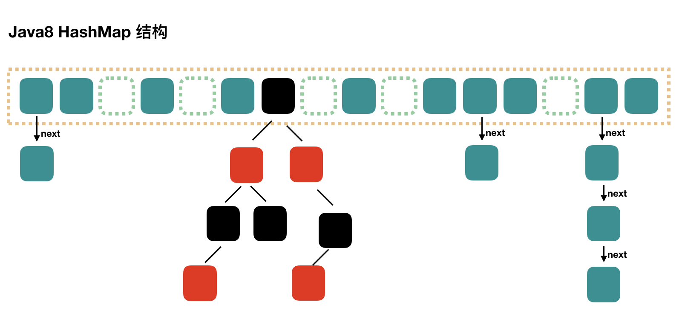
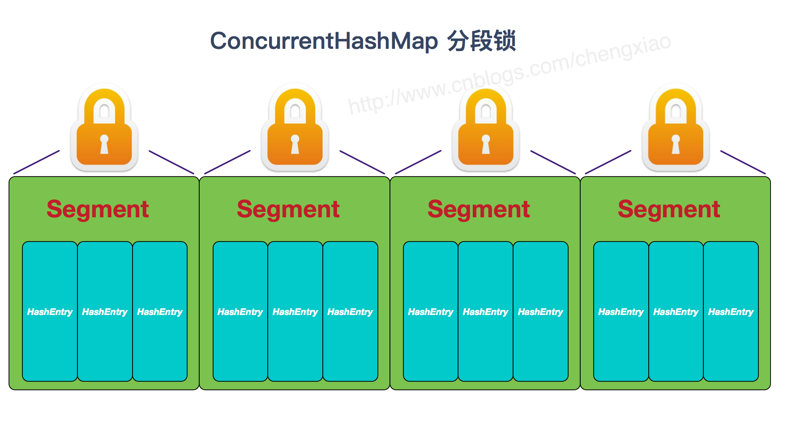

# Java集合框架

以下是Java集合框架中常见的面试题及答案，主要涉及集合框架的基本概念、各类集合的特性和用法、常用集合的原理和性能对比等：





## 1. **Java集合框架的基本结构是什么？有哪些主要接口？**

**答案**：

- Java集合框架的基本结构是以`Collection`和`Map`为主。
- **主要接口**：
    - **Collection**：集合根接口，包含三个子接口：
      - **List**：有序集合，允许重复元素，如`ArrayList`、`LinkedList`。
      - **Set**：不允许重复元素，如`HashSet`、`LinkedHashSet`、`TreeSet`。
      - **Queue**：遵循队列规则，如`LinkedList`、`PriorityQueue`。
    - **Map**：键值对集合，不允许重复键，如`HashMap`、`LinkedHashMap`、`TreeMap`。

## 2. **`ArrayList`和`LinkedList`的区别是什么？**

**答案**：

- **存储结构**：
    - `ArrayList`基于动态数组，随机访问速度快，但增删元素慢。
    - `LinkedList`基于双向链表，增删速度快，但随机访问慢。
- **线程安全**：都不是线程安全的，`Vector`是线程安全的`List`实现。
- **适用场景**：
    - `ArrayList`适合频繁访问和较少增删的情况。
    - `LinkedList`适合频繁增删的情况。

## 3. **`HashSet`和`TreeSet`的区别是什么？**

**答案**：

- **存储结构**：
    - `HashSet`基于哈希表，元素无序，增删速度快。
    - `TreeSet`基于红黑树，元素有序，性能比`HashSet`稍差。
- **线程安全**：两者都不是线程安全的。
- **排序**：`TreeSet`可以自然排序或使用`Comparator`排序，`HashSet`则不能。

## 4. **`HashMap`的工作原理是什么？**

**答案**：

- `HashMap`基于数组+链表+红黑树实现。存储时通过键的`hashCode()`确定存储桶位置，若发生哈希冲突则以链表存储，链表长度超过阈值（默认8）后转换为红黑树，提高查询效率。
- `HashMap`的默认负载因子为0.75，超过容量的75%会进行扩容。

## 5. **`HashMap`和`Hashtable`的区别是什么？**

**答案**：

- **线程安全**：`HashMap`不是线程安全的，`Hashtable`是线程安全的。
- **null值**：`HashMap`允许`null`键和`null`值，`Hashtable`不允许。
- **效率**：由于同步的开销，`Hashtable`的性能低于`HashMap`。
- **继承关系**：`HashMap`继承自`AbstractMap`，`Hashtable`继承自`Dictionary`。

## 6. **`ArrayList`和`Vector`的区别是什么？**

**答案**：

- **线程安全**：`Vector`是线程安全的，所有方法同步，而`ArrayList`不是。
- **性能**：`ArrayList`性能较高，因为不涉及同步。
- **扩容方式**：`ArrayList`每次扩容为原大小的1.5倍，而`Vector`每次扩容为原大小的2倍。

## 7. **如何实现线程安全的`HashMap`？**

**答案**：

- 使用`Collections.synchronizedMap()`包装`HashMap`。
- 使用`ConcurrentHashMap`，它是Java集合中线程安全、效率较高的`Map`实现，采用分段锁机制实现高并发。



## 8. **`HashMap`在扩容时可能会出现什么问题？**

**答案**：

- **数据丢失**：扩容期间，其他线程修改可能导致数据丢失。
- **死循环**：高并发下链表形成环导致死循环（Java 7之前）。Java 8优化后不易出现。

## 9. **`ConcurrentHashMap`的工作原理是什么？**

**答案**：

- `ConcurrentHashMap`基于分段锁（Java 8之前）和CAS操作（Java 8及以后），减少锁的粒度，提高并发性能。
- 在Java 8中，使用CAS和synchronized配合，基于数组+链表+红黑树实现高效的线程安全`Map`。



## 10. **`TreeMap`和`HashMap`的区别是什么？**

**答案**：

- **排序**：`TreeMap`基于红黑树实现，元素按键排序，`HashMap`无序。
- **性能**：`TreeMap`的查找、插入较`HashMap`慢。
- **适用场景**：`TreeMap`适用于需要键排序的场景，`HashMap`适用于无序访问。

## 11. **`LinkedHashMap`的特性是什么？**

**答案**：

- `LinkedHashMap`保留插入顺序或访问顺序，基于`HashMap`和双向链表实现。
- **常见应用**：LRU缓存可以用`LinkedHashMap`实现，通过`removeEldestEntry()`方法移除最旧的条目。

## 12. **`PriorityQueue`的工作原理是什么？**

**答案**：

- `PriorityQueue`基于最小堆（默认为自然顺序），头部总是最小元素。
- 插入元素时，`PriorityQueue`根据优先级进行排序，适用于需要有序处理的任务队列。

## 13. **`HashMap`和`ConcurrentHashMap`的区别？**

**答案**：

- **线程安全**：`HashMap`非线程安全，`ConcurrentHashMap`线程安全。
- **性能**：`ConcurrentHashMap`的分段锁提高并发性能。
- **扩容**：`ConcurrentHashMap`的扩容和并发访问不会导致死锁，`HashMap`则在高并发下有风险。

## 14. **如何选择`HashMap`、`TreeMap`和`LinkedHashMap`？**

**答案**：

- **HashMap**：无序，适合快速查找、插入、删除的场景。
- **TreeMap**：有序（按键排序），适合需要自然排序或自定义排序的场景。
- **LinkedHashMap**：按插入或访问顺序排列，适合需要记录访问顺序的场景，如LRU缓存。

## 15. **什么是Fail-Fast和Fail-Safe？**

**答案**：

- **Fail-Fast**：在遍历过程中若集合被修改，立即抛出`ConcurrentModificationException`，如`ArrayList`、`HashMap`。
- **Fail-Safe**：在遍历过程中允许修改，使用原集合的副本，不抛异常，如`ConcurrentHashMap`、`CopyOnWriteArrayList`。

## 16. **`HashMap`的默认初始容量和负载因子分别是多少？**

**答案**：

- 默认初始容量是16，负载因子是0.75。
- 当元素数量超过`容量 × 负载因子`时触发扩容。

## 17. **`Set`接口与`List`接口的主要区别是什么？**

**答案**：

- **Set**：不允许重复元素，顺序不固定。
- **List**：允许重复元素，按插入顺序排列，可通过索引访问。

## 18. **`Iterator`和`ListIterator`的区别？**

**答案**：

- **Iterator**：适用于遍历`Collection`，只能单向遍历。
- **ListIterator**：只能用于`List`，支持双向遍历，并可在遍历时添加、修改元素。

## 19. **如何避免`ConcurrentModificationException`？**

**答案**：

- 使用`ConcurrentHashMap`、`CopyOnWriteArrayList`等并发安全集合。
- 使用`Iterator`的`remove()`方法而不是集合的`remove()`。
- 使用`for-each`或普通循环遍历时，不在遍历过程中修改集合。

## 20. **`Comparable`和`Comparator`接口的区别？**

**答案**：

- **Comparable**：对象自身比较，实现`compareTo()`，适用于自然排序。
- **Comparator**：外部比较器，实现`compare()`，适用于定制排序。

## 21. **如何在集合中删除重复元素？**

**答案**：

- 可以将集合元素放入`Set`中，因为`Set`不允许重复元素。
- 如果需要保持原有顺序，可以使用`LinkedHashSet`来去重，因为它维护插入顺序。

## 22. **`WeakHashMap`的特点是什么？应用场景有哪些？**

**答案**：

- `WeakHashMap`中的键使用弱引用，当键没有其他引用时会被垃圾回收，从而自动删除对应的键值对。
- **应用场景**：用于缓存，存储一些可被自动回收的缓存数据，避免内存泄漏。

## 23. **什么是`EnumSet`和`EnumMap`？它们的特点是什么？**

**答案**：

- **EnumSet**：一个专门用于`Enum`类型的集合，实现了`Set`接口，所有元素必须是同一个枚举类型，具有高性能和低内存开销。
- **EnumMap**：一个专门用于`Enum`类型键的映射实现了`Map`接口，键必须为枚举类型。内部使用数组存储，效率非常高。

## 24. **`CopyOnWriteArrayList`和`ArrayList`的区别是什么？**

**答案**：

- **CopyOnWriteArrayList**：是线程安全的，修改时会创建数组的副本。适合读多写少的并发场景。
- **ArrayList**：不是线程安全的，读写都直接操作同一数组，因此在多线程下需要手动同步。

## 25. **`LinkedHashSet`如何保持插入顺序？**

**答案**：

- `LinkedHashSet`继承自`HashSet`，并使用双向链表记录元素的插入顺序。
- 每个元素在存储时会在链表中维护插入顺序，所以`LinkedHashSet`具有`Set`的去重特性和链表的顺序特性。

## 26. **如何对`ArrayList`进行排序？**

**答案**：

- 使用`Collections.sort(list)`对列表元素进行升序排序。
- 若需要自定义排序，可传入`Comparator`实现类，如：`Collections.sort(list, comparator)`。

## 27. **`TreeSet`如何保证元素排序？**

**答案**：

- `TreeSet`基于红黑树实现，插入时会根据元素的自然顺序或`Comparator`顺序进行排序。
- 默认元素按照自然顺序排序，也可以通过构造函数传入自定义的`Comparator`实现类来指定排序规则。

## 28. **`HashSet`如何检查重复？**

**答案**：

- `HashSet`依赖元素的`hashCode()`和`equals()`方法来检查重复。
- 当插入元素时，首先通过`hashCode()`确定存储桶位置，再使用`equals()`进行比较，确保不存入重复元素。

## 29. **`IdentityHashMap`和`HashMap`的区别是什么？**

**答案**：

- **IdentityHashMap**：使用`==`比较键对象是否相等（基于内存地址），而`HashMap`使用`equals()`比较。
- **应用场景**：需要区分内存地址相同、内容不同的对象时，使用`IdentityHashMap`。

## 30. **`LinkedBlockingQueue`和`ArrayBlockingQueue`的区别？**

**答案**：

- **LinkedBlockingQueue**：基于链表实现，容量可以不固定（可指定容量上限），适合大批量任务的存取。
- **ArrayBlockingQueue**：基于数组实现，容量固定，适合有界的任务队列。

## 31. **如何在遍历集合时安全地删除元素？**

**答案**：

- 使用`Iterator`的`remove()`方法安全删除。
- 使用`ListIterator`进行双向遍历，并通过`remove()`方法删除元素。
- 使用`ConcurrentHashMap`或`CopyOnWriteArrayList`在并发环境下删除元素，防止抛出`ConcurrentModificationException`。

## 32. **`Deque`和`Queue`有什么区别？**

**答案**：

- **Queue**：单端队列，只允许从一端插入和另一端移除，如`LinkedList`。
- **Deque**：双端队列，支持两端插入和移除元素，如`ArrayDeque`、`LinkedList`。

## 33. **`BlockingQueue`的作用是什么？常用的`BlockingQueue`实现有哪些？**

**答案**：

- **作用**：`BlockingQueue`用于在生产者-消费者场景中处理线程安全的队列操作，当队列满时阻塞生产线程，当队列空时阻塞消费线程。
- **常用实现**：
    - `ArrayBlockingQueue`：基于数组的有界阻塞队列。
    - `LinkedBlockingQueue`：基于链表的阻塞队列，可指定容量上限。
    - `PriorityBlockingQueue`：带优先级的无界阻塞队列。
    - `SynchronousQueue`：每次插入都需等待相应的删除操作，无缓冲。

## 34. **如何判断`Collection`是否为空？**

**答案**：

- 使用`Collection`接口的`isEmpty()`方法来判断集合是否为空。
- 若使用`Map`类型，使用`map.isEmpty()`方法。

## 35. **`List`、`Set`和`Map`的主要区别是什么？**

**答案**：

- **List**：允许重复元素，有序集合，可以通过索引访问，如`ArrayList`、`LinkedList`。
- **Set**：不允许重复元素，无序集合或按特定顺序排列，如`HashSet`、`TreeSet`。
- **Map**：键值对存储，不允许重复键，如`HashMap`、`TreeMap`。

## 36. **如何使用`Collections.synchronizedList()`和`Collections.synchronizedMap()`？**

**答案**：

- 通过`Collections.synchronizedList(new ArrayList<>())`获取线程安全的`List`实现。
- 通过`Collections.synchronizedMap(new HashMap<>())`获取线程安全的`Map`实现。
- 这种方式适合在需要并发访问的场景中为原集合添加同步访问功能。

## 37. **`Queue`接口有哪些常用方法？**

**答案**：

- **常用方法**：
    - `add()`：添加元素，满队列时抛异常。
    - `offer()`：添加元素，返回布尔值表示是否成功。
    - `remove()`：移除队首元素，队列空时抛异常。
    - `poll()`：移除队首元素，队列空时返回`null`。
    - `element()`：查看队首元素，不移除，空时抛异常。
    - `peek()`：查看队首元素，不移除，空时返回`null`。

## 38. **什么是不可变集合？如何创建不可变集合？**

**答案**：

- **不可变集合**：集合内容不能修改，适用于只读场景，线程安全。
- **创建方式**：
    - 使用`Collections.unmodifiableList()`、`Collections.unmodifiableSet()`等方法创建不可变集合。
    - Java 9提供的`List.of()`、`Set.of()`、`Map.of()`创建不可变集合。

## 39. **为什么`TreeMap`适合用于按范围搜索？**

**答案**：

- `TreeMap`基于红黑树实现，存储有序，适合按键范围搜索。
- 提供`subMap()`、`headMap()`、`tailMap()`等方法，便于按指定范围获取子集。

## 40. **什么是`Properties`类？常用场景有哪些？**

**答案**：

- `Properties`类继承自`Hashtable`，用于读取和写入键值对配置文件。
- **常用场景**：读取系统配置、应用配置文件（如`.properties`文件），可以通过`load()`和`store()`方法读取和存储配置。

## 41. **`HashMap`和`TreeMap`的性能比较？**

**答案**：

- **HashMap**：基于哈希表实现，`O(1)`时间复杂度获取和插入元素。适用于无序的快速访问。
- **TreeMap**：基于红黑树实现，`O(log n)`时间复杂度，保持键的自然顺序或自定义顺序。适用于按顺序存储和范围查询。
- 总体来说，`HashMap`在查找和插入方面更快，但`TreeMap`适合有序需求。

## 42. **`HashMap`的扩容机制是怎样的？**

**答案**：

- **初始容量**：`HashMap`默认容量为16。
- **扩容触发**：当元素数量超过负载因子（默认0.75）乘以当前容量时触发扩容。
- **扩容过程**：容量翻倍，将现有元素重新哈希并重新分配到新数组中。
- **性能影响**：扩容是较为耗时的操作，因此可以在初始化时估算合理容量，减少扩容次数。

## 43. **为什么`ConcurrentHashMap`线程安全？**

**答案**：

- **分段锁**：早期版本使用分段锁（segment locking）来降低锁粒度。
- **CAS操作**：在Java 8后，采用无锁的CAS（Compare-And-Swap）机制更新值，并用`Synchronized`控制少量并发场景，从而减少了锁的竞争。
- **效率优势**：这种机制相比`Hashtable`的全表锁效率更高。

## 44. **`LinkedHashMap`如何实现LRU缓存？**

**答案**：

- **继承方式**：`LinkedHashMap`通过`accessOrder`参数控制顺序，当`accessOrder=true`时按照访问顺序排列。
- **实现LRU**：重写`removeEldestEntry()`方法，判断当元素数超过容量时自动移除最久未访问的元素，从而实现LRU缓存。

## 45. **`PriorityQueue`如何实现优先级？**

**答案**：

- **底层结构**：基于二叉堆实现，最小元素始终在根节点。
- **优先级顺序**：插入元素时按照优先级重新排列，可以通过实现`Comparable`接口或指定`Comparator`定义优先级。
- **常用方法**：`poll()`用于移除优先级最高（最小）元素。

## 46. **什么是`NavigableMap`和`NavigableSet`？**

**答案**：

- **NavigableMap**：提供一系列方法如`lowerKey()`、`higherKey()`、`floorKey()`、`ceilingKey()`等，便于获取比指定键更低、更高或相等的键。
- **NavigableSet**：提供类似功能用于`Set`，支持获取指定元素的上下界。

## 47. **如何使用集合框架实现一个线程安全的`FIFO`队列？**

**答案**：

- 可以使用`LinkedBlockingQueue`或`ArrayBlockingQueue`，它们是线程安全且遵循`FIFO`的阻塞队列。
- **示例**：`Queue<String> queue = new LinkedBlockingQueue<>();`

## 48. **`TreeSet`和`TreeMap`如何保持排序？**

**答案**：

- **TreeSet**：内部使用`TreeMap`实现，基于红黑树排序。
- **TreeMap**：每个节点根据键的自然顺序或指定的`Comparator`进行排序，红黑树自动调整顺序以保证查询效率。

## 49. **如何在多线程环境下使用集合的迭代器？**

**答案**：

- 在多线程环境中，尽量使用线程安全的集合（如`ConcurrentHashMap`、`CopyOnWriteArrayList`）。
- 若非线程安全的集合，需在迭代器上加锁（`synchronized`块）或使用`synchronized`集合（如`Collections.synchronizedList()`）。
- **注意**：避免`fail-fast`现象，即在集合被并发修改时抛出`ConcurrentModificationException`。

## 50. **`ConcurrentLinkedQueue`与`LinkedBlockingQueue`的区别？**

**答案**：

- **ConcurrentLinkedQueue**：非阻塞的线程安全队列，适合高并发的无界队列。
- **LinkedBlockingQueue**：阻塞队列，支持容量限制，适合生产者-消费者模式。
- **应用场景**：`ConcurrentLinkedQueue`用于无阻塞队列，`LinkedBlockingQueue`用于需要阻塞等待的场景。

## 51. **如何实现一个不可变的`List`？**

**答案**：

- 使用`Collections.unmodifiableList(new ArrayList<>(...))`创建不可变集合。
- 在Java 9及以上版本，可使用`List.of(...)`方法直接创建不可变`List`。

## 52. **`TreeSet`中的自定义排序如何实现？**

**答案**：

- 可以在`TreeSet`构造时传入一个`Comparator`实例，以自定义元素的排序规则。
- **示例**：`TreeSet<Integer> set = new TreeSet<>(Comparator.reverseOrder());`

## 53. **为什么`HashSet`不能保证元素的顺序？**

**答案**：

- `HashSet`基于`HashMap`实现，通过哈希值决定存储位置，不关心插入顺序。
- 如果需要顺序，可以使用`LinkedHashSet`或`TreeSet`。

## 54. **如何选择`HashMap`和`ConcurrentHashMap`？**

**答案**：

- 在单线程或仅读多写少的场景，`HashMap`的性能更好。
- 在多线程环境中或需要高频读写操作，`ConcurrentHashMap`更适合，它通过分段锁提高并发效率。

## 55. **`List`和`Set`的应用场景是什么？**

**答案**：

- **List**：适合需要保持元素顺序、允许重复的场景，如记录日志、按顺序排列的元素。
- **Set**：适合去重且无序或有自定义顺序的场景，如用户ID集合、关键词集合。

## 56. **在集合中，如何避免`NullPointerException`？**

**答案**：

- **预防措施**：
    - 使用`Optional.ofNullable()`来包装集合元素。
    - 使用`Objects.requireNonNull()`检查非空。
    - 使用`ConcurrentSkipListMap`（不允许`null`键或值）等集合类避免`null`带来的问题。

## 57. **`LinkedList`和`ArrayList`的扩容机制有什么区别？**

**答案**：

- **ArrayList**：动态数组实现，扩容时容量会扩充1.5倍左右。
- **LinkedList**：基于双向链表，无扩容机制，因为链表节点存储分散，只需在尾部或头部添加或删除节点。

## 58. **`Set`中可以添加`null`吗？不同的`Set`实现有何差别？**

**答案**：

- **HashSet**：允许一个`null`元素。
- **TreeSet**：不允许`null`元素，因为排序时会抛出`NullPointerException`。
- **LinkedHashSet**：允许一个`null`元素。

## 59. **如何在Java 8中过滤集合？**

**答案**：

- 使用`Stream` API中的`filter`方法过滤集合。
- **示例**：`list.stream().filter(x -> x > 10).collect(Collectors.toList());`。

## 60. **如何合并两个集合并去重？**

**答案**：

- 可以使用`Set`来合并两个集合并去重。
- **示例**：
     ```java
     Set<String> set1 = new HashSet<>(list1);
     set1.addAll(list2);
     ```

## 61. **为什么`Collections.synchronizedList`在多线程环境中并不完全安全？**

**答案**：
`Collections.synchronizedList`提供同步的`List`实现，但在迭代时，如果有其他线程修改了集合，仍可能抛出`ConcurrentModificationException`。在多线程环境中迭代时，最好使用显式锁定整个`List`或者使用并发集合类，如`CopyOnWriteArrayList`。

## 62. **在集合中如何删除所有偶数的整数？**

**答案**：
使用`removeIf`方法可以简化此操作，例如：
   ```java
   List<Integer> list = new ArrayList<>(Arrays.asList(1, 2, 3, 4));
   list.removeIf(n -> n % 2 == 0);  // 删除所有偶数
   ```

## 63. **如何将`List`拆分为固定大小的子列表？**

**答案**：
可以使用Guava库中的`Lists.partition()`方法，或手动实现：
   ```java
   List<Integer> list = Arrays.asList(1, 2, 3, 4, 5, 6);
   List<List<Integer>> partitions = Lists.partition(list, 2);  // 每个子列表包含2个元素
   ```

---

## 64. **`ArrayDeque`和`LinkedList`作为队列有什么区别？**

**答案**：

- **ArrayDeque**：基于数组实现，不允许`null`元素，适合双端队列的场景，效率较高。
- **LinkedList**：基于链表实现，允许`null`元素，但在访问元素上`ArrayDeque`通常效率更高，适用于需要频繁在头尾插入和删除元素的场景。

## 65. **`EnumSet`是什么？**

**答案**：
`EnumSet`是一个专门用于枚举类型的集合。它比常规集合更高效，因为它底层基于位向量实现，只能存储相同枚举类型的值。

## 66. **`LinkedHashMap`的`accessOrder`在何种场景下会有用？**

**答案**：
`accessOrder`设置为`true`时，`LinkedHashMap`会根据访问顺序排序，非常适用于实现缓存机制（例如LRU缓存），可以在满容量时删除最早访问的元素。

## 67. **在高并发环境下，`ArrayList`和`CopyOnWriteArrayList`有何区别？**

**答案**：

- **ArrayList**：非线程安全，在高并发环境中容易发生并发修改异常。
- **CopyOnWriteArrayList**：在写操作时复制整个底层数组，适用于读多写少的场景，因为写操作的开销较大。

## 68. **`Queue`接口有哪些常用实现类？**

**答案**：
常用的`Queue`接口实现类包括：
- **ArrayDeque**：无阻塞双端队列。
- **LinkedList**：支持双端操作的队列。
- **PriorityQueue**：基于优先级的队列。
- **LinkedBlockingQueue** 和 **ArrayBlockingQueue**：阻塞队列，适合生产者-消费者模型。

## 69. **什么是`IdentityHashMap`？**

**答案**：
`IdentityHashMap`使用对象的引用而不是`equals()`来比较键的相等性，适用于需要区分不同实例的场景。它与`HashMap`的主要区别在于比较键时使用`==`。

## 70. **如何防止`HashSet`中重复元素的添加？**

**答案**：
`HashSet`内部依赖`hashCode()`和`equals()`来判断元素的唯一性。要防止重复，确保自定义对象正确实现`hashCode()`和`equals()`方法，使具有相同数据的对象被视为相同对象。

## 71. **`WeakHashMap`的工作原理是什么？**

**答案**：
`WeakHashMap`的键使用`WeakReference`引用，意味着在键没有其他强引用时会被GC自动回收。当键被GC回收后，对应的键值对也会从`WeakHashMap`中移除，非常适合缓存实现。

## 72. **如何将数组转换为`ArrayList`？**

**答案**：
可以使用`Arrays.asList()`方法，但它返回的`List`是固定大小的。可以用以下代码转换为可变大小的`ArrayList`：
   ```java
   List<Integer> list = new ArrayList<>(Arrays.asList(array));
   ```

## 73. **`PriorityQueue`默认是最大堆还是最小堆？**

**答案**：
`PriorityQueue`默认是最小堆（最小元素具有最高优先级）。可以通过提供自定义`Comparator`来定义排序顺序。

## 74. **为什么`HashMap`中的容量必须是2的幂？**

**答案**：
`HashMap`的容量是2的幂可以使哈希分布更均匀，并通过位运算快速定位元素的索引位置，进而提升查找效率。

## 75. **如何安全地遍历并删除`ArrayList`中的元素？**

**答案**：
使用`Iterator`的`remove()`方法来安全地删除元素。使用增强`for`循环或`forEach`删除时会引发`ConcurrentModificationException`。

## 76. **`ConcurrentSkipListMap`和`TreeMap`的区别？**

**答案**：

- **ConcurrentSkipListMap**：线程安全，基于跳表实现，适用于多线程的有序`Map`。
- **TreeMap**：非线程安全，基于红黑树实现，有序性较好，但不适用于高并发环境。

## 77. **为什么`CopyOnWriteArrayList`适合读多写少场景？**

**答案**：
`CopyOnWriteArrayList`在写操作时会复制底层数组，因此写操作开销较大。但由于读取不需要加锁，因此适合读多写少的场景，可以避免锁竞争带来的性能问题。

## 78. **什么是集合中的“fail-fast”机制？**

**答案**：
`fail-fast`机制指在迭代过程中，如果集合被其他线程修改，则会抛出`ConcurrentModificationException`。例如在`ArrayList`或`HashMap`中，迭代时对集合的结构进行并发修改会触发此异常。

## 79. **在`HashSet`和`TreeSet`中，向集合中插入元素的时间复杂度是多少？**

**答案**：

- **HashSet**：插入复杂度为`O(1)`，因为基于哈希表。
- **TreeSet**：插入复杂度为`O(log n)`，因为基于红黑树。

## 80. **为什么`ConcurrentHashMap`不支持`null`键和值？**

**答案**：
`ConcurrentHashMap`不支持`null`键和值的原因是避免空指针异常，同时在高并发环境下无法判断返回`null`是键不存在还是值为`null`，这会导致逻辑上的混乱。 

## 81. **`HashSet`的迭代顺序是否一致？**

**答案**：
`HashSet`的迭代顺序不保证一致，它取决于元素的哈希值和哈希表的实现细节。使用`LinkedHashSet`可以确保迭代顺序与插入顺序一致。

## 82. **`BlockingQueue`有哪些常见实现？**

**答案**：
`BlockingQueue`接口的常见实现包括：
- **ArrayBlockingQueue**：有界阻塞队列，基于数组实现。
- **LinkedBlockingQueue**：有界/无界阻塞队列，基于链表实现。
- **PriorityBlockingQueue**：无界优先级阻塞队列，基于堆实现。
- **SynchronousQueue**：无容量的阻塞队列，每次插入操作必须等待对应的删除操作。

## 83. **如何避免`ConcurrentModificationException`？**

**答案**：
有几种方式：
- 使用并发集合，如`CopyOnWriteArrayList`、`ConcurrentHashMap`。
- 在单线程环境下，使用`Iterator`的`remove()`方法。
- 在多线程环境中，可以使用`Collections.synchronizedList`包装集合或显式同步代码块。

