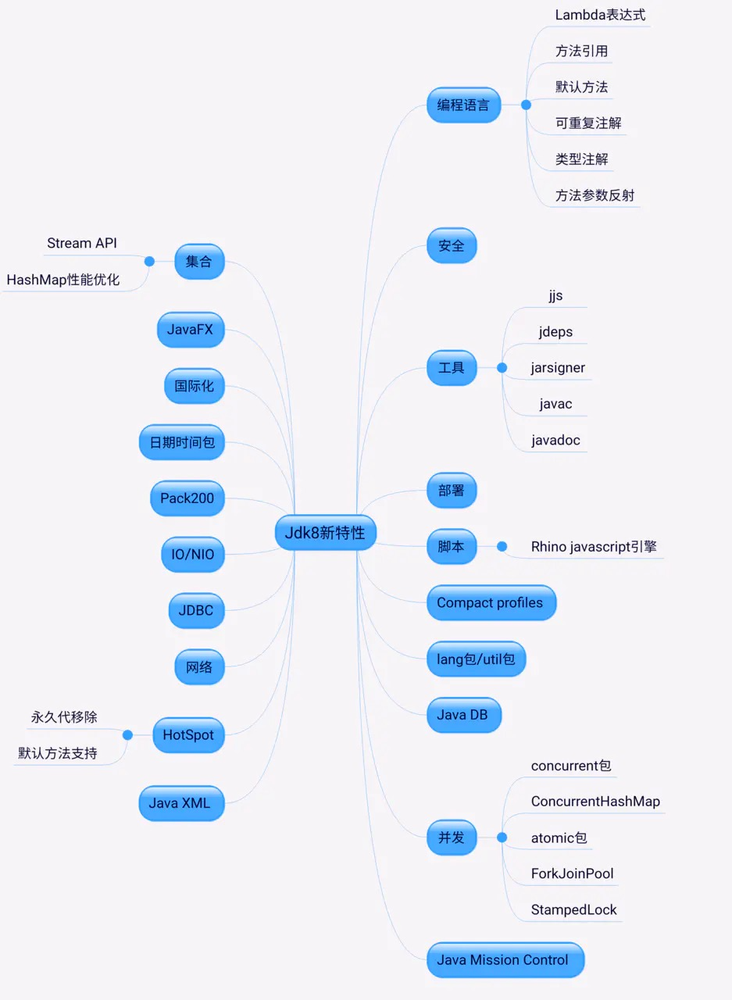
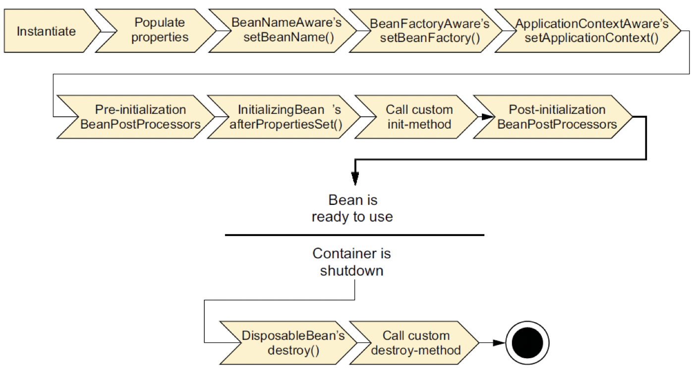

# Java重要知识点

## JVM

### JVM堆内存模型

### String s=new String("abc"); 创建了几个字符串?

将创建1或2个字符串。如果常量内存池中没有，则先在内存池中创建，再在堆中创建，否则只在堆中创建。

## 多线程

### 线程中的start和run的区别

启动一个线程，线程是就绪状态(runnable)，并没获得cpu。run时获得了cpu，线程处理运行状态(runnig)

### sleep和 wait的区别

sleep属于Thread静态方法，wait属于对象实例方法。

sleep时让出CPU给其他线程，不会释放锁，线程进入time-wating状态，时间一到自动恢复运行状态；wait时，线程会放弃锁，当前线程进入wating状态，只有等待另外线程的通知或被中断才会返回，获得对象锁进行运行状态。

### synchronized 关键字和 volatile 关键字的区别

- 两者是互补存在，不是对立关系。
- volatile关键字是线程同步的轻量级实现，所以volatile性能更好。但volatile只能修饰变量，synchronized用来修饰方法和代码块。synchronized关键字在jdk1.6之后为了减少获取和释放锁的性能消耗引入了偏向锁和轻量级锁以及各种优化之后执行效率显著提升。
- 多线程访问volatile不会发生阻塞，而synchronized可能会。
- volatile主要用于解决变量在多个线程中的可见性和有序性，而synchronized是 解决多个线程访问资源的同步性（原子性）。原子性、可见性和有序性为并发编程的三个重要特性。

### ThreadLocal理解和原理？

- ThreadLocal可以理解为线程的私有变量。如果创建了一个ThreadLocal变量，那么访问这个变量的每个线程都会有这个变量的本地副本。
- ThreadLocal为ThreadLocalMap的封装，即最终的变量是放在ThreadLocalMap中。另因为ThreadLocalMap使用的key为ThreadLocal的弱引用，而value为强引用。尽管ThreadLocalMap考虑到了这可能会存在内存泄露问题，但我们使用完之后最好手动调用一下remove方法，清理key为null的记录。

### AtomicInteger类的原理？

主要利用CAS(compare and swap), volatile和native方法保证原子操作。

### ConcurrentHasMap和HashTable的区别？

- 数据结构：JDK1.7中ConcurrentHashMap使用分段数组+链表结构，HashTable使用数组+链表结构。链表主要是为解决哈希冲突而存在。到了JDK1.8时ConcurrentHashMap采用Node数组+链表+红黑树的结构。
- 线程安全的实现方式：在JDK1.7时，ConcurrentHashMap使用分段锁对整个桶数组进行分段，多线程访问不同数组段就不存在锁竞争，提高了并发效率。到了JDK1.8时直接用Node数组+链表+红黑树实现，并发使用synchronized和CAS来操作。JDK1.8可以看到Segment结构是为了兼容旧版。HashTable是使用synchronized来保证线程安全，效率较低，高并发时可能会进入阻塞和轮询状态。

### CopyOnWriteArrayList是如何做到读取完全不用加锁，而且写入不阻塞读取操作的呢？

读取不会修改数据，因此没有进行同步控制或加锁操作，通过volatile保证可见性。写入的时候加了ReentrantLock可重入锁来保证同步，避免多线写的时候拷贝多个副本。

### Java的锁有哪些？

悲观锁，乐观锁；自旋锁，适应性自旋锁；无锁，偏向锁，轻级锁，重量级锁；公平锁，非公平锁；可重入锁，非可重入锁；共享锁，排他锁；闭锁等。图:https://www.processon.com/mindmap/5f43286a5653bb57696cba70  Ref: https://tech.meituan.com/2018/11/15/java-lock.html

### synchronized与Lock的区别?

1. 原始构成
    synchronized是关键字属于JVM层面
    monitorenter
    monitorexit
    Lock是具体类是API层的锁
2. 使用方法
    synchronized不需要用户去手动释放锁，当synchronized代码执行完后系统会自动让线程释放对锁的占用
    ReentrantLock则需要用户去手动释放锁，若没有主动释放锁，就可能导致出现死锁的现象。
    需要lock()各unlock()方法配合try/finally语句块来完成。
3. 等待是否可中断
    synchronized不可中断，除非抛出异常或者正常运行完成
    ReentrantLock可中断，
        1. 设置超时方法trylock(long timeout,TimeUnit unit)
        2. lockInterruptibly()放代码块中，调用interrput()方法中断
4. 加锁是否公平
    synchronized非公平锁
    ReentrantLock两者都可以，默认为非公平锁
5. 锁绑定多个条件Condition
    synchronized没有
    ReentrantLock用来实现分组唤醒的线程们，可以精确唤醒，而不是synchronized要么随机唤醒一个线程要么唤醒全部线程

### jdk1.7和1.8的区别

1. 增加了stream特性，主要基于fork-join框架构建，可以在并行流和顺序流之间进行切换。
1. Hashmap性能优化。
1. 永久代移除，变成元空间。
1. lamda表达式。
1. 并发：LongAdder(AtomicLong 的并发进化版)
1. CompletableFuture。
1. StampedLock。
1. ConcurreentHashmap
1. fork-join框架的优化

ref: https://juejin.im/post/6844904122169196552

### WeekHashMap与HashMap的区别？

1. WeekHashMap中默认存储的是弱引用键值条目（entry）,HashMap默认存储的是强引用entry
2. 当key丢弃时，WeekHashMap中对应的entry会被垃圾回收（GC），但HashMap不会。
3. WeekHashMap未实现Cloneable接口，仅实现了Map接口。

### ArrayList、LinkedList与Vector三者有什么区别

1. 从存储数据结构分析

    ArrayList：数组
    Vector：数组
    LinkedList：双向链表

    数组：可以根据下标快速查找，所以大部分情况下，查询快。
    但是如果要进行增删操作的时候，会需要移动修改元素后面的所有元素，所以增删的开销比较大，数组的对增删操作的执行效率低。而采用数组作为数据存储结构的ArrayList、Vector也存在这些特性，查询速度快（可以根据下标直接取，比迭代查找更快），增删慢。

    链表：增加和删除元素方便，增加或删除一个元素，仅需处理结点间的引用即可。就像人手拉手连成一排，要增加或删除某个人只要附近的两个人换一个人牵手，对已经牵好手的人没影响。无论在哪里换人耗费的资源和时间都是一样的。
    但是查询不方便，需要一个个对比，无法根据下标直接查找。而采用链表结构存储的LinkedList也有这些特性，增删方便，查询慢(指的是随机查询，不是顺序查询)。

2. 从继承上分析

    它们都实现了List接口，也就是说都实现了get(int location)、remove(int location)等“根据索引值来获取、删除节点的函数”。
    数组结构根据下标取值很容易，LinkedList双向链表的实现也比较简单，通过计数索引值实现，从链表长度的1/2开始查找，下标大了就从表头开始找，小了就从表尾开始找。

3. 从并发安全上分析

    Vector：线程安全
    ArrayList：非线程安全
    LinkedList:非线程安全

4. 数据增长分析

    Vector：缺省的情况下，增长为原数组长度的一倍。说到缺省，说明他其实是可以自主设置初始化大小的。
    ArrayList：自动增长原数组的50%。

### OOM

原因：可使用内存太少；用的太多，用完没有释放（内存泄露，内存溢出）。

最常见的情况：OutOfMemoryError: Java heap space；OutOfMemoryError：MetaSpace；StackOverflowError ------> 不会抛OOM error，但也是比较常见的Java内存溢出。

排查手段：Dump分析。如果是内存溢出，调整-Xmx和-Xms。如果是内存泄露通过Jprofiler分析修复。

## Spring

### Spring bean生命周期

bean生成---销毁

BeanDefinition
    1. scope
    2. initMethod
    3. byName byType
    4. dependsOn
    5. beanClass

实例化->填充属性->BeanNameAware绑定Name ID->BeanFactoryAware绑定Factory->ApplicationContextAware绑定上下文-> Bean后置处理器预初始化->InitializingBean的后属性设置->自定义初始化方法->Bean后置处理器的后初始化-> 放到单例池待用-> DisposableBean的销毁方法->自定义销毁方法

### Bean创建的几种方式

@Bean, 配置器创建, BeanFactory.registerSingleton

### ApplicationContext与BeanFactory的区别

ApplicationContext扩展了BeanFactory的功能，也扩展了其他的比如环境，国际化等等功能。

### 拦截器和过滤器什么区别

Spring的拦截器与Servlet的过滤器Filter有很多相似之处，比如两者都是AOP编程思想的体现，都能实现权限检查、日志记录等，不同的是：

1. 使用范围不同：Filter是Servlet规范规定的，只能用于Web程序中，而拦截器既可以用于Web程序，也可以用于Application、Swing程序中
2. 规范不同：Filter是Servlet规范中定义的，是Servlet容器支持的。而拦截器是在Spring容器内的，是Spring框架支持的
3. 使用的资源不同：拦截器是一个Spring的组件，归Spring管理，配置在Spring文件中，因此能使用Spring里的任何资源、对象，例如Service对象、数据源、事务管理等，通过IoC注入到拦截器即可，而Filter则不能
4. 深度不同：Filter只在Servlet前后起作用。而拦截器能够深入到方法前后、异常抛出前后等，因此拦截器的使用具有更大的弹性。所以在Spring架构的程序中，要优先使用拦截器。
5. 实现原理不同：拦截器是基于动态代理来实现的，而过滤器是基于函数回调来实现的。
6. 作用域不同：拦截器只对Action起作用，过滤器可以对所有请求起作用。
7. 调用次序不同：在action的生命周期中，拦截器可以多次被调用，而过滤器只能在容器初始化时被调用一次。

### Spring怎样解决bean循环依赖的问题

bean后置处理器(BeanPostProccess，这里的后置指的是Bean生命周期的每个节点都有执行)解决的。构造器循环依赖直接运行失败，属性和方法循环依赖不会。

Ref:https://www.bilibili.com/video/BV1tx411o77Z?p=10

### Spring中的AOP是怎么实现的?

使用代理的方式实现。若是接口则使用jdk动态代理，若是类使用cglib。

### 为什么java动态代理必须是接口?

因为jdk动态代理生成的类默认继承Proxy，Java是单继承方式。

### Spring和事务的关系

Spring和事务之间是管理关系。

### Spring提供三个接口供我们使用事务？

TransactionDefinition：平台事务管理器，PlatformTranscationManager：事务定义（隔离级别，传播行为，超时，只读，回滚规则）, TransactionStatus：事务运行状态。

## Mybatis

### mybatis加载mappers文件有几种方式?

有resource, url, class, package4种，package优先级最高。

### mybatis有几种执行器?

有3种，分别是simple，reuse,  batch。

### SqlSession是线程安全的吗？

本身不是线程安全的，但在Spring环境下是线程安全的。Spring通过ThreadLocal，确切的说是通过对象ThreadLocal<Map<SqlSessionFactory,SqlSessionHolder>>来实现线程安全。

## Tomcat

### Tomcat7，8区别

区别不大，Tomcat7有BIO和NIO。Tomcat8增加了AIO(或叫NIO2或者叫APR)

BIO方式适用于连接数目比较小且固定的架构，这种方式对服务器资源要求比较高，并发局限于应用中，JDK1.4以前的唯一选择，但程序直观简单易理解。
NIO方式适用于连接数目多且连接比较短(轻操作)的架构，比如聊天服务器，并发局限于应用中，编程比较复杂，JDK1.4开始支持。 
AIO方式使用于连接数目多且连接比较长(重操作)的架构，比如相册服务器，充分调用OS参与并发操作，编程比较复杂，JDK7开始支持。

这三种模式的不同之处如下：
BIO：一个线程处理一个请求。缺点：并发量高时，线程数较多，浪费资源。Tomcat7或以下，在 Linux 系统中默认使用这种方式。
NIO：利用Java的异步IO处理，可以通过少量的线程处理大量的请求。Tomcat8在Linux系统中默认使用这种方式。
AIO(APR)：即Apache Portable Runtime，从操作系统层面解决io阻塞问题。

### Tomcat部署方式有哪几种？

war包部署，文件夹部署，xml配置部署（即标识符部署）

### Tomcat四大容器？

Engine, Host, Context, Wrapper。前四大窗口为包含关系，包含多个。Wrapper包含多个Servlet。

### Tomcat通信？

操作系统实现TCP可靠传输。TCP三次握手 SYN--->SYN-ACK--->ACK
通过Socket通创建TCP连接。

### IO模型?

Tomcat7有BIO，NIO。Tomcat8增加了AIO。
Endpoint来区分
BIO中一个socket连接对应一个线程。多个http对应一个线程。

## Redis

### 缓存穿透，缓存击穿，缓存雪崩指什么，怎样防止？

缓存穿透指查询数据和缓存都没有的数据。解决方案：缓存空对象，布隆过滤器，入口业务检查过滤。
缓存击穿（热点数据）指数据库有数据，缓存没有或数据刚好失效。解决方案：分布式锁。
缓存雪崩指的缓存在同一时间过期。解决方案：redis高可用，错开数据时间，降级。
https://blog.csdn.net/zeb_perfect/article/details/54135506

### 红锁

解决问题：当master宕机，应用请求锁时会从slave上获取锁，导致同一锁获取多次。
原理：

1. 获取当前的时间（单位是毫秒）。
2. 使用相同的key和随机值在N个节点上请求锁。这里获取锁的尝试时间要远远小于锁的超时时间，防止某个masterDown了，我们还在不断的获取锁，而被阻塞过长的时间。
3. 只有在大多数节点上获取到了锁，而且总的获取时间小于锁的超时时间的情况下，认为锁获取成功了。
4. 如果锁获取成功了，锁的超时时间就是最初的锁超时时间进去获取锁的总耗时时间。
5. 如果锁获取失败了，不管是因为获取成功的节点的数目没有过半，还是因为获取锁的耗时超过了锁的释放时间，都会将已经设置了key的master上的key删除。

### 缓存数据不一致问题怎么解决的？

解决方案，1. 延时双删除，确保最后一步成功，若不成功采用重试机制和记日志的方式最终解决。2. 串行化

## 队例

### 为什么要用消息队列？

消息队列是一种“先进先出”的数据结构。常用于解耦、异步、削峰（还有经济考量）。

### 各种消息队列产品的比较？

### 消息队列的优点和缺点？

优点解耦、异步、削峰。缺点系统可用性降低、系统复杂度提高、一致性问题。

### 如何保证消息队列的高可用？

RabbitMQ镜像集群。RocketMQ双主双从。

### 如何保证消息不丢失？

消息丢失原因有以下几种情况：1，生产都没有成功发送到MQ。2，MQ宕机导致内存消息丢失。3，消费者获取到消息，但还没真正处理宕机了，但MQ中已删除，消费者重启后不能再消费之前的消息。要解决以上问题可以给出以下方案。生产者发送给MQ，须得到MQ确认；MQ收到消息后做持久化；消费者处理化消息后进行确认，MQ收到确认后删除持久化的消息。

### 如何保证消息不被重复消费？（消费的幂等性？）

重复消费的原因不可避免，网络不可达。消息携带全局唯一ID，消费方接到后先查判定是否重复操作再处理。

### 如何保证消息消费的顺序性？

消息的顺序消费是指按照消息发送的顺序进行消费，分为全局消息和局部消息，局部顺序消费更常见。对于全局顺序消息，生产者：MQ：消费都=1：1：1。对于局部顺序消息：1，生产者将同一组消息发送到单个队列；2，多个消费者并行对消息进行消费；3，队列通过分段锁保证消息消费的顺序性。

### 基于MQ的分布式事务实现？

消息发送方：1. 处理业务逻辑；2. 保存消息到本地数据库；3. 发送消息给MQ；4. 监听MQ消息方通知消息，更改消息状态为已处理；5. 定时任务将长期未处理消息得新发送到MQ。

消息消费方：1. 监听MQ中间件消息；2. 判断消息是否得复，重复就丢弃；3. 消息未重复，执行本地业务；4. 业务处理完毕，写消息记录到本地数据库；5. 发送通知消息到MQ。

Ref:https://www.bilibili.com/video/BV1tK411p71q?from=search&seid=11076650873668614869

## 微服务

### 谈谈微服务注册中心Zookeeper&Eureka

Zookeeper基于监听机制（临时节点）通知消费者服务状态。Eureka每30秒续命告知注册服务器。消费方每30秒拉取，刷本地缓存。
Zookeeper，奇数台做集群，CP(强一 致性）。Eureka，只需两台以上即可，AP（可用性）。

### 谈谈互联网常见的负载均衡

服务端负载均衡如Nginx。客户端负载均衡如Dubbo的Proxy，Spring Cloud的Ribbon。负载均衡详见方式有轮询、权重、最小活跃数、ip_hash、一致性hash。Ref:https://zhuanlan.zhihu.com/c_1050762683808403456 

### 分布式事务解决方案有哪些？

全局事务(X/Open Distributed Transaction Processing Reference Model)，基于可靠消息服务的分布式事务，最大努力通知，TCC（两阶段型，补偿型）
Ref:https://juejin.im/post/6844903573667446797

## Java核心

### HashMap的特点有哪些？与HastTable的区别？

### HashMap的扩容

1.7数组+链表。头插法，相同数组的链倒过来了。指定负载因子

1.8节点+链表。一次性移过去

### HashMap的容量为什么是2的幂次

方便转移到新的位置，即可能不变，也可能是老的长度+现在的位置。减少碰撞

### 锁分段原理

### 为什么使用红黑树，不用二叉树。  红黑树实现原理

### HashMap原理，列锁的原因

### HashMap中的put是如何实现的

### 为什么不直接将key作为哈希值而是与高16位做异或运算

### ConcurrentHasmMap扩容的过程

### 扩容列循环的问题

并发情况下，扩容时在同一节点，使用头插法，当达到3个或以上的时候，开成闭环，引起死循环

### Jdk1.7和1.8中的ConcurrentHashMap有什么差别，为什么1.8要采用这种设计

1. 整体结构
    § 1.7：Segment + HashEntry + Unsafe
    § 1.8: 移除Segment，使锁的粒度更小，Synchronized + CAS + Node + Unsafe

2. put（）
    § 1.7：先定位Segment，再定位桶，put全程加锁，没有获取锁的线程提前找桶的位置，并最多自旋64次获取锁，超过则挂起。
    § 1.8：由于移除了Segment，类似HashMap，可以直接定位到桶，拿到first节点后进行判断，1、为空则CAS插入；2、为-1则说明在扩容，则跟着一起扩容；3、else则加锁put（类似1.7）

3. get（）
    § 基本类似，由于value声明为volatile，保证了修改的可见性，因此不需要加锁。

4. resize（）
    § 1.7：跟HashMap步骤一样，只不过是搬到单线程中执行，避免了HashMap在1.7中扩容时死循环的问题，保证线程安全。
    § 1.8：支持并发扩容，HashMap扩容在1.8中由头插改为尾插（为了避免死循环问题），ConcurrentHashmap也是，迁移也是从尾部开始，扩容前在桶的头部放置一个hash值为-1的节点，这样别的线程访问时就能判断是否该桶已经被其他线程处理过了。

5. size（）
    § 1.7：很经典的思路：计算两次，如果不变则返回计算结果，若不一致，则锁住所有的Segment求和。
    § 1.8：用baseCount来存储当前的节点个数，这就设计到baseCount并发环境下修改的问题

### ConcurrentHashMap某节点数量超过8会树化，在什么情况下超过8个节点不会树化

只有节点大于8，数组大于或等于64才会树化。

### 为什么HashMap线程不安全，ConcurrentHashMap线程安全
