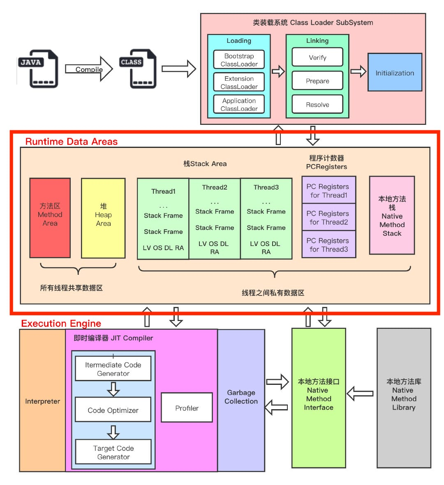
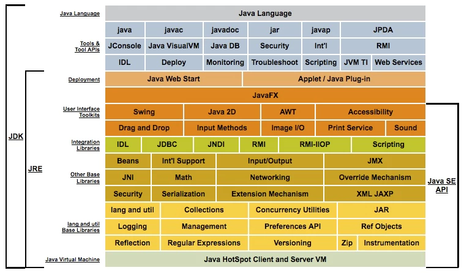

# JVM（Java虚拟机）

以下是Java虚拟机（JVM）相关的常见面试题及其答案，涵盖JVM的内存管理、垃圾回收机制、类加载机制和性能调优等方面：

## 1. JVM内存模型（运行时数据区域）有哪些部分？

**答案**：
JVM内存模型分为五个主要部分：

- **程序计数器（PC寄存器）**：记录当前线程执行的字节码行号。
- **Java虚拟机栈**：每个线程独有，存储局部变量、操作数栈、动态链接和方法返回地址等。
- **本地方法栈**：用于支持Native方法。
- **堆**：存放对象实例，是GC的主要区域。
- **方法区**：用于存储已加载的类信息、常量、静态变量等。

## 2. 什么是JVM，JRE和JDK？

JVM（Java Virtual Machine）、JRE（Java Runtime Environment）和JDK（Java Development Kit）是Java开发和运行环境中的重要组件，它们各自承担不同的功能：

| 名称 | 功能 | 包含内容 | 适用人群 |
|------|------|----------|----------|
| JVM  | 运行Java字节码的虚拟机 | 不包含类库或开发工具，仅执行字节码 | 平台相关，属于JRE和JDK的一部分 |
| JRE  | Java应用的运行环境 | 包含JVM和核心类库 | 适合只需运行Java应用的用户 |
| JDK  | Java开发工具包 | 包含JRE、编译器、调试工具等 | 适合Java开发人员 |

## 2. 什么是堆内存和栈内存？它们的区别是什么？

**答案**：
栈内存用于存储局部变量和方法调用信息，线程独有，存取速度快。堆内存是线程共享的区域，用于存放对象实例，生命周期由GC控制。栈中存储的变量数据量较小，而堆中存储的对象生命周期较长。

## 3. 在Java中，为什么说栈（Stack）通常比堆（Heap）更快？

**答案**：原因主要有以下几点：

1. **内存分配方式**
   - **栈内存**：栈的内存分配是连续的、基于指针的操作。在调用方法时，栈上会分配一个新的栈帧，当方法结束时，栈帧被直接释放。由于栈的分配和释放非常简单，通常只涉及栈指针的移动，因此非常快速。
   - **堆内存**：堆的内存分配则更为复杂，内存位置不一定是连续的。分配和释放堆内存可能涉及到内存管理算法和垃圾回收（GC），因此速度相对较慢。
2. **缓存局部性**
   - **栈内存的数据是局部的**，且访问模式连续，这种特性利用了CPU缓存的局部性原理，可以极大提高访问速度。
   - **堆中的对象分布较为分散**，访问时更容易导致缓存未命中（cache miss），从而降低了访问速度。
3. **垃圾回收的影响**
   - **栈上内存的释放由方法调用结束自动处理**，无需GC干预。
   - **堆上的对象生命周期不确定，需要通过GC进行管理，这增加了额外的开销**。GC需要扫描堆内存中无用的对象，并回收其内存空间，这对性能有一定影响。
4. **线程隔离**
   - **栈是线程私有的**，每个**线程有独立**的栈空间，**彼此不干扰**，这样在栈上的操作不会有线程安全问题。
   - **堆是线程共享的**，因此在堆上的对象可能**需要同步机制**来防止多线程竞争资源，这也会带来一定的性能损耗。

总之，栈因其内存分配方式简单、访问模式连续、无需GC管理且线程隔离等特性，使得它在大多数情况下比堆更高效。

## 4. Java中的哪些区域会发生垃圾回收？

**答案**：
垃圾回收主要发生在堆内存的年轻代（包括Eden区和Survivor区）和老年代。此外，方法区的部分实现（如永久代）在类卸载时也会被回收。

## 5. 什么是垃圾回收（GC）？GC的目的是什么？

**答案**：
垃圾回收是自动管理内存的机制，用于清除不再使用的对象，释放内存空间。GC的主要目的是防止内存泄漏和提高内存利用率，使程序在有限内存中长期稳定运行。

## 6. 垃圾回收算法有哪些？

**答案**：

- **标记-清除算法**：标记可达对象，然后清除未标记对象，缺点是容易产生内存碎片。
- **复制算法**：将活跃对象复制到新区域，效率高但浪费一半内存空间。
- **标记-整理算法**：标记后整理对象位置，避免内存碎片。
- **分代收集算法**：根据对象生命周期分代，年轻代用复制算法，老年代用标记-清除或标记-整理。

## 7. JVM中垃圾回收器有哪些？

**答案**：

- **Serial GC**：单线程收集器，适合单CPU环境。
- **Parallel GC**：多线程收集器，适合多核CPU，追求高吞吐量。
- **CMS GC**：并发标记清除，减少停顿时间，适合需要低延迟的应用。
- **G1 GC**：面向服务端应用，按区域收集，控制停顿时间。

## 8. Minor GC和Major GC的区别是什么？

**答案**：

- **Minor GC**：发生在年轻代（新生代），清除短生命周期对象，触发频率高但速度快。
- **Major GC（或Full GC）**：发生在老年代，清除生命周期较长的对象，频率低但耗时长，通常伴随`Stop The World`。

## 9. 什么是`Stop The World`（STW）？

**答案**：
`Stop The World`是指GC过程中暂停所有应用线程，使得垃圾回收能安全地执行。所有GC都会触发STW，但不同的GC类型会影响停顿的时长和频率。

## 10. 如何判断对象是否可回收？

**答案**：
JVM使用**可达性分析算法**，从GC Roots（如栈中的局部变量、常量、类静态属性等）开始，查找引用链，无法触达的对象即为不可达对象，属于可回收状态。

## 11. Java中引用的类型有哪些？

**答案**：

- **强引用**：不会被GC回收（如普通对象引用）。
- **软引用**：在内存不足时回收（`SoftReference`）。
- **弱引用**：在下一次GC时回收（`WeakReference`）。
- **虚引用**：无实际引用关系，仅在对象被GC时收到通知（`PhantomReference`）。

## 12. 类加载的过程包括哪些步骤？

**答案**：类加载分为：

- **加载**：将字节码从文件或网络加载到内存。
- **验证**：检查字节码的合法性和安全性。
- **准备**：为类的静态变量分配内存并初始化默认值。
- **解析**：将符号引用替换为直接引用。
- **初始化**：初始化静态变量和静态块。

## 13. 类加载器有哪些？

**答案**：

- **启动类加载器（Bootstrap ClassLoader）**：加载JDK核心类库（如`rt.jar`）。
- **扩展类加载器（Extension ClassLoader）**：加载扩展类库（如`jre/lib/ext`目录）。
- **应用类加载器（AppClassLoader）**：加载应用程序类路径下的类（如`classpath`）。

## 14. 什么是双亲委派模型？

**答案**：
双亲委派模型是类加载器的工作机制，类加载器先将类加载请求委托给父类加载器，父类加载失败后才由当前类加载器加载。这种机制避免了重复加载核心类的风险，确保了核心类安全。

## 15. 如何打破双亲委派模型？

**答案**：
打破双亲委派通常通过**自定义类加载器实现**，使其不再调用父类加载器的`loadClass()`，而是直接加载需要的类。某些框架（如`SPI`、`OSGi`）使用这种机制实现隔离和动态加载。

## 16. JVM参数中-Xms、-Xmx、-Xss是什么意思？

**答案**：

- **`-Xms(Minimum heap Size)`**：设置堆的初始大小。
- **`-Xmx(MaXimum heap size)`**：设置堆的最大大小。
- **`-Xss(thread Stack Size)`**：设置每个线程的栈大小。

## 17. 如何查看并分析JVM内存使用情况？

**答案**：可以使用JVM提供的工具，如：

- **`jstat`**：监控GC活动。
- **`jmap`**：生成堆转储。
- **`jstack`**：生成线程转储。
- **`jconsole`/`VisualVM`**：图形化监控工具，查看内存、线程等实时信息。

## 18. 什么是内存泄漏？如何排查内存泄漏？

**答案**：内存泄漏是指**不再使用的对象未被GC回收**，导致堆内存持续增长，最终引发`OutOfMemoryError`。排查方法：

- 使用`jmap`生成堆转储文件（heap dump），使用`MAT`( Eclipse Memory Analyzer Tool)分析堆转储。
- 使用`jconsole`或`VisualVM`观察对象增长情况。

## 19. 常见的OOM（OutOfMemoryError）有哪些？

**答案**：

- **Java heap space**：堆内存不足。
- **GC overhead limit exceeded**：GC时间过长。
- **PermGen space/Metaspace**：方法区或元空间不足。
- **Direct buffer memory**：直接内存不足。
- **Unable to create new native thread**：系统资源耗尽，无法创建新线程。

## 20. 如何进行JVM性能调优？

**答案**：
性能调优主要从**内存分配、GC策略和参数优化等**方面入手。

- 增大堆内存、调整新生代和老年代比例。
- 选择合适的垃圾回收器（如`G1`适合低延迟应用）。
- 调整GC参数（如`-XX:MaxGCPauseMillis`、`-XX:GCTimeRatio`）。
- 定位并优化内存

## 21. 什么是ClassLoader中的“上下文类加载器”？

**答案**：
上下文类加载器（Context ClassLoader）是**线程关联的类加载器**，它允许从不同类加载器中加载类。Java在某些情况下允许我们通过设置和获取上下文类加载器（`Thread.setContextClassLoader()`）来动态指定加载的类，以适应**模块化和插件化**的需求。

## 22. 什么是即时编译（JIT）？JIT编译有哪些优化？

**答案**：
JIT（Just-In-Time）编译是**将字节码转换为机器码的实时编译过程**，它可以**大幅提升**Java应用的**性能**。JIT优化主要包括：

- **内联**：将频繁调用的小方法直接嵌入调用点，减少方法调用开销。
- **逃逸分析**：将局部对象分配在栈上而非堆中。
- **锁消除和锁粗化**：减少锁的开销。
- **循环展开**：对循环进行展开优化，减少循环次数。

## 23. 什么是Java内存模型（JMM）？

**答案**：
Java内存模型（Java Memory Model，JMM）定义了多线程环境下共享变量的可见性和有序性规则。JMM规定了如何通过`volatile`、`synchronized`和`final`关键字保证线程间的**可见性、原子性和有序性**，以确保并发的正确性。

## 24. 什么是分代收集（Generational Collection），为什么JVM选择这种方式？

**答案**：
分代收集是**将对象分为不同代并采用不同GC策略的方式**。根据对象生命周期的特点，将对象分为新生代、老年代等。短生命周期的对象主要位于新生代，通过快速GC清理，减少了内存开销，而长生命周期的对象进入老年代，以较低频率进行清理。

## 25. 哪些情况会导致Full GC？如何避免频繁Full GC？

**答案**：Full GC通常在以下情况触发：

- 老年代内存不足。
- 方法区（或元空间）内存不足。
- 调用`System.gc()`。

**避免方法**：

- 增大堆和老年代内存。
- 尽量避免创建短生命周期对象。
- 优化大对象分配和对象生命周期管理。

## 26. JVM中有哪些常用的调优参数？

**答案**：一些常用的调优参数包括：

- **`-Xms`和`-Xmx`**：堆初始和最大内存。
- **`-Xmn`**：年轻代大小。
- **`-XX:+UseG1GC`**：使用G1收集器。
- **`-XX:MaxGCPauseMillis`**：设定GC最大停顿时间。
- **`-XX:NewRatio`**：设置年轻代和老年代比例。
- **`-XX:SurvivorRatio`**：Eden区和Survivor区比例。

## 27. 解释GC Root的概念及作用？

**答案**：
GC Root是垃圾回收的起始点，JVM通过GC Roots找到活动的对象，回收无法访问的对象。GC Roots包括栈中的局部变量、静态变量、方法区常量池、线程等。

## 28. 什么是Metaspace？如何与PermGen不同？

**答案**：
JDK 8之后用Metaspace替换了PermGen。Metaspace位于本地内存中，而PermGen在堆内存中。Metaspace的大小受限于物理内存，不再容易出现`OutOfMemoryError: PermGen space`错误，增强了动态加载类的支持。

## 29. 如何使用工具监控JVM的内存和线程？

**答案**：

- **VisualVM**：实时监控CPU、堆、线程。
- **jconsole**：监控内存、线程、GC等。
- **jstat**：命令行监控GC行为和内存占用。
- **jmap**和**jstack**：获取堆转储和线程转储，用于分析内存泄漏和死锁。

## 30. 如何理解Java对象的内存布局？

**答案**：Java对象在内存中的布局包括三部分：

- **对象头**：包含对象的元数据（如哈希码、锁状态等）。
- **实例数据**：对象的字段数据。
- **对齐填充**：对齐后的填充数据，以便提高访问效率。

## 31. 如何判断哪些对象是可以被GC回收的？

**答案**：
JVM通过**可达性分析**算法来判断对象是否可回收。从GC Roots出发，沿着引用链向下搜索，凡是无法通过GC Roots访问的对象即被视为不可达对象，可以被回收。GC Roots包括当前线程栈中的变量、本地方法栈中的引用、类的静态属性、常量等。

## 32. JVM如何优化锁的性能？

**答案**：JVM通过以下几种优化方式来提高锁的性能：

- **偏向锁**：优化无锁竞争的情况，将锁**偏向第一个**获得的线程，减少锁开销。
- **轻量级锁**：线程尝试**CAS操作获取锁**，避免了重锁的开销。
- **自旋锁**：在短时间等待锁的情况下，线程会**自旋等待而不是直接进入阻塞状态**，减少上下文切换的开销。
- **锁粗化**：将小范围的锁**扩展到更大**的范围，减少多次锁解锁的开销。
- **锁消除**：在JIT编译时**消除不必要**的锁，进一步提高并发性能。

## 33. 什么是对象的分配过程？JVM如何决定对象分配在栈上还是堆上？

**答案**：
通常情况下，Java对象分配在堆上。然而，通过**逃逸分析**，JVM能确定对象是否会逃逸出方法。如果**对象在方法中局部使用且不逃逸，可以直接分配在栈上**，这样在方法结束后即可直接回收，减少了堆的压力。

## 34. 类加载器有哪些典型的应用场景？

**答案**：类加载器主要应用于以下场景：

- **插件系统**：如`Tomcat`和`Spring`可以通过不同的类加载器加载独立的插件和模块，避免类冲突。
- **JDBC驱动**：通过上下文类加载器来动态加载数据库驱动。
- **OSGi**：实现模块化和隔离，保证类的版本独立性和安全性。

## 35. 如何理解HotSpot虚拟机的栈帧？

**答案**：
在HotSpot VM中，栈帧是每个方法调用对应的内存区域，包含了**局部变量表**、**操作数栈**、**动态链接**和**方法返回地址**等信息。当方法调用时，JVM为每个栈帧分配内存，并压入到线程栈中，方法执行完后对应的栈帧出栈。

## 36. 什么是“直接内存” (`Direct Memory`)，与堆内存的区别是什么？

**答案**：
直接内存是由`NIO`库使用的内存，通常直接分配在操作系统内存中，不在堆上，因而不受JVM堆大小的限制。直接内存使用`ByteBuffer`类分配和管理，访问速度快。由于不在堆中，直接内存的分配和释放依赖于操作系统。

## 37. 如何避免类加载的内存泄漏？

**答案**：
类加载器引起的内存泄漏通常发生在Web容器中，由于类的生命周期和类加载器相绑定。避免方法包括：

- **避免静态变量持有外部类引用**，尽量减少对象对类加载器的强引用。
- **及时关闭线程和资源**，如使用线程池和定时器的类，保证线程池正确终止。
- 使用**WeakReference**和**SoftReference**，减弱对类加载器的强引用。

## 38. 什么是Java的“弱引用”和“软引用”？如何使用它们？

**答案**：
Java提供了不同级别的引用类型来支持GC管理：

- **软引用**：使用`SoftReference`，对象在内存不足时才会被GC回收，适用于缓存。
- **弱引用**：使用`WeakReference`，在下次GC时会回收该对象，适合短期使用的对象。
- 使用它们可以灵活管理对象生命周期，避免内存泄漏或过度持有对象。

## 39. 什么是逃逸分析？逃逸分析的实际应用是什么？

**答案**：
逃逸分析（Escape Analysis）是JIT编译器的优化技术，用于判断对象是否会逃逸出方法。如果对象不会被其他方法引用，则可以**在栈上分配内存**，甚至进行**锁消除**，提升性能。应用场景主要包括：

- **栈上分配**：避免对象在堆中分配，减少GC压力。
- **同步消除**：若对象未逃逸，JVM可移除其上的同步操作。
- **标量替换**：将对象分解为基本数据类型，减少对象分配。

## 40. JVM如何管理线程的本地存储（Thread Local Storage, TLS）？

**答案**：
JVM通过`ThreadLocal`类提供线程本地存储，使变量仅对某一线程可见。每个线程都有一个独立的`ThreadLocal`实例，JVM通过**ThreadLocalMap**来存储变量，确保线程隔离，常用于数据库连接、会话信息等场景。要注意的是，`ThreadLocal`可能会导致内存泄漏，需要在不使用时清除。

## 41. 如何理解JVM中的“编译器优化屏障”（Compiler Optimization Barrier）？

**答案**：
编译器优化屏障（Compiler Optimization Barrier）是**一种指令，阻止编译器对特定代码块进行重排序或优化，确保代码的有序性**。Java中的`volatile`关键字就包含了屏障效果，通过内存屏障来保证变量的**可见性和有序性**，避免CPU优化导致的乱序执行。

## 42. 什么是内存屏障（Memory Barrier）？JVM如何利用内存屏障保证线程安全？

**答案**：
内存屏障是指令序列中的同步点，用于确保指令的执行顺序和内存可见性。JVM通过内存屏障实现Java内存模型（JMM）的有序性和可见性。例如，`volatile`变量的读写会插入内存屏障，防止重排序，确保各线程看到的是最新值。

## 43. 什么是内联缓存（Inline Caching），JVM如何使用它提升性能？

**答案**：
内联缓存是JVM动态方法调用的优化技术。JVM在第一次调用时记录方法调用目标，后续调用若目标不变则使用缓存，避免重复查找目标。对于多态调用，JVM也可以使用**多态内联缓存（Polymorphic Inline Cache）**，记录多个目标，显著提升方法调用性能。

## 44. JVM中的“代码去优化”（Deoptimization）是什么？为何需要去优化？

**答案**：
去优化是JVM将已优化的机器代码回退到解释执行的过程。当JIT编译的假设不再成立（如类的加载和方法的动态变化），JVM会将已编译代码还原为字节码，重新解释执行。这种机制确保代码的动态适应性和安全性。

## 45. 什么是G1垃圾收集器的“分区”概念？

**答案**：
G1垃圾收集器将内存划分为若干大小相同的分区（Region），新生代和老年代动态划分在这些分区中。G1的垃圾收集是基于分区的，优先清理垃圾最多的分区，减少了单次GC的时间，适合**低延迟**和**大内存**场景。

## 46. CMS和G1垃圾收集器的区别是什么？

**答案**：

- **CMS**：是**并发低停顿收集器**，适合老年代GC，通过标记-清除算法，可能产生内存碎片，主要用于低延迟应用。
- **G1**：是**分区化的垃圾收集器**，通过分区和优先级排序回收，减少单次GC停顿时间，适合大内存、低延迟场景。相比CMS，**G1避免了碎片化**，更适合长时间运行的应用。

## 47. 什么是Java的偏向锁（Biased Locking）？在什么场景下适合使用？

**答案**：
偏向锁是**一种优化锁操作的机制，适用于无竞争的同步场景**。当锁第一次被线程获取后，偏向锁会将锁“偏向”该线程，后续的同一线程操作无需加锁。**适合单线程访问频繁、不涉及并发竞争的场景**，减少了锁获取和释放的开销。

## 48. 解释“Metaspace OOM”及解决方法

**答案**：
Metaspace OOM（OutOfMemoryError）错误是因为类元数据占用的本地内存（Metaspace）耗尽引起的。可以通过增大`-XX:MaxMetaspaceSize`参数、减少类加载、避免动态生成类来缓解此问题。

## 49. JVM中的代码缓存（Code Cache）是什么？

**答案**：
代码缓存用于存储JIT编译生成的机器代码，减少对字节码的重复编译。若代码缓存满了，JVM无法进一步优化方法，影响性能。可以调整`-XX:ReservedCodeCacheSize`来设置缓存大小。

## 50. JVM如何处理内存对齐（Memory Alignment）？

**答案**：
内存对齐是JVM按对齐边界存储对象数据，提高访问效率。JVM会填充对象数据，**使对象大小是8字节的倍数。对齐操作避免了跨内存块访问数据的开销，有助于CPU缓存优化**。

## 51. 堆Heap和栈Stack内存有什么区别？

**答案**：
堆和栈主要的区别如下：

- 所有应用的部分都使用堆内存，然而**只有执行线程使用栈内存**。
- 每当对象被创建时，它总是存在堆空间中，栈内存包含它的引用。**栈内存仅包括本地的原始变量和在堆空间中的对象的引用变量**。
- **栈内存是通后进先出LIFO的方法管理**的，然而在堆内存中因为它是全局使用，所以它的管理方式更加复杂。
