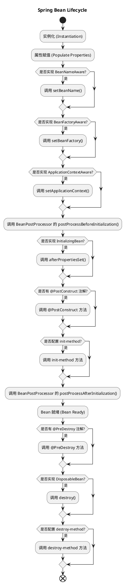

# Spring生态系统

以下是关于 Spring 生态系统的常见面试题及答案，涵盖了 Spring 核心、Spring Boot、Spring MVC、Spring Data 和 Spring Cloud 等技术：

## 1. 什么是 Spring 框架？Spring 框架的主要特性有哪些？

**答案**：

- **Spring 框架**是一个轻量级的开源框架，旨在简化 Java 开发。它提供了面向对象编程、面向方面编程和依赖注入的支持。
- 主要特性包括：
  - **依赖注入（DI）**和**控制反转（IoC）**：减少了对象间的耦合性。
  - **面向方面编程（AOP）**：允许在不改变业务代码的情况下应用横切关注点（如日志、事务管理等）。
  - **数据访问框架**：提供 JDBC 模板、事务管理，支持与 ORM 集成。
  - **MVC 框架**：用于构建基于 Web 的应用程序。
  - **集成测试**：支持单元测试和集成测试。
  - **Spring Cloud**：提供了分布式系统所需的组件（如注册中心、负载均衡等）。

## 2. 什么是依赖注入（DI）？Spring 框架如何实现 DI？

**答案**：

- **依赖注入（Dependency Injection）** 是一种设计模式，将对象的依赖交由框架负责注入，从而实现对象的解耦。
- Spring 提供两种方式实现 DI：
  - **构造函数注入**：通过构造函数传入依赖对象。
  - **Setter 注入**：通过 Setter 方法注入依赖对象。
- Spring 的 XML 配置文件、注解（如 `@Autowired`）、Java 配置类都可以实现依赖注入。

## 3. 什么是 Spring 的 IoC 容器？常见的 IoC 容器有哪些？

**答案**：

- **IoC 容器**：管理和配置应用中对象的生命周期和依赖关系的容器，利用依赖注入将依赖对象注入到目标对象中。
- **常见的 IoC 容器**：
  - **BeanFactory**：基础的 IoC 容器，延迟初始化，只在对象被调用时创建实例。
  - **ApplicationContext**：功能更丰富，支持事件监听、国际化等。常见实现包括 `ClassPathXmlApplicationContext` 和 `AnnotationConfigApplicationContext`。

## 4. Spring Bean 的作用域有哪些？

**答案**：

- **singleton**（默认）：在 IoC 容器中每个 Bean 类有且仅有一个实例。
- **prototype**：每次请求都会生成一个新的实例。
- **request**：在每个 HTTP 请求中创建一个实例（仅适用于 Web 应用）。
- **session**：在每个 HTTP 会话中创建一个实例（仅适用于 Web 应用）。
- **global-session**：跨会话使用单例实例。

## 5. Spring 中的 AOP 是什么？有何作用？

**答案**：

- **AOP（Aspect-Oriented Programming，面向方面编程）** 用于处理横切关注点（如日志、事务、安全性等）。
- AOP 的核心概念：
  - **Aspect**：切面，包含一组横切关注点。
  - **Join Point**：切点，方法或构造函数执行时的某个点。
  - **Advice**：通知，表示在 Join Point 之前或之后执行的操作。
  - **Pointcut**：定义在哪里应用 Advice。
  - **Weaving**：将 Advice 应用到 Join Point 的过程。

## 6. 什么是 Spring Boot？Spring Boot 的主要优点是什么？

**答案**：

- **Spring Boot** 是 Spring 框架的扩展，用于快速创建独立的、生产级别的应用程序。
- **主要优点**：
  - 提供开箱即用的配置，减少手动配置。
  - 嵌入式服务器（如 Tomcat、Jetty），无需外部部署。
  - 强大的生产就绪功能（如监控、健康检查、外部化配置）。
  - 丰富的 Spring Boot Starter 依赖，简化了依赖管理。
  - 支持自动配置，根据项目中的依赖自动设置配置。

## 7. Spring Boot 的自动配置原理是什么？

**答案**：

- Spring Boot 使用 `@EnableAutoConfiguration` 注解，根据类路径下的依赖自动配置 Bean。
- 通过 **`spring.factories`** 文件来加载自动配置类，每个配置类包含条件注解（如 `@ConditionalOnClass`、`@ConditionalOnMissingBean`）来判断是否应该应用某个自动配置。

## 8. Spring MVC 的常见注解有哪些？

**答案**：

- **@Controller**：声明类为控制器。
- **@RequestMapping**：定义请求 URL 和方法的映射关系。
- **@GetMapping**、**@PostMapping**：用于指定请求方法。
- **@RequestParam**：用于绑定请求参数到方法参数。
- **@PathVariable**：用于绑定 URL 路径中的变量。
- **@ResponseBody**：将方法返回的对象序列化为 JSON 或 XML 响应。
- **@ExceptionHandler**：用于处理异常并返回自定义响应。

## 9. 如何在 Spring MVC 中实现文件上传？

**答案**：

- 需要在 `application.properties` 中配置 `spring.servlet.multipart` 属性来启用文件上传。
- 在控制器方法中使用 `MultipartFile` 参数处理上传文件。
- 示例代码：

  ```java
  @PostMapping("/upload")
  public ResponseEntity<String> handleFileUpload(@RequestParam("file") MultipartFile file) {
      if (!file.isEmpty()) {
          String fileName = file.getOriginalFilename();
          // 保存文件逻辑
          return ResponseEntity.ok("File uploaded successfully: " + fileName);
      }
      return ResponseEntity.badRequest().body("File upload failed");
  }
  ```

## 10. 什么是 Spring Data？它如何简化数据访问？

**答案**：

- **Spring Data** 提供了一套通用的 API，用于与不同类型的数据存储交互（如关系数据库、NoSQL、数据流等）。
- 通过定义仓储接口（如 `JpaRepository`、`MongoRepository` 等），Spring Data 自动提供 CRUD 操作的实现，减少数据访问代码量。
- 还支持基于方法名的查询、分页和排序等功能。

## 11. 什么是 Spring Cloud？它解决了哪些问题？

**答案**：

- **Spring Cloud** 是一组工具，用于简化分布式系统和微服务的开发。
- 解决的问题包括：
  - 服务发现与注册（Eureka、Consul）。
  - 分布式配置管理（Spring Cloud Config）。
  - 负载均衡（Ribbon）。
  - 服务网关（Spring Cloud Gateway）。
  - 熔断器（Hystrix）。
  - 分布式追踪（Zipkin）。

## 12. Spring Cloud 中的服务发现和注册如何工作？

**答案**：

- **服务注册中心**（如 Eureka）用于存储服务实例的注册信息。
- **服务发现客户端**将应用实例信息注册到服务中心，并定期发送心跳保持连接。
- 客户端可以通过服务注册中心获取其他服务的实例列表，实现客户端负载均衡和服务调用。

## 13. 什么是 Spring Cloud Config？如何使用它？

**答案**：

- **Spring Cloud Config** 提供集中式配置管理，支持配置文件的版本控制（如 Git）。
- **使用步骤**：
  - 配置中心从配置存储（如 Git）拉取配置文件。
  - 客户端服务从配置中心读取配置，可以动态更新配置。
  - 可以通过 `@RefreshScope` 注解实现配置的动态刷新。

## 14. 什么是 Hystrix？它的主要功能是什么？

**答案**：

- **Hystrix** 是一个熔断器组件，用于隔离和管理分布式系统中的服务间调用。
- 主要功能：
  - **熔断**：当依赖的服务不稳定或失败时，断开调用链，避免雪崩效应。
  - **降级**：提供默认返回或处理逻辑，提高系统的稳定性。
  - **资源隔离**：使用线程池隔离服务调用，防止某个服务调用占用所有资源。

## 15. 什么是 Spring AOP 中的切面（Aspect）？如何定义一个切面？

**答案**：

- **切面**（Aspect）是 AOP 的核心概念，用于定义一组横切逻辑。
- 使用

 `@Aspect` 注解标注类，并在类中定义 `@Before`、`@After` 等注解的方法。

  ```java
  @Aspect
  @Component
  public class LoggingAspect {
      @Before("execution(* com.example.service.*.*(..))")
      public void logBeforeMethod() {
          System.out.println("Method is about to execute");
      }
  }
  ```

## 16. Spring的生命周期？



这些问题可以帮助深入理解 Spring 框架及其生态系统。掌握这些知识将有助于在面试中对 Spring 系列问题做出深度解答。
