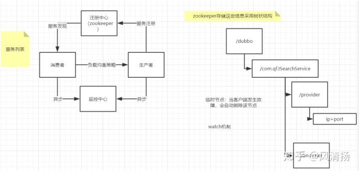
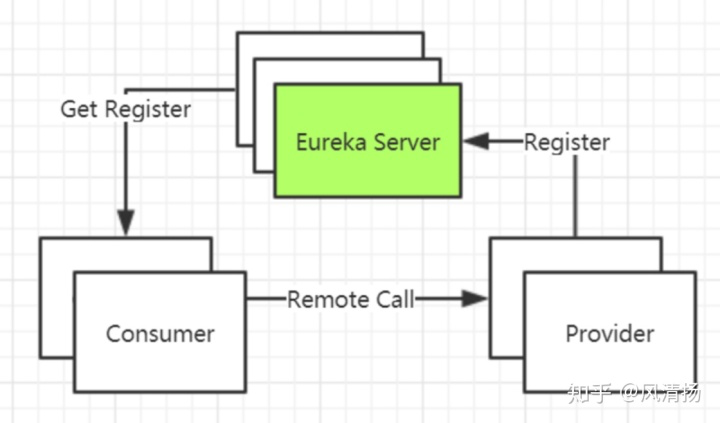
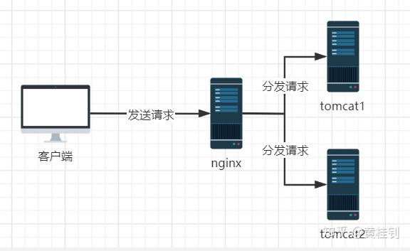
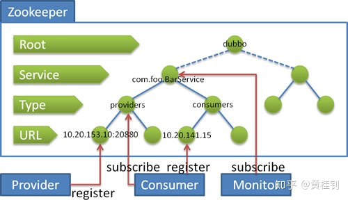

# 微服务

## 谈谈微服务注册中心zookeeper&Eureka

首先，大家要明确一点微服务注册中心是一个重要的组件，解决的是服务的注册和发现的问题，而zookeeper，Eureka都只是其中一款落地实现的产品，再比如Nacos也是如此，所以关键是掌握注册中心的工作原理，组件的使用，诸如配置，安装，这些都是常规步骤，没有什么特别的。

那下面，我们来谈谈这两个注册中心的工作原理，如果对nacos刚兴趣，可以直接查看官网即可。

1. zookeeper
   - zookeeper的核心主要是包含两个部分：服务信息的管理和变更通知机制（watch）

   - 所谓的服务注册，就是在zookeeper的服务器上创建一个节点，而且是临时节点，保存着服务的地址信息。（临时节点是因为一但服务节点宕机，则zookeeper可以自动将该节点删除）

   - 所谓的服务发现，就是去获取zookeeper上面的节点信息，获取到提供该服务的地址列表信息。 这样当消费者去调用服务提供者，就可以采用负载均衡策略，去访问其中一个提供者。

   - 所谓监听机制，当服务提供者某个节点发生故障，这个时候服务端的临时节点会被删除，上层的父节点就相当发生了变化，所以可以基于监听机制通知客户端（服务消费者）当前服务列表发生变化了，客户端再次去获取最新的服务列表信息。

   - 下面，我们以图片来说明
     

2. Eureka
   - 包含两个组件
     - Eureka Server 注册中心服务端，提供了服务的注册和发现（相当于zookeeper的作用）
     - Eureka Client 注册中心客户端（相当于之前的生产者和消费者）， 需要将本身提供的服务注册到EurekaServer
   - 两个关键的时间参数
     - 一个是每隔30s，客户端会发送心跳包给EurekaServer，告知健康状态，表示还活着
     - 一个是每隔30s，客户端会去找EurekaServer拉取最新的注册表信息，刷新本地的缓存列表。
    

3. 两者集群模型的差别
   - 注册中心作为微服务架构中非常关键的组件，所以其可用性非常重要，所以我们来简单说说其集群架构的区别
   - zookeeper，奇数台做集群，CP（强一致性）
   - eureka，只需要两台以上即可，AP（可用性）

## 谈谈互联网常见的负载均衡

负载均衡是我们对应高并发流量的一种常见处理方式

1. 负载均衡的分类
   1. 服务端负载均衡
      - 表示其负载均衡算法是在服务端实现的，比如我们常见的nginx，通过nginx我们可以来管理背后的多台tomcat服务器，从而实现多台tomcat服务共同对外提供服务的效果，如图所示：
      

   1. 客户端负载均衡
       - 就是表示其负载均衡算法是由调用者来维护，比如Dubbo的Proxy，SpringCloud的Ribbon

2. 负载均衡的常见方式
   1. 轮询
      - 即按照固定顺序，顺序循环访问后台的服务器，比如上述的tomcat1，tomcat2
   2. 权重
      - 即可以根据后台服务器的硬件差异，配置权重，让性能好的服务器多处理请求
   3. 最小活跃数
      - 根据服务器的压力，动态调整对请求的处理
   4. ip_hash
      - 根据客户端的ip地址做hash运算，找到对应的服务器进行处理
   5. 一致性hash
      - 相同参数的请求总是发到同一提供者。
      - 当某一台提供者挂时，原本发往该提供者的请求，基于虚拟节点，平摊到其它提供者，不会引起剧烈变动。
  
[算法参见wikipedia](http://en.wikipedia.org/wiki/Consistent_hashingen.wikipedia.org)

## 谈谈单体架构和微服务架构的区别？一般依据怎样的原则进行微服务的拆分？

微服务架构并非就一定比单体架构好，每种架构都有其适用场景。

第一，我们来看看单体架构适用的场景

单体架构特别适合初创公司的初创项目，可以小成本快速试错，且系统模块之间的调用，是进程内的通信，所以整体的性能表现会非常好，所以这类型的项目，我推荐采用单体架构足以，在市场还没有打开之前，采用各类看似高大上的技术，除非是为了卖弄技术，否则毫无意义。
做产品，需要考虑MVP模式，架构除了考虑技术，更应该考虑成本，成本意识是很关键的。

第二，我们来看看，微服务架构适合的场景

当系统经过一段时间的运营之后，如果运气不错，用户量有了一定的增量，业务也随着市场需求有了扩展，从而慢慢的整个系统的业务变得复杂而庞大，这个时候一个系统的启动时间，重新编译的时间，都可能会非常耗时，一个功能的修改也需要做全盘的回归测试，所谓牵一发而动全身，这个时候就适合对系统进行服务拆分，拆分成多个服务子系统，每个子系统可以更灵活做升级。注意！此时原先的模块之间的通信，***由原先的进程内通信变为进程间的通信***，所以其响应速度会有所影响。

第三，我们再来看看，微服务拆分的原则

一般我们根据***业务的边界***来拆分，比如按照商品，购物车，订单等等业务边界进行服务的拆分，另外一个，系统中存在的共性基础服务，比如像短信，邮件，日志等等，我们也可以作为单独的服务进行拆分，作为基础服务层供上层服务复用。

## Dubbo

1. 当zookeeper挂了之后，生产者和消费者之间还能通信吗？

   ***可以***。因为当启动dubbo容器时，消费者会去zookeeper拉取注册的生产者地址列表，并将其缓存在本地。每次发起调用时，都会按照本地的地址列表，以负载均衡的策略去进行调用。

   但是如果zookeeper挂掉了，则后续新的生产者无法被消费者发现。

2. 当监控中心monitor挂了之后，生产者和消费者之间还能通信吗？

   ***可以***。因为监控中心主要是起到一个收集数据的作用，监控中心宕机，只会影响采集数据，不影响生产者和消费者之间的通信。

3. zookeeper实际是如何存储生产者和消费者信息？

   zookeeper采用树状结构来存储相关的信息，会创建相关的znode节点来存储信息。如图所示：
     

   流程说明：
   - 服务提供者启动时: 向 /dubbo/com.foo.BarService/providers 目录下写入自己的 URL 地址
   - 服务消费者启动时: 订阅 /dubbo/com.foo.BarService/providers 目录下的提供者 URL 地址。并向 /dubbo/com.foo.BarService/consumers 目录下写入自己的 URL 地址
   - 监控中心启动时: 订阅 /dubbo/com.foo.BarService 目录下的所有提供者和消费者 URL 地址。

4. 谈谈Dubbo的负载均衡策略

   使用Dubbo，我们可以非常方便地做服务的水平扩展，集群部署。

   Dubbo为我们提供了4种策略，默认是随机策略。 4种策略分别如下：
   - Random LoadBalance 随机
  
      按权重设置随机概率。在一个截面上碰撞的概率高，但调用量越大分布越均匀，而且按概率使用权重后也比较均匀，有利于动态调整提供者权重。

   - RoundRobin LoadBalance 轮询

      按公约后的权重设置轮询比率。存在慢的提供者累积请求的问题，比如：第二台机器很慢，但没挂，当请求调到第二台时就卡在那，久而久之，所有请求都卡在调到第二台上。
   - LeastActive LoadBalance 最少活跃调用数

      相同活跃数的随机，活跃数指调用前后计数差。使慢的提供者收到更少请求，因为越慢的提供者的调用前后计数差会越大。

   - ConsistentHash LoadBalance 一致性Hash

      相同参数的请求总是发到同一提供者。当某一台提供者挂时，原本发往该提供者的请求，基于虚拟节点，平摊到其它提供者，不会引起剧烈变动。

      算法参见：http://en.wikipedia.org/wiki/Consistent_hashing

      缺省只对第一个参数 Hash，如果要修改，请配置 <dubbo:parameter key="hash.arguments" value="0,1" />

      缺省用 160 份虚拟节点，如果要修改，请配置 <dubbo:parameter key="hash.nodes" value="320" />

5. 谈谈采用注册中心和直连的区别？

   首先，生产者和消费者***可以采用直连的方式进行通信***，即点对点的通信方式，但是我们更***推荐采用注册中心的方式***，因为注册中心在这其中，起到了一个***解耦***的作用，而消费者只需要获取到生产者的地址列表，就可以采用***负载均衡***的方式去调用。

6. 谈谈Dubbo底层的通信原理

   Dubbo底层通信，默认采用***高性能的Netty***通信框架，实现网络通信，***Netty是一个高性能的NIO通信框架***，所以聊到底层原理，就要从NIO的特点来聊起。

   NIO是如何做到多路复用机制的，以及Netty在此基础之后，又增加了主从线程池来进行优化，结合这两方面进行讲解即可。

## 分布式事务解决方案有哪些

- 全局事务(X/Open Distributed Transaction Processing Reference Model)
- 基于可靠消息服务的分布式事务
- 最大努力通知
- TCC（两阶段型，补偿型）

[引用](https://juejin.im/post/6844903573667446797)
