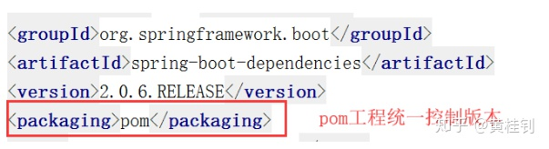
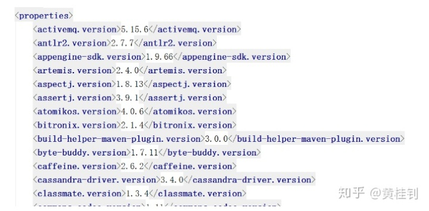

# Spring内核

## Spring bean生命周期

bean生成---销毁

bean定义（BeanDefinition）

1. scope
2. initMethod
3. byName byType
4. dependsOn
5. beanClass

实例化->填充属性->BeanNameAware绑定Name ID->BeanFactoryAware绑定Factory->ApplicationContextAware绑定上下文->
Bean后置处理器预初始化->InitializingBean的后属性设置->自定义初始化方法->Bean后置处理器的后初始化->
放到单例池待用->
DisposableBean的销毁方法->自定义销毁方法
  

## Bean创建的几种方式

1. @Bean
1. 配置器创建
1. BeanFactory.registerSingleton

## ApplicationContext与BeanFactory的区别

ApplicationContext扩展了BeanFactory的功能，也扩展了其他的比如环境，国际化等等功能。

## 拦截器和过滤器什么区别

Spring的拦截器与Servlet的过滤器Filter有很多相似之处，比如两者都是AOP编程思想的体现，都能实现权限检查、日志记录等，不同的是：

1. 使用范围不同：Filter是Servlet规范规定的，只能用于Web程序中，而拦截器既可以用于Web程序，也可以用于Application、Swing程序中
2. 规范不同：Filter是Servlet规范中定义的，是Servlet容器支持的。而拦截器是在Spring容器内的，是Spring框架支持的
3. 使用的资源不同：拦截器是一个Spring的组件，归Spring管理，配置在Spring文件中，因此能使用Spring里的任何资源、对象，例如Service对象、数据源、事务管理等，通过IoC注入到拦截器即可，而Filter则不能
4. 深度不同：Filter只在Servlet前后起作用。而拦截器能够深入到方法前后、异常抛出前后等，因此拦截器的使用具有更大的弹性。所以在Spring架构的程序中，要优先使用拦截器。
5. 实现原理不同：拦截器是基于动态代理来实现的，而过滤器是基于函数回调来实现的。
6. 作用域不同：拦截器只对Action起作用，过滤器可以对所有请求起作用。
7. 调用次序不同：在action的生命周期中，拦截器可以多次被调用，而过滤器只能在容器初始化时被调用一次。

## Spring怎样解决bean循环依赖的问题

bean后置处理器(BeanPostProccess，这里的后置指的是Bean生命周期的每个节点都有执行)解决的。构造器循环依赖直接运行失败，属性和方法循环依赖不会。

[引用](https://www.bilibili.com/video/BV1tx411o77Z?p=10)

## Spring中的AOP是怎么实现的

使用代理的方式实现。若是接口则使用jdk动态代理，若是类使用cglib。

## 为什么java动态代理必须是接口

因为jdk动态代理生成的类默认继承Proxy，Java是单继承方式。

## Spring和事务的关系

Spring和事务之间是管理关系。

## Spring提供三个接口供我们使用事务

TransactionDefinition：平台事务管理器，PlatformTranscationManager：事务定义（隔离级别，传播行为，超时，只读，回滚规则）, TransactionStatus：事务运行状态。

## 谈谈自定义注解

注解的内容很多，本次的面试题讲解主要是针对以下几个问题：

1. 注解是在编译期生效还是运行期生效？
2. 有没有在编译期生效的注解？
3. 编译期生效的注解和运行期生效的注解有什么区别？

我们的分析如下：

***首先***，第一个问题是给面试者挖坑，两者都存在，关键看注解的定义描述；

***其次***，第二个问题是有，比如我们JDK默认提供注解@Override。

我们观察其注解的定义如下

```java
@Target(ElementType.METHOD)
@Retention(RetentionPolicy.SOURCE)
public @interface Override {
}
```

上面的两个注解说明做下解释：

- @Target(ElementType.METHOD) ：表示该注解可以放到方法的定义上
- @Retention(RetentionPolicy.SOURCE) ： 表示该注解在编译期有效

那什么是编译期有效？

就好比我们说的@Override，它的作用就是在编译期间，检查我们重写的代码有没有符合语法规则，如果不符合就会通过红线报错，编译失败，而真正到运行期间就没有作用了

***最后***，说第三个问题。

就是运行期的注解有什么用，其实我们用过的很多框架，他们都会提供注解，这些都不是JDK提供的注解，我们统称为自定义注解。

比如Springweb提供的@RestController

我们观察其注解的定义说明如下：

```java
@Target(ElementType.TYPE)
@Retention(RetentionPolicy.RUNTIME)
@Documented
@Controller
@ResponseBody
public @interface RestController {
}
```

我们可以看到其关键点的描述为：

@Retention(RetentionPolicy.RUNTIME) ： 表示是运行期有效

为什么需要定义为运行期有效？

大家想想，我们创建Controller是不是在服务运行期间才正式对外提供服务的，而Spring容器需要去检查到底哪些Controller可以对外提供服务，那么以这个自定义注解为暗号，一看，咦，你小子有这个注解，行了，你就是可以对外提供服务的人，所以注解必须是在运行期间有效

## 谈谈SpringBoot的工作原理

对技术的探索，一切源于好奇心，保持好奇心，才能让人更年轻。

至今，我们已经有了很多创建SpringBoot项目的经验，比如我们要创建一个支持web开发的项目，我们只需要引入web-starter模块即可。

那么，SpringBoot为什么这么神奇？引入的依赖变少了，配置文件也不见了，但项目却可以正常运行。下面我们一起来探究这背后的逻辑：

1. 为什么依赖的依赖变少了？SpringBoot是如何管理这些依赖的？

    我们分两个点来看起

    1.1. 从pom文件出发

    首先，是有一个父工程的引用
      

    我们继续往里面跟踪，发现父工程又依赖于另一个父工程
      

    继续跟踪，发现这是一个pom工程，统一控制版本
      

    定义了一堆第三方jar包的版本
      

    ***结论***：

    所有我们使用了SpringBoot之后，由于***父工程有对版本的统一控制，所以大部分第三方包，我们无需关注版本***，个别没有纳入SpringBoot管理的，才需要设置版本号

    1.2. ***SpringBoot将所有的常见开发功能，分成了一个个场景启动器（starter）***，这样我们需要开发什么功能，就导入什么场景启动器依赖即可。

    比如，我们现在要开发web项目，所以我们导入了spring-boot-starter-web
      

    我们来跟踪看看，内部也复用一些starter
      

    还有Springweb和SpringMVC，这也就是为什么，我们就可以开发SpringWeb程序的原因
      

    ***结论***：

    大家会发现，***SpringBoot是通过定义各种各样的Starter来管理这些依赖的***。比如，我们需要开发web的功能，那么引入spring-boot-starter-web；比如，我们需要开发模板页的功能，那么引入spring-boot-starter-thymeleaf；我们需要整合redis，那么引入spring-boot-starter-data-redis；我们需要整合amqp，实现异步消息通信机制，那么引入spring-boot-starter-amqp等等。

2. 为什么我们不需要配置？

    我们来看看SpringBoot的启动类代码，除了一个关键的注解，其他都是普通的类和main方法定义
      

    那么，我们来观察下这个注解背后的东西，发现，这个注解是一个复合注解，包含了很多的信息
    

    其他注解都是一个注解的常规配置，所以关键看圈中的这两个

    我们来分析第一个关键注解：@SpringBootConfiguration

    我们可以看到，内部是包含了@Configuration，这是Spring定义配置类的注解

    而@Configuration实际上就是一个@Component，表示一个受Spring管理的组件
      

    结论：

    ***@SpringBootConfiguration这个注解只是更好区分这是SpringBoot的配置注解，本质还是用了Spring提供的@Configuration注解***

    我们再来探讨下一个注解：@EnableAutoConfiguration。
    这个注解的作用是告诉SpringBoot开启自动配置功能，这样就减少了我们的配置。那么具体是怎么实现自动配置的？我们先来观察这个注解背后的内容：
      

    所以，又到了分析其中的两个注解了。先来分析@AutoConfigurationPackage。观察其内部实现，内部是采用了@Import，来给容器导入一个Registrar组件
      

    所以，我们继续往下跟踪，来看Registrar内部是什么情况？
    

    我们可以跟踪源码看看这段是什么信息
      

    结论：

    通过源码跟踪，我们知道，程序运行到这里，会去加载启动类所在包下面的所有类。

    这就是为什么，默认情况下，我们要求定义的类，比如controller，service必须在启动类的同级目录或子级目录的原因。

    再来分析 ***@Import(AutoConfigurationImportSelector.class)***。

    这个的关键是来看AutoConfigurationImportSelector.class内部的细节。在这个类的内部，有一个关键的方法，我们可以调试来看看结果
      

    发现***默认加载了好多的自动配置类，这些自动配置类，会自动给我们加载每个场景所需的所有组件，并配置好这些组件，这样就省去了很多的配置***。
      

## 什么是事务的传播特性及Spring支持的特性有哪些

### 1 什么是事务的传播特性

我们一般都是将事务的边界设置在Service层，

那么当我们调用Service层的一个方法的时，它能够保证我们的这个方法中执行的所有的对数据库的更新操作保持在一个事务中，

在事务层里面调用的这些方法要么全部成功，要么全部失败。那么事务的传播特性也是从这里说起的。

如果你在你的Service层的这个方法中，还调用了本类的其他的Service方法，那么在调用其他的Service方法的时候，这个事务是怎么规定的呢？

必须保证在我方法里调用的这个方法与我本身的方法处在同一个事务中，否则无法保证事物的一致性。

事务的传播特性就是解决这个问题的

### 2 Spring支持的事务传播特性

在Spring中，针对传播特性的多种配置，我们大多数情况下只用其中的一种:PROPGATION_REQUIRED：

这个配置项的意思是说当我调用service层的方法的时候，开启一个事务,

那么在调用这个service层里面的其他的方法的时候,如果当前方法产生了事务就用当前方法产生的事务，否则就创建一个新的事务。

这个工作是由Spring来帮助我们完成的。

### 3 Spring支持的事务传播特性

PROPAGATION_REQUIRED：支持当前事务，如果当前没有事务，就新建一个事务。这是最常见的选择。

PROPAGATION_SUPPORTS：支持当前事务，如果当前没有事务，就以非事务方式执行。

PROPAGATION_MANDATORY：支持当前事务，如果当前没有事务，就抛出异常。

PROPAGATION_REQUIRES_NEW：新建事务，如果当前存在事务，把当前事务挂起

PROPAGATION_NOT_SUPPORTED：以非事务方式执行操作，如果当前存在事务，就把当前事务挂起。

PROPAGATION_NEVER：以非事务方式执行，如果当前存在事务，则抛出异常。

## SpringMVC有哪些常用的注解？有什么作用

@RequestMapping：做请求的URL跟我们controller或者方法的映射关系

@RequestParam：做请求参数的匹配，当请求参数名称跟我们方法的参数名不一致的时候，可以做匹配

@GetMapping: 请求方式为GET

@PostMapping:请求方式为POST

@PathVariable:获取URL中携带的参数值，处理RESTful风格的路径参数

@CookieValue：获取浏览器传递cookie值

@RequestBody：接收请求中的参数信息，一般来说，接收一个集合或数组，或者以post方式提交的数据

@ResponseBody: 改变返回逻辑视图的默认行为，返回具体的数据，比如json

@Controller：Spring定义的，作用就是标明这是一个controller类

@RestController：@Controller+@ResponseBody的组合

## Spring+SpringMVC的父子容器关系

SpringMVC+Spring这种开发模式的时候，会有两个容器

• SpringMVC容器管理，controller，Handlermapping，ViewResolver

• Spring容器管理，service，datasource，mapper，dao

  

• Spring容器是父容器，SpringMVC容器是子容器

• 子容器可以访问父容器上面的资源，所以我们会在看Controller可以注入Service

## 谈谈SpringMVC的工作流程

如图所示：

  

1. 首先，将请求分给前端控制器DispatcherServlet

2. DispatcherServlet查询HandlerMapping（映射控制器），从而找到处理请求的Controller（处理器）

3. Controller执行业务逻辑处理后，返回一个ModelAndView（模型和视图）

4. DispatcherServlet查询一个或多个ViewResolver（视图解析器），找到ModelAndView对应的视图对象，视图对象负责渲染返回给客户端

## Spring的bean是线程安全的吗

大家可以回顾下线程不安全构成的三要素：

1 多线程环境

2 访问同一个资源

3 资源具有状态性

那么Spring的bean模式是单例，而且后端的程序，天然就处于一个多线程的工作环境。

那么是安全的吗？

关键看第3点，我们的bean基本是无状态的，所以从这个点来说，是安全的。

所谓无状态就是没有存储数据，即没有通过数据的状态来作为下一步操作的判断依据

结论： ***不是线程安全的***

Spring容器中的Bean是否线程安全，容器本身并没有提供Bean的线程安全策略，因此可以说Spring容器中的Bean本身不具备线程安全的特性，但是具体还是要结合具体scope的Bean去研究。

## Spring 的 bean 作用域（scope）类型

1 singleton:单例，默认作用域。

2 prototype:原型，每次创建一个新对象。

3 request:请求，每次Http请求创建一个新对象，适用于WebApplicationContext环境下。

4 session:会话，同一个会话共享一个实例，不同会话使用不用的实例。

5 global-session:全局会话，所有会话共享一个实例。

## 谈谈你对Spring的认识

这类问题，非常宽，来吧我们说说看

1 概览图如下：

  

2 说说上面的模块

核心的IOC容器技术（控制反转），帮助我们自动管理依赖的对象，不需要我们自己创建和管理依赖对象，从而实现了层与层之间的解耦，所以重点是解耦！

核心的AOP技术（面向切面编程），方便我们将一些非核心业务逻辑抽离，从而实现核心业务和非核心业务的解耦，比如添加一个商品信息，那么核心业务就是做添加商品信息记录这个操作，非核心业务比如，事务的管理，日志，性能检测，读写分离的实现等等

spring Dao，Spring web模块，更方便集成各大主流框架，比如ORM框架，hibernate，mybatis，比如MVC框架，struts2，SpringMVC

## 如何实现动态代理

SpringAOP（面向切面编程），AOP分离核心业务逻辑和非核心业务逻辑，其背后动态代理的思想，

主要的实现手段有两种

1 JDK的动态代理，是基于接口的实现。继承自Proxy类

2 基于CGLIB的动态代理，是基于继承当前类的子类来实现的（所以，这个类不能是final）。我们项目结构是没有接口的情况下，如果实现动态代理，那么就需要使用这种方法。

所以，我们的Spring默认会在以上两者根据代码的关系自动切换，当我们采用基于接口的方式编程时，则默认采用JDK的动态代理实现。如果不是接口的方式，那么会自动采用CGLIB。

SpringAOP的背后实现原理就是动态代理机制。

如何去验证这个结论：

1. 搭建一个Spring项目

2. 创建有接口的方式

3. 创建无接口的方式

4. 打印输出动态生成的代理对象（完整类名）

```java
@Autowire

private IMiaoShaService miaoShaService;
```

比如，miaoshaService真正运行的时候就是一个代理对象

## 谈谈对MVC的理解（重要）

MVC是对Web层做了进一步的划分，更加细化

- Model（模型） - 模型代表一个存取数据的对象或JAVA POJO。
- View（视图） - 视图代表模型包含的数据的可视化，比如HTML，JSP，Thymeleaf，FreeMarker等等
- Controller（控制器） - 控制器作用于模型和视图上。它控制数据流向模型对象，并在数据变化时更新视图。它使视图与模型分离开，目前的技术代表是Servlet，Controller

常见的MVC框架有，Struts1，Struts2，SpringMVC。 比如，SpringMVC分为两个控制器

***DispatchServlet：前端控制器***，由它来接收客户端的请求，再根据客户端请求的URL的特点，分发到对应的***业务控制器***，比如UserController

## 谈谈三层架构

### 1. JavaEE将企业级软件架构分为三个层次

Web层：负责与用户交互并对外提供服务接口

业务逻辑层：实现业务逻辑模块

数据存取层：将业务逻辑层处理的结果持久化，方便后续查询

### 2. 三层架构图

  

### 3. 每个层都有各自的框架

WEB层：SpringMVC，Struts2，Struts1

业务逻辑层：Spring

数据持久层：Hibernate，MyBatis，SpringDataJPA，SpringJDBC
