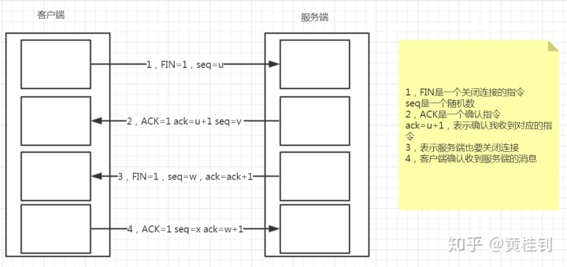
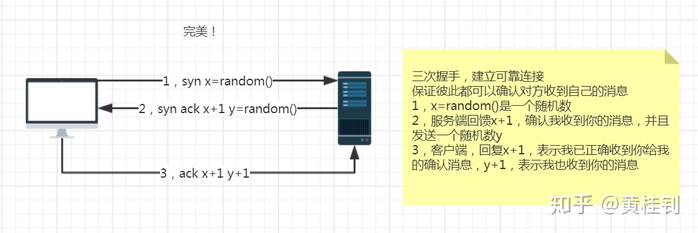
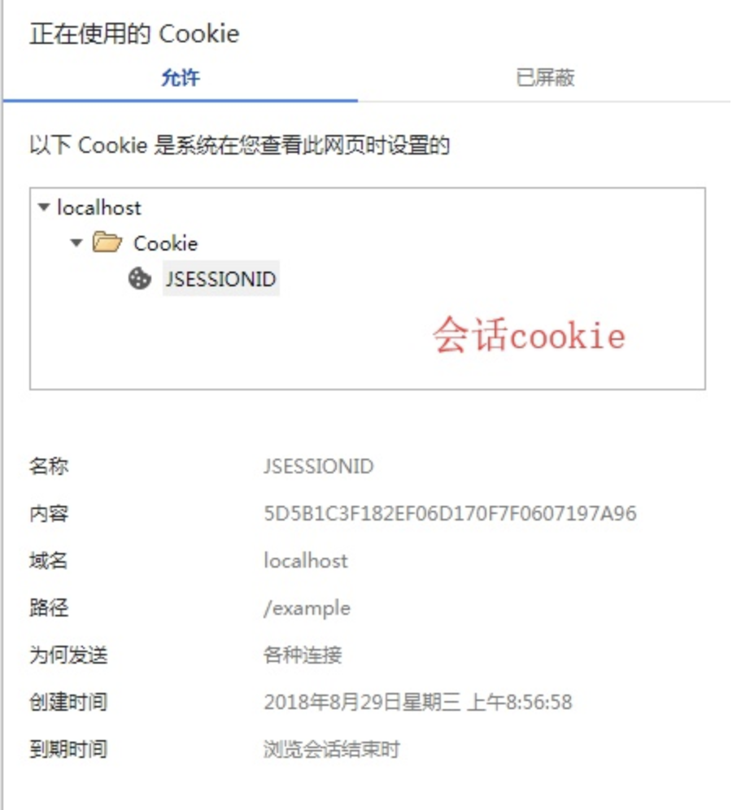
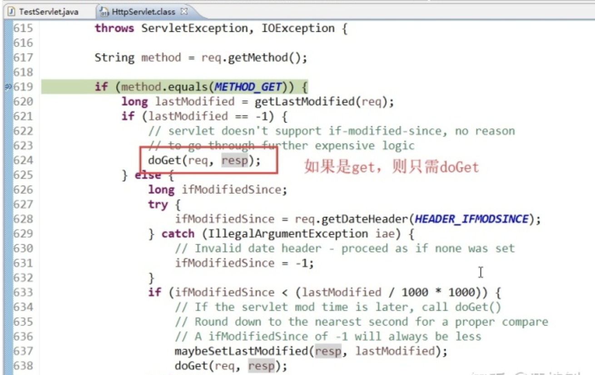
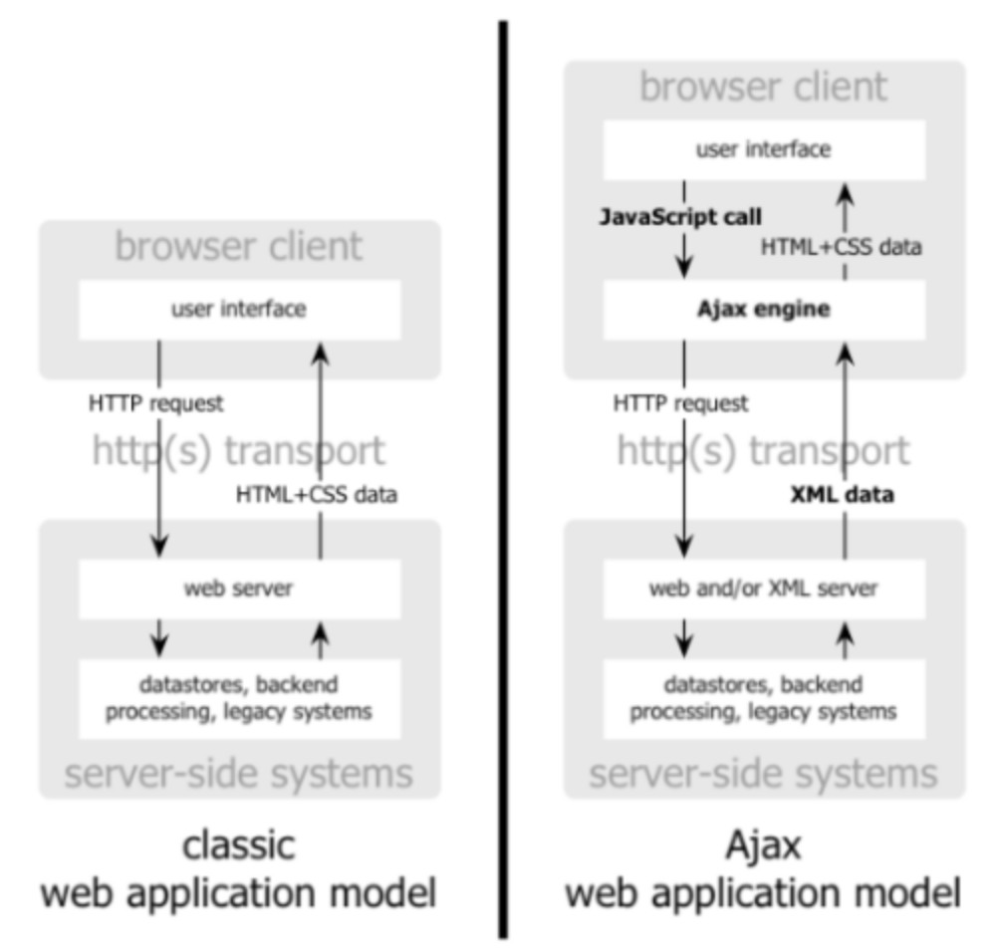
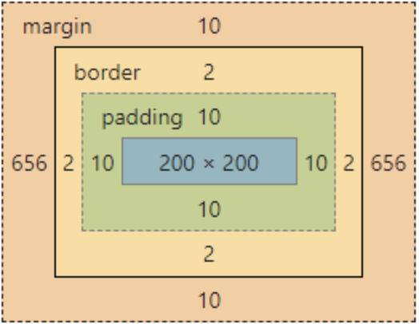

# Web

## 从浏览器输入URL到页面加载完毕，都经历了什么

首先，需要经过DNS（域名解析服务）将URL转换为对应的ip地址，实际上域名只是方便我们记忆，在网络上的每台主机交互的地址都是IP。

其次，我们需要通过这个ip地址跟服务器建立TCP网络连接，随后向我们的服务器发出http请求。注意，http协议是tcp的上层协议

最后，服务器接收到我们的请求，处理完毕之后，将响应数据放入到http的响应信息中，然后返回给客户端。

客户端浏览器完成对服务器响应信息的渲染，将信息展现在用户面前。

常见的响应状态码：

200,500,404,400,405,301这些你知道什么意思吗？

## 谈谈什么是TCP的四次挥手

大家可以思考一个问题，为什么要四次挥手，原因是TCP连接是一种双工的通信模式。
  

## 谈谈什么是TCP的三次握手

来，看图，个人觉得很完美的一张图，不接受反驳
  

## 说说TCP和UDP的区别

首先，两者都是传输层的协议。

其次，

tcp提供可靠的传输协议，传输前需要建立连接，面向字节流，传输慢

udp无法保证传输的可靠性，无需创建连接，以报文的方式传输，效率高

## 什么是XSS攻击

XSS攻击，俗称跨站点脚本攻击，

其原理是往网页添加恶意的执行脚本，比如js脚本。

当用户浏览该网页时，嵌入其中的脚本就会被执行，从而达到攻击用户的目的。

比如盗取客户的cookie，重定向到其他有毒的网站等等。

比如写一段js脚本（这还是很有善意的脚本）

```js
for(var i=1;i<100;i++){
    alert("努力不一定成功，但不努力一定很舒服！");
}
```

这个时候的解决办法，是采用拦截器或过滤器对输入的信息做过滤处理。比如将执行脚本的符号做一些替换处理。

## 转发和重定向的区别

转发： 发生在服务器内部的跳转，所以，对于客户端来说，至始至终就是一次请求，所以这期间，保存在request对象中的数据可以传递

重定向： 发生在客户端的跳转，所以，是多次请求，这个时候，如果需要在多次请求之间传递数据，就需要用session对象

## 在后台程序，想跳转到百度，应该用转发还是重定向

重定向，因为转发的范围限制在服务器内部

## 描述Session跟Cookie的区别（重要）

### 1. 存储的位置不同

Session：服务端

Cookie：客户端

### 2.存储的数据格式不同

Session：value为对象，Object类型

Cookie：value为字符串，如果我们存储一个对象，这个时候，就需要将对象转换为JSON

### 3. 存储的数据大小

Session：受服务器内存控制

Cookie：一般来说，最大为4k

### 4. 生命周期不同

Session：服务器端控制，默认是30分钟，注意，当用户关闭了浏览器，session并不会消失

Cookie：客户端控制，其实是客户端的一个文件，分两种情况

1. 默认的是会话级的cookie，这种随着浏览器的关闭而消失，比如保存sessionId的cookie

2. 非会话级cookie，通过设置有效期来控制，比如这种“7天免登录”这种功能，
就需要设置有效期，setMaxAge

cookie的其他配置

> httpOnly=true：防止客户端的XSS攻击
> path="/" ：访问路径
> domain=""：设置cookie的域名

### 5. cookie跟session之间的联系

http协议是一种无状态协议，服务器为了记住用户的状态，我们采用的是Session的机制

而Session机制背后的原理是，服务器会自动生成会话级的cookie来保存session的标识，如下图所示：
  

## JSP的4大域对象

### 4大域对象

ServletContext context域

HttpSession session域

HttpServletRequet request域

PageContext page

### 4大域对象的作用范围

page域: 只能在当前jsp页面使用 (当前页面)

request域: 只能在同一个请求中使用 (转发才有效，重定向无效)

session域: 只能在同一个会话(session对象)中使用 (私有的，多个请求和响应之间)

context域: 只能在同一个web应用中使用 (全局的)

## 描述JSP的9大内置对象（不重要）

首先，对于我们现在来说，用JSP的内置对象来直接开发的基本没有了，除非是比较老旧的项目，jsp的内置对象，则是不需要在jsp页面中创建，直接可以使用。

其实，我们通过观察jsp生成的java文件可以发现，其背后是帮我们创建了这些对象，所以对象的创建方式还是没有改变的。

我们去观察背后生成java类，那么里面是有给各个对象创建及初始化的代码(截取部分代码片段)

```java
public void _jspService(final javax.servlet.http.HttpServletRequest request, final javax.servlet.http.HttpServletResponse response)

pageContext = _jspxFactory.getPageContext(this, request, response, null, true, 8192, true);
      _jspx_page_context = pageContext;
      application = pageContext.getServletContext();
      config = pageContext.getServletConfig();
      session = pageContext.getSession();
      out = pageContext.getOut();
      _jspx_out = out;
....

```

记得多少回答多少即可。

|内置对象名 |类型  |
|---------|---------|
|request |HttpServletRequest |
|response |HttpServletResponse |
|config |ServletConfig |
|application |ServletContext |
|session |HttpSession |
|exception |Throwable |
|page |Object(this) |
|out |JspWriter |
|pageContext |PageContext |

## 描述JSP和Servlet的区别

### 技术的角度

JSP本质就是一个Servlet

JSP的工作原理：JSP->翻译->Servlet(java)->编译->Class（最终跑的文件）

### 应用的角度

JSP=HTML+Java

Servlet=Java+HTML

各取所长，***JSP的特点在于实现视图，Servlet的特点在于实现控制逻辑***

## 谈谈Servlet的生命周期

先要明确一点，***Servlet是单实例***的，这个很重要！

### 生命周期的流程

创建对象-->初始化-->service()-->doXXX()-->销毁

### 创建对象的时机

1 默认是第一次访问该Servlet的时候创建

2 也可以通过配置web.xml，来改变创建时机，比如在容器启动的时候去创建，DispatcherServlet(SpringMVC前端控制器)就是一个例子

```<load-on-startup>1</load-on-startup>```

### 执行的次数

对象的创建只有一次，单例

初始化一次

销毁一次

### 关于线程安全

构成线程不安全三个因素：

1 多线程的环境（有多个客户端，同时访问Servlet）

2 多个线程共享资源，比如一个单例对象（Servlet是单例的）

3 这个单例对象是有状态的（比如在Servlet方法中采用全局变量，并且以该变量的运算结果作为下一步操作的判断依据）

### 伪代码,演示线程不安全的操作方式

```java
public class MyServlet extends HttpServlet{
     private int ticket = 100;
     public void doXXX(){
        if(ticket > 0){
          //......
          ticket--;
         }
       }
}
```

所以，我们要***避免在Servlet中做上述类似的操作***！

分析Servlet内部源码，关于Service对请求的分发处理逻辑，会调用相应的doXXX方法
  

## 浅谈JavaScript的原型机制

JavaScript的原型有一个关键的作用就是来扩展其原有类的特性，比如下面这段代码，给String扩展了hello方法。很多的框架就是采用这种方式来进行扩展，从而让框架更易用。

```javascript
var str="a";
String.prototype.hello = function(){
    alert("通过原型机制来扩展其原有类的特性");
}
str.hello();
```

## 谈谈Ajax的工作原理

谈这个问题的关键三要素，***异步交互，XMLHttpRequest对象，回调函数***。

下面，看图，传统模式跟Ajax工作模式的对比：
  

早期，预计是以XML为主要的传输数据格式，所以Ajax的最后一个字母就是代表XML的意思，不过现在基本是json为主。

## JavaScript如何处理兼容性问题

### 什么是兼容性问题

因为历史原因，不同浏览器支持的方法或属性有差异

### 解决办法

1. 判断当前是哪款浏览器内核，然后调用这个内核支持的方法，但获取内核的方式，通常会有误差

2. 存在性检查的方式(推荐)
    > 如果当前的对象或方法存在，则会是true，进入if，否则进入false

### 案例：比如判断当前浏览器是否支持trim()方法

```javascript
if(email.value.trim){
    if(email.value.trim() == ""){
       email.value = "请输入邮箱地址";
     }
}else{
    //正则表达式-去除前后空格
   if(email.value.replace(/(^\s+)|(\s+$)/g,"") == ""){
       email.value = "请输入邮箱地址";
   }
}
```

## JavaScript提供了哪些定时器

定时器在js中的应用非常广泛，比如首页的轮播图效果，网页的时钟，秒杀倒计时等等

就是采用定时器来实现的。

那么主要提供了两种定时器：一次性的和周期性的定时器

```javascript
<script type="text/javascript">
    //一次性的
    window.setTimeout(function () {
        alert(1);
    },1000)

    //周期性的
    window.setInterval(function () {
        alert(2);
    },1000)
</script>
```

## 谈谈对CSS盒子模型的理解

一图胜千言
  

padding:内边距

border：边框

margin：外边距

div+css，通常就用于布局。
