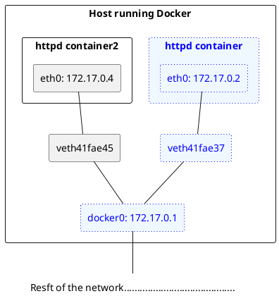
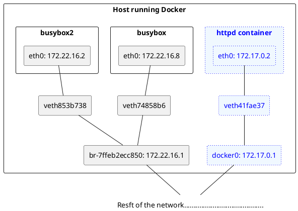
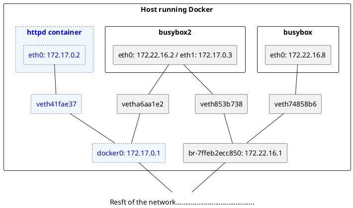

# Docker网络详解

## Docker网络（host、bridge、none）

**我们会首先学习Docker提供的几种原生网络，以及如何创建自定义网络；然后探讨容器之间如何通信，以及容器与外界如何交互。**

 Docker网络从覆盖范围可分为单个host上的容器网络和跨多个host的网络，本章重点讨论前一种。对于更为复杂的多host容器网络，我们会在后面进阶技术章节单独讨论。

Docker 安装时会自动在host 上创建三个网络，我们可用**docker network ls**命令查看

```bash
$ docker network ls
NETWORK ID     NAME      DRIVER    SCOPE
75ccd80aeeb3   bridge    bridge    local
11efd5f1b964   host      host      local
191f8d69954a   none      null      local
```

### none网络

**顾名思义，none网络就是什么都没有的网络。挂在这个网络下的容器除了lo，没有其他任何网卡。容器创建时，可以通过-network=none指定使用none网络，** 如下：

```bash
$ docker run -it --network=none busybox
/ # ifconfig
lo        Link encap:Local Loopback
          inet addr:127.0.0.1  Mask:255.0.0.0
          UP LOOPBACK RUNNING  MTU:65536  Metric:1
          RX packets:0 errors:0 dropped:0 overruns:0 frame:0
          TX packets:0 errors:0 dropped:0 overruns:0 carrier:0
          collisions:0 txqueuelen:1000
          RX bytes:0 (0.0 B)  TX bytes:0 (0.0 B)

/ #
```

**我们不禁会问，这样一个封闭的网络有什么用呢？**

> 其实还真有应用场景。封闭意味着隔离，一些对安全性要求高并且不需要联网的应用可以使用none网络。
> 比如某个容器的唯一用途是生成随机密码，就可以放到none网络中避免密码被窃取。
>
> **当然大部分容器是需要网络的，我们接着看host网络。**

### host网络

**连接到host网络的容器共享Docker host的网络栈，容器的网络配置与host完全一样。**
**可以通过-network-host 指定使用host网络**

```bash
$ docker run -it --network=host busybox
/ # ip l
1: lo: <LOOPBACK,UP,LOWER_UP> mtu 65536 qdisc noqueue qlen 1000
    link/loopback 00:00:00:00:00:00 brd 00:00:00:00:00:00
2: eth0: <BROADCAST,MULTICAST,UP,LOWER_UP> mtu 1500 qdisc mq qlen 1000
    link/ether 00:17:fa:02:d9:7f brd ff:ff:ff:ff:ff:ff
3: docker0: <NO-CARRIER,BROADCAST,MULTICAST,UP> mtu 1500 qdisc noqueue
    link/ether 02:42:59:65:5f:40 brd ff:ff:ff:ff:ff:ff
/ # ifconfig
docker0   Link encap:Ethernet  HWaddr 02:42:59:65:5F:40
          inet addr:172.17.0.1  Bcast:172.17.255.255  Mask:255.255.0.0
          UP BROADCAST MULTICAST  MTU:1500  Metric:1
          RX packets:0 errors:0 dropped:0 overruns:0 frame:0
          TX packets:0 errors:0 dropped:0 overruns:0 carrier:0
          collisions:0 txqueuelen:0
          RX bytes:0 (0.0 B)  TX bytes:0 (0.0 B)

eth0      Link encap:Ethernet  HWaddr 00:17:FA:02:D9:7F
          inet addr:10.0.2.6  Bcast:10.0.2.255  Mask:255.255.255.0
          UP BROADCAST RUNNING MULTICAST  MTU:1500  Metric:1
          RX packets:14498946 errors:0 dropped:0 overruns:0 frame:0
          TX packets:16768450 errors:0 dropped:0 overruns:0 carrier:0
          collisions:0 txqueuelen:1000
          RX bytes:6748863653 (6.2 GiB)  TX bytes:5284543299 (4.9 GiB)

lo        Link encap:Local Loopback
          inet addr:127.0.0.1  Mask:255.0.0.0
          UP LOOPBACK RUNNING  MTU:65536  Metric:1
          RX packets:1615189 errors:0 dropped:0 overruns:0 frame:0
          TX packets:1615189 errors:0 dropped:0 overruns:0 carrier:0
          collisions:0 txqueuelen:1000
          RX bytes:439375970 (419.0 MiB)  TX bytes:439375970 (419.0 MiB)

/ #
```

**在容器中可以看到host的所有网卡，并且连hostmame 也是host的。host网络的使用场景又是什么呢？**

直接使用Docker host的网络最大的好处就是性能，如果容器对网络传输效率有较高要求，则可以选择host网络。当然不便之处就是牺牲一些灵活性，比如要**考虑端口冲突问题**，Docker host 上**已经使用的端口就不能再用**了。
**Docker host的另一个用途是让容器可以直接配置host网路，比如某些跨host的网络解决方案，其本身也是以容器方式运行的，这些方案需要对网络进行配置，比如管理iptables**

### bridge网络

Docker安装时会创建一个命名为docker0的Linux bridge。**如果不指定-network，创建的容器默认都会挂到docker0上**。

```bash
# brctl  bridge control 
$ brctl show
bridge name     bridge id               STP enabled     interfaces
docker0         8000.024259655f40       no
```

当前docker0上没有任何其他网络设备，我们创建一个容器看看有什么变化

```bash
$ docker run -d httpd
$ brctl show
bridge name     bridge id               STP enabled     interfaces
docker0         8000.024259655f40       no              veth41fae37
```

**一个新的网络接口veth41fae37被挂到了docker0上，veth41fae37就是新创建容器的虚拟网卡。**
下面看一下容器的网络配置

```bash
$ docker ps
CONTAINER ID   IMAGE    COMMAND             CREATED         STATUS         PORTS     NAMES
0784119d38f1   httpd    "httpd-foreground"  6 minutes ago   Up 6 minutes   80/tcp    upbeat_engelbart
$ docker inspect 0784119d38f1
[
    {
        {
            {
            "Networks": {
                "bridge": {
                    "IPAMConfig": null,
                    "Links": null,
                    "Aliases": null,
                    "NetworkID": "75ccd80aeeb39705fc200e9ee47cc136871f652b4aa2bfb793f6aad0ab0c4f06",
                    "EndpointID": "8fcfdee4073eb95c33988e20d8f5598c690a45440e3b66b4ab94bbb0056a0a87",
                    "Gateway": "172.17.0.1",
                    "IPAddress": "172.17.0.2",
                    "IPPrefixLen": 16,
                    "IPv6Gateway": "",
                    "GlobalIPv6Address": "",
                    "GlobalIPv6PrefixLen": 0,
                    "MacAddress": "02:42:ac:11:00:02",
                    "DriverOpts": null
                }
            }
        }
    }
]
```

**容器有一个网卡eth0@if34，为什么不是vethb56e98c呢？**

实际上eth0@if34 和veth28c57df 是一对veth pair。 veth pair 是一种成对出现的特殊网络设备，可以把它们想象成由一根虚拟网线连接起来的一对网卡， 网卡的一头(eth0@if34) 在容器中，另一头(veth28c57df) 挂在网桥docker0 上，其效果就是将eth0@if34 也挂在了docker0上。
我们还看到eth0@if34 已经配置了IP 172.17.0.2， 为什么是这个网段呢?让我们通过**docker network inspect bridge**看- -下bridge 网络的配置信息

```bash
$ docker network inspect bridge
[
    {
        "Name": "bridge",
        "Id": "75ccd80aeeb39705fc200e9ee47cc136871f652b4aa2bfb793f6aad0ab0c4f06",
        "Created": "2021-07-20T14:01:16.586541053Z",
        "Scope": "local",
        "Driver": "bridge",
        "EnableIPv6": false,
        "IPAM": {
            "Driver": "default",
            "Options": null,
            "Config": [
                {
                    "Subnet": "172.17.0.0/16",
                    "Gateway": "172.17.0.1"
                }
            ]
        }
    }
]
```

原来bridge 网络配置的subnet 就是172.17.0.0/16, 并且网关是172.17.0.1\. 这个网关在哪儿呢?大概你已经猜出来了，就是docker0

```bash
$ ifconfig docker0
docker0: flags=4163<UP,BROADCAST,RUNNING,MULTICAST>  mtu 1500
        inet 172.17.0.1  netmask 255.255.0.0  broadcast 172.17.255.255
        ether 02:42:59:65:5f:40  txqueuelen 0  (Ethernet)
        RX packets 0  bytes 0 (0.0 B)
        RX errors 0  dropped 0  overruns 0  frame 0
        TX packets 0  bytes 0 (0.0 B)
        TX errors 0  dropped 0 overruns 0  carrier 0  collisions 0

$ ifconfig veth41fae37
veth41fae37: flags=4163<UP,BROADCAST,RUNNING,MULTICAST>  mtu 1500
        ether 9e:94:4f:95:2f:00  txqueuelen 0  (Ethernet)
        RX packets 0  bytes 0 (0.0 B)
        RX errors 0  dropped 0  overruns 0  frame 0
        TX packets 0  bytes 0 (0.0 B)
        TX errors 0  dropped 0 overruns 0  carrier 0  collisions 0
```

**容器网络拓扑图**如下



**容器创建时，docker 会自动从172.17.0.0/16 中分配-个IP,这里16 位的掩码保证有足够多的IP可以供容器使用。**

### user-defined网络

除了none、host、bridge这三个自动创建的网络，用户也可以根据业务需要创建user-defined网络。
Docker提供三种user-defined 网络驱动：bridge、overlay 和macvlan。overlay 和macvlan用于创建跨主机的网络

我们可通过bridge 驱动创建类似前面默认的bridge 网络

```bash
$ docker network create --driver bridge my_net
ecccf1106017cbf5f6180cba82c32125f45d0585afaa8dac8eb10ab085474a0f
$ brctl show
bridge name     bridge id               STP enabled     interfaces
br-ecccf1106017         8000.0242853e8e6e       no
docker0         8000.024259655f40       no              veth41fae37
$ docker network ls
NETWORK ID     NAME      DRIVER    SCOPE
75ccd80aeeb3   bridge    bridge    local
11efd5f1b964   host      host      local
ecccf1106017   my_net    bridge    local
191f8d69954a   none      null      local
```

新增了一个网桥br-ecccf1106017，这里ecccf1106017正好是新建bridge网络my_net的短id。执行**docker network inspect**查看一下my_net的配置信息，

```bash
$ docker network inspect ecccf1106017
[
    {
        "Name": "my_net",
        "Id": "ecccf1106017cbf5f6180cba82c32125f45d0585afaa8dac8eb10ab085474a0f",
        "Created": "2021-07-22T06:58:40.056101849Z",
        "Scope": "local",
        "Driver": "bridge",
        "EnableIPv6": false,
        "IPAM": {
            "Driver": "default",
            "Options": {},
            "Config": [
                {
                    "Subnet": "172.18.0.0/16",
                    "Gateway": "172.18.0.1"
                }
            ]
        },
        "Internal": false,
        "Attachable": false,
        "Ingress": false,
        "ConfigFrom": {
            "Network": ""
        },
        "ConfigOnly": false,
        "Containers": {},
        "Options": {},
        "Labels": {}
    }
]
```

**这里172.18.0.0/16是Docker自动分配的IP网段。

我们可以自己指定IP网段吗？
答案是：可以。**

只需在创建网段时**指定--subnet和-gateway参数**


```bash
$ docker network create --driver bridge --subnet 172.22.16.0/24 --gateway 172.22.16.1 my_net2
7ffeb2ecc8503a43265b7276829b61053e750fbf88e2c63dbc78befee3a8fd67
$ docker network inspect 7ffeb2ecc85
[
    {
        "Name": "my_net2",
        "Id": "7ffeb2ecc8503a43265b7276829b61053e750fbf88e2c63dbc78befee3a8fd67",
        "Created": "2021-07-22T07:05:23.416660498Z",
        "Scope": "local",
        "Driver": "bridge",
        "EnableIPv6": false,
        "IPAM": {
            "Driver": "default",
            "Options": {},
            "Config": [
                {
                    "Subnet": "172.22.16.0/24",
                    "Gateway": "172.22.16.1"
                }
            ]
        },
        "Internal": false,
        "Attachable": false,
        "Ingress": false,
        "ConfigFrom": {
            "Network": ""
        },
        "ConfigOnly": false,
        "Containers": {},
        "Options": {},
        "Labels": {}
    }
]
```

这里我们创建了新的bridge网络my_net2，网段为172.22.16.0/24，网关为172.22.16.1与前面一样，网关在my net2对应的网桥br-7ffeb2ecc850上

```bash
$ ifconfig br-7ffeb2ecc850
br-7ffeb2ecc850: flags=4099<UP,BROADCAST,MULTICAST>  mtu 1500
        inet 172.22.16.1  netmask 255.255.255.0  broadcast 172.22.16.255
        ether 02:42:37:a2:9f:8c  txqueuelen 0  (Ethernet)
        RX packets 0  bytes 0 (0.0 B)
        RX errors 0  dropped 0  overruns 0  frame 0
        TX packets 0  bytes 0 (0.0 B)
        TX errors 0  dropped 0 overruns 0  carrier 0  collisions 0
```

容器要**使用新的网络，需要在启动时通过--network指定**

```bash
$ docker run -it --network=my_net2 busybox
/ # ip a
1: lo: <LOOPBACK,UP,LOWER_UP> mtu 65536 qdisc noqueue qlen 1000
    link/loopback 00:00:00:00:00:00 brd 00:00:00:00:00:00
    inet 127.0.0.1/8 scope host lo
       valid_lft forever preferred_lft forever
14: eth0@if15: <BROADCAST,MULTICAST,UP,LOWER_UP,M-DOWN> mtu 1500 qdisc noqueue
    link/ether 02:42:ac:16:10:02 brd ff:ff:ff:ff:ff:ff
    inet 172.22.16.2/24 brd 172.22.16.255 scope global eth0
       valid_lft forever preferred_lft forever
/ #
```

容器分配到的IP为172.22.16.2到目前为止，容器的IP都是docker自动从subnet中分配，我们能否指定一个静态IP呢？
**答案是：可以，通过-p指定**

```bash
$ docker run -it --network=my_net2 --ip 172.22.16.8 busybox
/ # ip a
1: lo: <LOOPBACK,UP,LOWER_UP> mtu 65536 qdisc noqueue qlen 1000
    link/loopback 00:00:00:00:00:00 brd 00:00:00:00:00:00
    inet 127.0.0.1/8 scope host lo
       valid_lft forever preferred_lft forever
16: eth0@if17: <BROADCAST,MULTICAST,UP,LOWER_UP,M-DOWN> mtu 1500 qdisc noqueue
    link/ether 02:42:ac:16:10:08 brd ff:ff:ff:ff:ff:ff
    inet 172.22.16.8/24 brd 172.22.16.255 scope global eth0
       valid_lft forever preferred_lft forever
/ #
```

好了，我们来看看当前**docker host的网络拓扑结构**



两个busybox容器都挂在mynet2上，应该能够互通。 开3个窗口

```bash
$ docker run -it --network=my_net2 --ip=172.22.16.8 busybox
/ # ip a
1: lo: <LOOPBACK,UP,LOWER_UP> mtu 65536 qdisc noqueue qlen 1000
    link/loopback 00:00:00:00:00:00 brd 00:00:00:00:00:00
    inet 127.0.0.1/8 scope host lo
       valid_lft forever preferred_lft forever
18: eth0@if19: <BROADCAST,MULTICAST,UP,LOWER_UP,M-DOWN> mtu 1500 qdisc noqueue
    link/ether 02:42:ac:16:10:08 brd ff:ff:ff:ff:ff:ff
    inet 172.22.16.8/24 brd 172.22.16.255 scope global eth0
       valid_lft forever preferred_lft forever
/ # ping 172.22.16.2
PING 172.22.16.2 (172.22.16.2): 56 data bytes
64 bytes from 172.22.16.2: seq=0 ttl=64 time=0.125 ms
64 bytes from 172.22.16.2: seq=1 ttl=64 time=0.080 ms
64 bytes from 172.22.16.2: seq=2 ttl=64 time=0.089 ms
^C
--- 172.22.16.2 ping statistics ---
3 packets transmitted, 3 packets received, 0% packet loss
round-trip min/avg/max = 0.080/0.098/0.125 ms
/ #
```

```bash
$ docker run -it --network=my_net2 busybox
/ # ip a
1: lo: <LOOPBACK,UP,LOWER_UP> mtu 65536 qdisc noqueue qlen 1000
    link/loopback 00:00:00:00:00:00 brd 00:00:00:00:00:00
    inet 127.0.0.1/8 scope host lo
       valid_lft forever preferred_lft forever
20: eth0@if21: <BROADCAST,MULTICAST,UP,LOWER_UP,M-DOWN> mtu 1500 qdisc noqueue
    link/ether 02:42:ac:16:10:02 brd ff:ff:ff:ff:ff:ff
    inet 172.22.16.2/24 brd 172.22.16.255 scope global eth0
       valid_lft forever preferred_lft forever
/ # ping 172.22.16.8
PING 172.22.16.8 (172.22.16.8): 56 data bytes
64 bytes from 172.22.16.8: seq=0 ttl=64 time=0.088 ms
64 bytes from 172.22.16.8: seq=1 ttl=64 time=0.076 ms
64 bytes from 172.22.16.8: seq=2 ttl=64 time=0.105 ms
^C
--- 172.22.16.8 ping statistics ---
3 packets transmitted, 3 packets received, 0% packet loss
round-trip min/avg/max = 0.076/0.089/0.105 ms
/ #
```

**可见同一网络中的容器、网关之间都是可以通信的。**
my_net2与默认bridge网络能通信吗？
从拓扑图可知，两个网络属于不同的网桥，应该不能通信，我们通过实验验证一下，让busybox容器ping 不同网段容器

```bash
$ docker run -it busybox
/ # ip a
1: lo: <LOOPBACK,UP,LOWER_UP> mtu 65536 qdisc noqueue qlen 1000
    link/loopback 00:00:00:00:00:00 brd 00:00:00:00:00:00
    inet 127.0.0.1/8 scope host lo
       valid_lft forever preferred_lft forever
22: eth0@if23: <BROADCAST,MULTICAST,UP,LOWER_UP,M-DOWN> mtu 1500 qdisc noqueue
    link/ether 02:42:ac:11:00:03 brd ff:ff:ff:ff:ff:ff
    inet 172.17.0.3/16 brd 172.17.255.255 scope global eth0
       valid_lft forever preferred_lft forever
/ # ping -c 172.22.16.2
ping: invalid number '172.22.16.2'
/ # ping 172.22.16.2
PING 172.22.16.2 (172.22.16.2): 56 data bytes
^C
--- 172.22.16.2 ping statistics ---
22 packets transmitted, 0 packets received, 100% packet loss

```

确实 ping不通，符合预期。
"等等！不同的网络如果加上路由应该就可以通信了吧？"我已经听到有读者在建议了这是一个非常非常好的想法。

确实，如果host上对每个网络都有一条路由，同时操作系统上打开了ip forwarding，host就成了一个路由器，挂接在不同网桥上的网络就能够相互通信。下面我们来看看docker host是否满足这些条件呢？

ip r查看host上的路由表：

```bash
$ ip r
172.17.0.0/16 dev docker0 proto kernel scope link src 172.17.0.1
172.22.16.0/24 dev br-7ffeb2ecc850 proto kernel scope link src 172.22.16.1
```

172.17.0.0/16和172.22.16.0/24两个网络的路由都定义好了。再看看ip forwarding：

```bash
$ sysctl net.ipv4.ip_forward
net.ipv4.ip_forward = 1
```

ip forwarding也已经启用了。条件都满足，为什么不能通行呢？

那么接下来的问题是：怎样才能让busybox与httpd 通信呢？

**答案是：为httpd容器添加一块net_my2的网卡。这个可以通过docker network connect命令实现，**

```bash
$ docker ps
CONTAINER ID   IMAGE       COMMAND              CREATED             STATUS             PORTS     NAMES
25426ca1b178   busybox     "sh"                 52 minutes ago      Up 52 minutes                quirky_visvesvaraya
3fd4eb035378   busybox     "sh"                 57 minutes ago      Up 57 minutes                objective_villani
0784119d38f1   httpd       "httpd-foreground"   4 hours ago         Up 4 hours         80/tcp    upbeat_engelbart

$ docker network connect my_net2 25426ca1b178
```

到容器中看是否能ping通

```bash
$ docker run -it busybox
/ # ip a
1: lo: <LOOPBACK,UP,LOWER_UP> mtu 65536 qdisc noqueue qlen 1000
    link/loopback 00:00:00:00:00:00 brd 00:00:00:00:00:00
    inet 127.0.0.1/8 scope host lo
       valid_lft forever preferred_lft forever
22: eth0@if23: <BROADCAST,MULTICAST,UP,LOWER_UP,M-DOWN> mtu 1500 qdisc noqueue
    link/ether 02:42:ac:11:00:03 brd ff:ff:ff:ff:ff:ff
    inet 172.17.0.3/16 brd 172.17.255.255 scope global eth0
       valid_lft forever preferred_lft forever
/ # ping -c 172.22.16.2
ping: invalid number '172.22.16.2'
/ # ping 172.22.16.2
PING 172.22.16.2 (172.22.16.2): 56 data bytes
^C
--- 172.22.16.2 ping statistics ---
22 packets transmitted, 0 packets received, 100% packet loss
/ # ping 172.22.16.2
PING 172.22.16.2 (172.22.16.2): 56 data bytes
64 bytes from 172.22.16.2: seq=0 ttl=64 time=0.106 ms
64 bytes from 172.22.16.2: seq=1 ttl=64 time=0.087 ms
64 bytes from 172.22.16.2: seq=2 ttl=64 time=0.088 ms
64 bytes from 172.22.16.2: seq=3 ttl=64 time=0.096 ms
64 bytes from 172.22.16.2: seq=4 ttl=64 time=0.091 ms
64 bytes from 172.22.16.2: seq=5 ttl=64 time=0.073 ms
^C
--- 172.22.16.2 ping statistics ---
6 packets transmitted, 6 packets received, 0% packet loss
round-trip min/avg/max = 0.073/0.090/0.106 ms
```

在宿主机上查看，又多了一个虚拟的网卡vetha6aa1e2

```bash
$ ifconfig
vetha6aa1e2: flags=4163<UP,BROADCAST,RUNNING,MULTICAST>  mtu 1500
        ether e6:49:7b:c0:d9:c6  txqueuelen 0  (Ethernet)
        RX packets 23  bytes 2198 (2.1 KiB)
        RX errors 0  dropped 0  overruns 0  frame 0
        TX packets 1  bytes 42 (42.0 B)
        TX errors 0  dropped 0 overruns 0  carrier 0  collisions 0
```


容器中增加了一个网卡ethl，分配了my_net2的IP 172.22.16.3。现在busybox应该能够访问docker0网段了，验证一下

```bash
$ docker inspect 25426ca1b178
[
    {
        {
            "Networks": {
                "bridge": {
                    "IPAMConfig": null,
                    "Links": null,
                    "Aliases": null,
                    "NetworkID": "75ccd80aeeb39705fc200e9ee47cc136871f652b4aa2bfb793f6aad0ab0c4f06",
                    "EndpointID": "337f07ece1eddc7bf039ae99900608d6130e8ee995db898d536d11e7f1a5ab7c",
                    "Gateway": "172.17.0.1",
                    "IPAddress": "172.17.0.3",
                    "IPPrefixLen": 16,
                    "IPv6Gateway": "",
                    "GlobalIPv6Address": "",
                    "GlobalIPv6PrefixLen": 0,
                    "MacAddress": "02:42:ac:11:00:03",
                    "DriverOpts": null
                },
                "my_net2": {
                    "IPAMConfig": {},
                    "Links": null,
                    "Aliases": [
                        "25426ca1b178"
                    ],
                    "NetworkID": "7ffeb2ecc8503a43265b7276829b61053e750fbf88e2c63dbc78befee3a8fd67",
                    "EndpointID": "f4dd368fa13f052456e49dedecf8db96ee2d988092ac0d11c87a073070490d8d",
                    "Gateway": "172.22.16.1",
                    "IPAddress": "172.22.16.3",
                    "IPPrefixLen": 24,
                    "IPv6Gateway": "",
                    "GlobalIPv6Address": "",
                    "GlobalIPv6PrefixLen": 0,
                    "MacAddress": "02:42:ac:16:10:03",
                    "DriverOpts": {}
                }
            }
        }
    }
]
```

最后我们再来看一下网络拓扑结构


