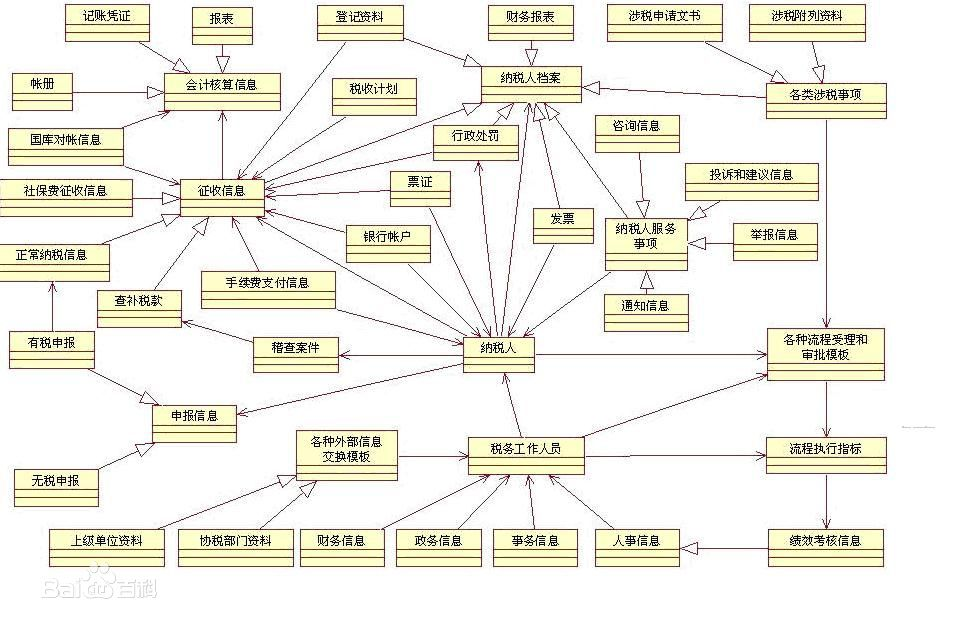

# 领域模型

## 概念

领域模型（也叫业务对像模型）是描述业务用例实现的对象模型。它是业务角色和业务实体之间如何联系和协作以执行业务的一种抽象。该模型为产生预期效果确定了业务人员以及他们处理和使用的对象（“业务类和对象”）之间应该具有的静态和动态关系。它注重业务中承担的角色及其当前职责。这些模型类的对象组合在一起可以执行所有的业务用例。

## 核心元素

业务对象模型将结构的概念和行为的概念结合了起来。

## 与数据模型的区别

**领域模型它是一个分析模型，帮助系统分析人员、用户认识现实业务的工具**，描述的是业务中涉及到的实体及其相互之间的关系，它是需求分析的产物，与问题领域相关。领域模型是需求分析人员与用户交流的有力工具，是需求分析人员与用户共同理解的概念，是彼此之间交流的语言。

而**数据模型是系统设计、实现的一部分，描述的是对用户需求在数据结构上的实现**，仅此而已。当然数据模型中的概念模型设计与领域模型类似，缺乏的是实体之间更广泛的关系描述。

通常大家会考虑数据怎么存放的问题，我的理解是领域模型设计期间不用考虑数据的存放问题，只考虑业务描述中涉及的实体以及实体之间的关系。

实体之间的关系，无非是泛化、依赖和关联，关联又分了一般关联、聚合、组合等等。

参考：

- https://baike.baidu.com/item/%E9%A2%86%E5%9F%9F%E6%A8%A1%E5%9E%8B
