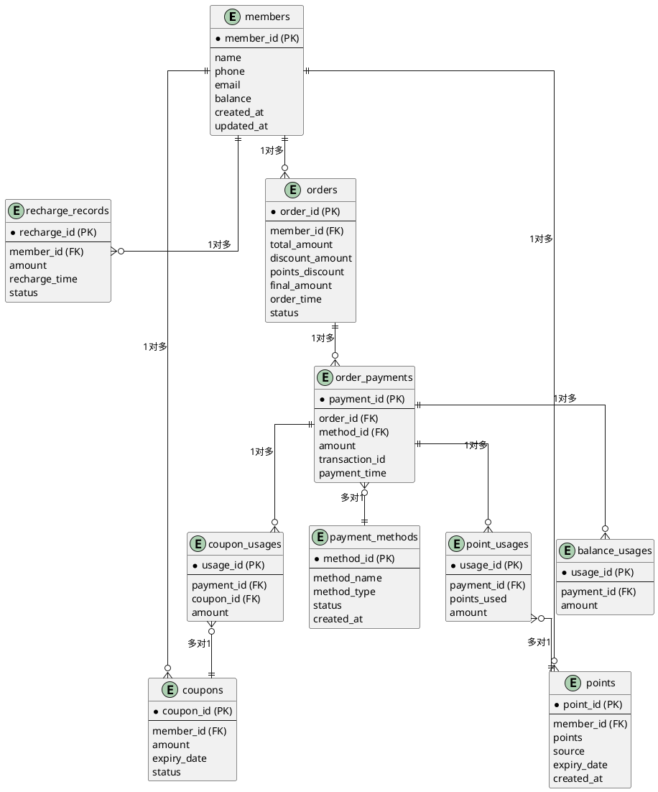

# 会员管理系统

好的！以下是重新整理后的会员管理系统设计，涵盖 **会员**、**充值**、**优惠券**、**积分**、**订单** 和 **支付** 模块，并支持多种支付方式（如微信支付、支付宝、余额支付等）。设计目标是清晰、灵活、可扩展。

## 1. 数据库设计

### 1.1 核心表结构

#### 1.1.1 会员表 (`members`)
- `member_id` (主键): 会员ID
- `name`: 会员姓名
- `phone`: 手机号
- `email`: 邮箱
- `balance`: 账户余额
- `created_at`: 注册时间
- `updated_at`: 最后更新时间

#### 1.1.2 充值记录表 (`recharge_records`)
- `recharge_id` (主键): 充值记录ID
- `member_id`: 会员ID (外键)
- `amount`: 充值金额
- `recharge_time`: 充值时间
- `status`: 充值状态（成功/失败）

#### 1.1.3 优惠券表 (`coupons`)
- `coupon_id` (主键): 优惠券ID
- `member_id`: 会员ID (外键)
- `amount`: 优惠券金额
- `expiry_date`: 过期时间
- `status`: 优惠券状态（未使用/已使用/已过期）

#### 1.1.4 积分表 (`points`)
- `point_id` (主键): 积分记录ID
- `member_id`: 会员ID (外键)
- `points`: 积分值（正数表示增加，负数表示减少）
- `source`: 积分来源（消费、签到、活动等）
- `expiry_date`: 积分过期时间
- `created_at`: 积分记录时间

#### 1.1.5 订单表 (`orders`)
- `order_id` (主键): 订单ID
- `member_id`: 会员ID (外键)
- `total_amount`: 订单总金额
- `discount_amount`: 优惠券抵扣金额
- `points_discount`: 积分抵扣金额
- `final_amount`: 实际支付金额
- `order_time`: 下单时间
- `status`: 订单状态（待支付/已支付/已取消）

#### 1.1.6 支付方式表 (`payment_methods`)
- `method_id` (主键): 支付方式ID
- `method_name`: 支付方式名称（如微信支付、支付宝、余额支付等）
- `method_type`: 支付方式类型（第三方支付、余额支付、积分支付等）
- `status`: 状态（启用/禁用）
- `created_at`: 创建时间

#### 1.1.7 订单支付表 (`order_payments`)
- `payment_id` (主键): 支付记录ID
- `order_id`: 订单ID (外键)
- `method_id`: 支付方式ID (外键)
- `amount`: 支付金额
- `transaction_id`: 第三方支付交易ID（如微信支付的交易号，可选）
- `payment_time`: 支付时间

#### 1.1.8 优惠券使用记录表 (`coupon_usages`)
- `usage_id` (主键): 使用记录ID
- `payment_id`: 支付记录ID (外键)
- `coupon_id`: 使用的优惠券ID (外键)
- `amount`: 优惠券抵扣金额

#### 1.1.9 积分使用记录表 (`point_usages`)
- `usage_id` (主键): 使用记录ID
- `payment_id`: 支付记录ID (外键)
- `points_used`: 使用的积分值
- `amount`: 积分抵扣金额

#### 1.1.10 余额使用记录表 (`balance_usages`)
- `usage_id` (主键): 使用记录ID
- `payment_id`: 支付记录ID (外键)
- `amount`: 使用的余额值

---

### 1.2 表关系图（PlantUML）

---

## 2. 功能设计

### 2.1 会员管理
- 注册、查询、更新会员信息。

### 2.2 充值管理
- 会员充值，记录充值历史。

### 2.3 优惠券管理
- 发放、查询、使用优惠券。

### 2.4 积分管理
- 获取、查询、使用积分。

### 2.5 订单管理
- 创建订单，计算总金额、抵扣金额和实际支付金额。

### 2.6 支付管理
- 支持多种支付方式（余额、优惠券、积分、微信支付、支付宝等）。
- 记录支付信息，更新订单状态。

---

## 3. 业务流程

### 3.1 订单支付流程
1. 会员下单，生成订单。
2. 选择支付方式（余额、优惠券、积分、第三方支付）。
3. 计算抵扣金额和实际支付金额。
4. 记录支付信息，更新订单状态。
5. 更新会员余额、优惠券状态、积分余额。

---

## 4. 总结

通过以上设计，系统能够清晰地管理会员、充值、优惠券、积分、订单和支付模块，并支持多种支付方式。表结构设计合理，功能模块解耦，便于后续扩展和维护。
