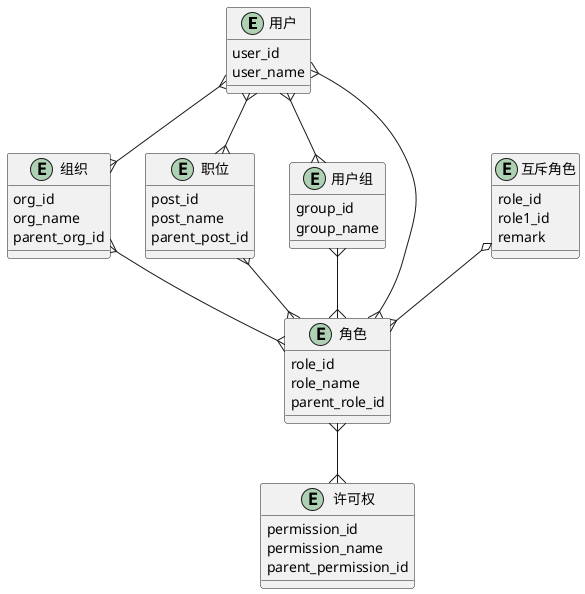

# RBAC

Role-Based Access Control

## 什么是RBAC？
RBAC允许您通过分配一组权限来创建和实施高级访问。权限基于特定用户类别执行其职责所需的访问级别。换句话说，公司中的不同人员可以完全基于其工作职能和职责等因素拥有完全不同的访问权限级别和类型。

例如，人力资源部员工可以查看员工记录，但不能查看客户数据。人力资源经理可以删除或更改人力资源记录，而较低级别的人力资源专家只能查看这些记录。

美国国家标准与技术研究院（NIST）引入了RBAC方法，作为自主访问控制（DAC）的更好替代方案。使用RBAC，可以为每个用户分配一个或多个角色，然后为这些角色分配允许的权限。用户可以是员工、承包商、业务合作伙伴等，这些类别中的每个角色都具有预定义的权限。当个人的职责或职能发生变化时，例如，由于晋升或部门调动，该人员被分配到RBAC系统中的新角色。

## 什么是RBAC中的角色？

在RBAC框架中，角色是用于构建权限的语义结构。角色可以由任意数量的标准定义，包括权限、职责、成本中心和业务部门。

角色本质上是指用户权限的集合。这与传统的用户群不同，后者是用户的集合。在RBAC的上下文中，权限与角色绑定，而不是与身份直接连接。

角色比组更稳定，因为角色是围绕访问管理组织的，在一个典型的组织中，功能和活动的变化不像身份那样频繁。

## 什么是RBAC中的权限？

权限（permission）即授予对受保护对象执行操作的批准的权限集。这里的受保护对象指的可以是应用中所有的内容，包括数据、模块、菜单、页面、字段、操作功能（增删改查）等等。同时，对于不同的权限可以使用不同的RBAC模型，分别管理或同一管理（即在一个系统中不一定仅使用一种RBAC模型）。例如在可以将页面访问权限与页面内的增删改查的操作权限一起基于RBAC0管理，数据权限（数据隔离）基于RBAC1实现，再为用户分配几种权限的组合。

## NIST标准包含的4级RBAC模型

**RBAC0（Core RBAC）**：基本模型有三个元素：用户、角色和权限。模型设计基于“多对多”原则，即多个用户可以具有相同的角色，一个用户可以具有多个角色。同样，您可以将同一权限分配给多个角色，也可以将同一角色分配给多个权限。

**RBAC1（Hierarchical RBAC）**：添加了第四个组件-层次结构，它定义了不同角色之间的资历关系。通过允许高级角色自动获取下级角色的权限，可以消除冗余，例如在角色重叠时必须指定某些权限。

分层RBAC支持几种类型的层次结构：

**树**：自底向上的层次结构，树底部的元素将权限授予更高的元素。例如，底部是一个具有常规权限的部门角色，所有权限比较小，上面的节点除了继承底部节点的权限，还可以添加自有的权限，这可以满足不同部门拥有不用的权限也有相同的权限的需求。

**倒树**：自上而下的层次结构，其中高级角色将其部分权限继承给下级角色。这种结构中层节点的权限均继承于底部节点，所以同层节点不存在共享权限。

**网格**：自下而上和自上而下的组合，其中每个角色都可以从其下方和上方的节点继承权限。此种结构相对比较灵活，既可以有共享权限，也可以有自有权限，且顶级节点拥有最大的权限。

**RBAC2（Static separation of duty (SSD) relations）**：为了在存在利益冲突策略的情况下提供帮助，将根据用户分配添加角色之间的关系。例如，作为一个角色的成员的用户将无法被指派为具有利益冲突的角色的成员。

**RBAC3（Dynamic separation of duty (DSD) relations）**：与SSD一样，DSD限制了可用的用户权限，但基于不同的上下文。例如，根据会话期间执行的任务，用户可能需要不同级别的访问，DSD限制会话期间激活的权限。

## 使用RBAC的好处有哪些？

RBAC最大的优点之一是它提供了一种系统化的方法，用于定义和维护角色，使您能够仅根据用户需要一致地授予访问权限，从而降低数据泄露或数据丢失的风险。

但RBAC还有很多其他好处，包括：

- 通过根据人力资源属性自动为新员工分配访问权限来加速入职
- 简化IT管理工作，例如，通过在全球范围内跨多个平台和应用程序快速重新分配权限
- 改善对欧盟《一般数据保护规则》（GDPR）或美国《健康保险可移植性和责任法案》（HIPAA）等法规的遵守
- 通过为供应商和业务合作伙伴等外部用户提供预定义的角色来降低第三方风险
- 通过在角色更改时自动更新访问权限来维护“最低权限”的最佳实践
- 降低高级访问控制的成本，尤其是在大型复杂环境中

## RBAC有哪些缺陷？

### 需要了解组织结构知识

没有一种一刀切的方法来定义角色。在决定如何对角色进行分类以及如何管理这些角色的访问权限时，组织必须跨部门协调。这需要清楚地了解组织的理想结构以及支持它的技术基础设施。

在大型或成长中的组织中，如果IT或安全经理需要在没有人力资源或执行决策者帮助的情况下定义角色，这可能是一项艰巨的任务，会变得更加困难。这种简化实施的常见尝试实际上使问题变得更糟，导致与公司更大的目标不一致。

### 需要深思熟虑的实施

分配角色可能是一项挑战。可能会出现很多问题，答案并不总是清晰的。例如：安全团队是否需要访问他们试图保护的数据，包含哪些访问权限（创建/读取/更新/删除）？是否应为用户分配部门之外的角色，以确保临时访问特权文件？

## 缺乏灵活性

RBAC以过于死板著称，这也难怪。组织成长，团队扩张，访问需求发生变化。在RBAC项目开始时定义的角色可能不再符合公司目标。

结果如何？人员的角色和权限级别可能不一致。例如，一个人可能被赋予过多的角色权限、分配过多的角色，或者两者兼而有之。虽然这些努力可能会起到快速修复的作用，但它们也会造成安全漏洞和法规遵从性挑战，从而打消了您最初实施RBAC的全部原因。

### 导致角色爆炸

一些团队试图通过定义越来越细粒度的角色、在出现新需求时创建临时角色，或将太多的角色分配给单个用户来回避上述问题。虽然这可能会在短期内缓解摩擦，但也会让RBAC变得混乱，难以管理。

这个问题通常被称为角色爆炸，是RBAC最常见的反对意见之一。当现实世界中的角色和访问需求与您的政策文件中概述的角色和访问需求不同时，甚至在很小的程度上也会出现这种情况。而作为临时解决方案创建的角色有时管理员可能会忘记或甚至故意选择保留这些角色，即使为其创建这些角色的人员离开或更换组织内的工作。结果是：特权蔓延和混乱。

## 常用的E-R图

