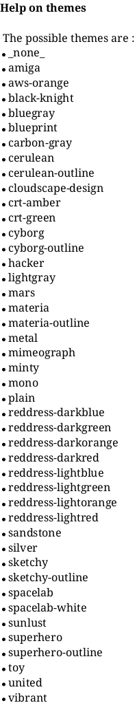
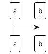
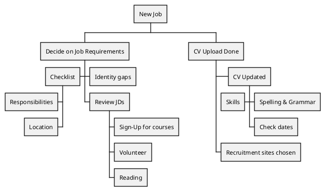

# 产品架构

```plantuml
' listsprite
```

```plantuml
' help skinparams
```

## 换肤





```plantuml
!include <archimate/Archimate>
Grouping(Example01, "Group Type 01"){
    Motivation_Stakeholder(StakeholderElement, "Stakeholder Description")
    Business_Service(BService, "Business Service")
    Business_Service(BService1, "Business Service")
    Business_Service(BService2, "Business Service")
    Business_Service(BService3, "Business Service")
    Business_Service(BService4, "Business Service")
    Business_Service(BService5, "Business Service")
    Application_Service(BService6, "Business Service")
}

```

```plantuml
skinparam minClassWidth 70
skinparam sameClassWidth true
class a
class thisisverylong


skinparam minClassWidth 100
' skinparam sameClassWidth true
class b
class thisisverylongb
```

```plantuml
@startuml
scale max 1024 width

!define TECHN_FONT_SIZE 12

skinparam wrapWidth 200


skinparam rectangle<<boundary>> {
    Shadowing false
    StereotypeFontSize 0
    FontColor #444444
    BorderColor #444444
    BorderStyle dashed
}


skinparam archimate {
  StereotypeAlignment right
  RoundCorner<<business-product>> 12
  RoundCorner<<application-service>> 25

'   RoundCorner<<strategy-capability>> 25
'   RoundCorner<<strategy-course-of-action>> 25
'   RoundCorner<<strategy-value-stream>> 25
'   RoundCorner<<business-process>> 25
'   RoundCorner<<business-event>> 25
'   RoundCorner<<business-function>> 25
'   RoundCorner<<business-interaction>> 25
'   RoundCorner<<business-event>> 25
'   RoundCorner<<business-service>> 25
'   RoundCorner<<application-function>> 25
'   RoundCorner<<application-interaction>> 25
'   RoundCorner<<application-process>> 25
'   RoundCorner<<application-event>> 25
'   RoundCorner<<technology-function>> 25
'   RoundCorner<<technology-process>> 25
'   RoundCorner<<technology-interaction>> 25
'   RoundCorner<<technology-event>> 25
'   RoundCorner<<technology-infra-service>> 25
'   RoundCorner<<implementation-workpackage>> 25
'   RoundCorner<<implementation-event>> 25
'   DiagonalCorner<<motivation-stakeholder>> 12
'   DiagonalCorner<<motivation-driver>> 12
'   DiagonalCorner<<motivation-assessment>> 12
'   DiagonalCorner<<motivation-goal>> 12
'   DiagonalCorner<<motivation-outcome>> 12
'   DiagonalCorner<<motivation-principle>> 12
'   DiagonalCorner<<motivation-requirement>> 12
'   DiagonalCorner<<motivation-constraint>> 12
}

' Layout Helpers
' ##################################
!define Lay_D(e_from, e_to) e_from -[hidden]D- e_to
!define Lay_U(e_from, e_to) e_from -[hidden]U- e_to
!define Lay_R(e_from, e_to) e_from -[hidden]R- e_to
!define Lay_L(e_from, e_to) e_from -[hidden]L- e_to

' Boundaries
' ##################################
!define Boundary(e_alias, e_label) rectangle "==e_label" <<boundary>> as e_alias
!define Boundary(e_alias, e_label, e_type) rectangle "==e_label\n<size:TECHN_FONT_SIZE>[e_type]</size>" <<boundary>> as e_alias


!define Business_Product(e_alias, e_label) archimate #BUSINESS "e_label" <<business-product>> as e_alias

!define Application_Service(e_alias, e_label) archimate #APPLICATION "e_label" <<application-service>> as e_alias

!define aa(text,len) return $strlen(text)< len

!function strlen2($text)
    !$alphabetDigital = "ABCDEFGHIJKLMNOPQRSTUVWXYZabcdefghijklmnopqrstuvwxyz0123456789"
    
    !$alphabetDigitalCount = 0
    
    !$strlen = %strlen($text)
    !while $strlen!=0
      !$alphabetDigitalLen=%strlen($alphabetDigital)
      !while $alphabetDigitalLen!=0
        !if (%substr($text, $strlen-1, 1) == %substr($alphabetDigital,$alphabetDigitalLen-1,1))
          !$alphabetDigitalCount = $alphabetDigitalCount +1
          !$alphabetDigitalLen=1
        !endif
        !$alphabetDigitalLen = $alphabetDigitalLen - 1
      !endwhile
      !$strlen = $strlen - 1
    !endwhile

    !return   2 * %strlen($text)-$alphabetDigitalCount
!endfunction

!function padding($text, $len=16, $padstr=" ")
    !if ($len == 0)
      !return $text
    !endif
    
    !$strlen = strlen2($text)
    !if ($strlen > $len)
       !return $text
    !endif
    
    !$padlen = $len - $strlen
    !$mi = $padlen/2
    
    !while $padlen!=0
      !if ($padlen > $mi)
        !$text = $padstr + $text
      !else
        !$text = $text + $padstr
      !endif
      !$padlen = $padlen - 1
    !endwhile

    !return $text
!endfunction

' left to right direction
top to bottom direction


Boundary(c,"ccc"){

    Boundary(o,"业务应用中心a"){
        Application_Service(store1 ,padding("STORE1",34))
        Application_Service(store2 ,padding("STORE1",34))
        Application_Service(store3 ,padding("STORE1",34))
        Application_Service(store4 ,padding("STORE1",34))
        Application_Service(store5 ,padding("STORE1",34))
        Lay_D(store1,store2)
        Lay_D(store2,store3)
        Lay_D(store3,store4)
        Lay_D(store4,store5)
    }

    Boundary(v,"中间件"){
        Business_Product(web20,padding("Web2"))
        Business_Product(web21,padding("Web2"))
        Business_Product(web22,padding("Web2"))
        ' Business_Product(web23,padding("Web2"))
        ' Business_Product(web24,padding("Web2"))
        ' Business_Product(web25,padding("Web2"))
        ' Business_Product(web26,padding("Web2"))
        ' Business_Product(web27,padding("Web2"))
        ' Business_Product(web28,padding("Web2"))
        ' Business_Product(web29,padding("Web2"))
        ' Business_Product(web210,padding("Web2"))
        ' Business_Product(web211,padding("Web2"))
        Lay_D(web20,web21)
        Lay_D(web21,web22)
        
    }

    Boundary(user1,"用户触点"){
        Business_Product(web,padding("Web",32))
        Business_Product(miniProgram,padding("小程序",32))
        Business_Product(app,padding("APP",32))
        Business_Product(thirdPartyEcommerce,padding("第三方电商",32))
        Business_Product(socialMedia,padding("社交媒体",32))
        Business_Product(pos,padding("POS",32))
        Business_Product(electronicScreen,padding("电子屏",32))
        Business_Product(smartDevice,padding("智能设备",32))
        Lay_R(app,thirdPartyEcommerce)
        Lay_D(thirdPartyEcommerce,socialMedia)
        Lay_R(socialMedia,pos)
        Lay_R(pos,electronicScreen)
        Lay_R(electronicScreen,smartDevice)
    }

    Boundary(businessApp,"业务应用中心"){
        Application_Service(store ,padding("STORE",19))
        Application_Service(fulfillment,padding("FULFILLMENT",19))
        Application_Service(marketing,padding("MARKETING",19))
        Application_Service(insight,padding("INSIGHT",19))
        Application_Service(customApp1,padding("App",19))
        Lay_R(marketing,insight)
        Lay_R(insight,customApp1)
    }
    
    Lay_D(socialMedia,businessApp)
    Lay_D(user1,businessApp)
    ' Lay_R(v,user1)
    ' Lay_R(v,businessApp)
    Lay_R(v,o)
}

@enduml
```

## dd


