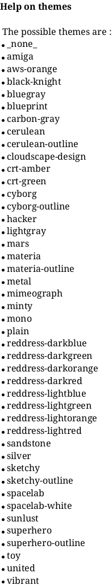
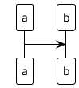
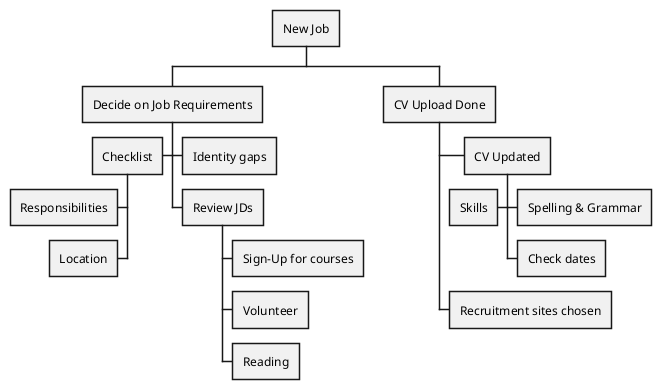

# 产品架构

## 换肤





```plantuml
!include <archimate/Archimate>
Grouping(Example01, "Group Type 01"){
    Motivation_Stakeholder(StakeholderElement, "Stakeholder Description")
    Business_Service(BService, "Business Service")
    Business_Service(BService1, "Business Service")
    Business_Service(BService2, "Business Service")
    Business_Service(BService3, "Business Service")
    Business_Service(BService4, "Business Service")
    Business_Service(BService5, "Business Service")
    Application_Service(BService6, "Business Service")
}

```

```plantuml
skinparam minClassWidth 70
skinparam sameClassWidth true
class a
class thisisverylong


skinparam minClassWidth 100
' skinparam sameClassWidth true
class b
class thisisverylongb
```

## 层级结构


