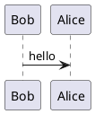

# PlantUML

## 安装插件

PlantUML

## 本地渲染

### 方法1

安装graphviz，添加路径到环境变量

### 方法2

docker run -d -p 8000:8080 plantuml/plantuml-server:jetty

## 测试

```plantuml
@startuml
Bob -> Alice : hello
@enduml
```
