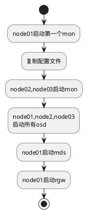

# 使用 docker 快速部署 ceph

## 需求

Docker多主机管理时，时常需要共享不同的文件，ceph能较好的稳定性等原因。

## 系统环境

- 至少需要三台虚拟机或者物理机，这里使用虚拟机
- 每台虚拟机至少需要两块硬盘（一块系统盘，一块OSD），本例中有三块硬盘

### 1\. 部署流程



### 2\. 主机规划

| 主机名 | IP地址       | 角色            |
| ------ | ------------ | --------------- |
| node01 | 192.168.1.11 | mon,mds,rgw,osd |
| node02 | 192.168.1.12 | mon,osd         |
| node03 | 192.168.3.13 | mon,osd         |

安装 docker
---------

登录 <https://cr.console.aliyun.com/#/accelerator> 获取自己的阿里云 docker 加速地址

### 1\. 安装升级 docker 客户端

```bash
# curl -sSL http://acs-public-mirror.oss-cn-hangzhou.aliyuncs.com/docker-engine/internet | sh -
```

### 2\. 使用 docker 加速器

可以通过修改 daemon 配置文件 /etc/docker/daemon.json 来使用加速器，注意修改使用自己的加速地址

```bash
# mkdir -p /etc/docker
# tee /etc/docker/daemon.json <<-'EOF'
{
  "registry-mirrors": ["https://******.mirror.aliyuncs.com"]
}
EOF
# systemctl daemon-reload
# systemctl restart docker
# systemctl enable docker
```

## 启动 MON

### 1\. 下载 ceph daemon 镜像

```bash
 docker pull ceph/daemon
```

### 2\. 启动第一个 mon

在 node1 上启动第一个 mon,注意修改 MON_IP

```bash
 docker run -d\
        --net=host\
        -v /etc/ceph:/etc/ceph\
        -v /var/lib/ceph/:/var/lib/ceph/\
        -e MON_IP=192.168.1.11\
        -e CEPH_PUBLIC_NETWORK=192.168.1.0/24\
        ceph/daemon mon
```

查看容器

```bash
 docker ps
CONTAINER ID        IMAGE               COMMAND                CREATED              STATUS              PORTS               NAMES
b79a02c40296        ceph/daemon         "/entrypoint.sh mon"   About a minute ago   Up About a minute                       sad_shannon
```

查看集群状态

```bash
 docker exec b79a02 ceph -s
    cluster 96ae62d2-2249-4173-9dee-3a7215cba51c
     health HEALTH_ERR
            no osds
     monmap e2: 1 mons at {node01=192.168.1.11:6789/0}
            election epoch 4, quorum 0 node01
        mgr no daemons active
     osdmap e1: 0 osds: 0 up, 0 in
            flags sortbitwise,require_jewel_osds,require_kraken_osds
      pgmap v2: 64 pgs, 1 pools, 0 bytes data, 0 objects
            0 kB used, 0 kB / 0 kB avail
                  64 creating
```

### 2\.置文件

将 node1 上的配置文 node02 和 node03路径包含/etc/ceph和/var/lib/ceph/bootstrap-*下的所有内容。

```bash
# ssh root@node2 mkdir -p /var/lib/ceph
# scp -r /etc/ceph root@node2:/etc
# scp -r /var/lib/ceph/bootstrap* root@node2:/var/lib/ceph

# ssh root@node3 mkdir -p /var/lib/ceph
# scp -r /etc/ceph root@node3:/etc
# scp -r /var/lib/ceph/bootstrap* root@node3:/var/lib/ceph
```

### 3\. 启动第二个和第三个 mon

在 node02 上执行以下命令启动 mon,注意修改 MON_IP

```bash
 docker run -d\
        --net=host\
        -v /etc/ceph:/etc/ceph\
        -v /var/lib/ceph/:/var/lib/ceph/\
        -e MON_IP=192.168.1.12\
        -e CEPH_PUBLIC_NETWORK=192.168.1.0/24\
        ceph/daemon mon
```

在 node03 上执行以下命令启动 mon,注意修改 MON_IP

```bash
 docker run -d\
        --net=host\
        -v /etc/ceph:/etc/ceph\
        -v /var/lib/ceph/:/var/lib/ceph/\
        -e MON_IP=192.168.1.13\
        -e CEPH_PUBLIC_NETWORK=192.168.1.0/24\
        ceph/daemon mon
```

查看在 node01 上集群状态

```bash
 docker exec b79a02 ceph -s
    cluster 96ae62d2-2249-4173-9dee-3a7215cba51c
     health HEALTH_ERR
            64 pgs are stuck inactive for more than 300 seconds
            64 pgs stuck inactive
            64 pgs stuck unclean
            no osds
     monmap e4: 3 mons at {node01=192.168.1.11:6789/0,node02=192.168.1.12:6789/0,node03=192.168.1.13:6789/0}
            election epoch 12, quorum 0,1,2 node01,node02,node03
        mgr no daemons active
     osdmap e1: 0 osds: 0 up, 0 in
            flags sortbitwise,require_jewel_osds,require_kraken_osds
      pgmap v2: 64 pgs, 1 pools, 0 bytes data, 0 objects
            0 kB used, 0 kB / 0 kB avail
                  64 creating
```

可以看到三个 mon 已经正确启动

## 启动 OSD

每台虚拟机准备了两块磁盘作为 osd,分别加入到集群,注意修改磁盘

```bash
 docker run -d\
        --net=host\
        -v /etc/ceph:/etc/ceph\
        -v /var/lib/ceph/:/var/lib/ceph/\
        -v /dev/:/dev/\
        --privileged=true\
        -e OSD_FORCE_ZAP=1\
        -e OSD_DEVICE=/dev/sdb\
        ceph/daemon osd_ceph_disk
```

```bash
 docker run -d\
        --net=host\
        -v /etc/ceph:/etc/ceph\
        -v /var/lib/ceph/:/var/lib/ceph/\
        -v /dev/:/dev/\
        --privileged=true\
        -e OSD_FORCE_ZAP=1\
        -e OSD_DEVICE=/dev/sdc\
        ceph/daemon osd_ceph_disk
```

按照同样方法将 node02 和 node03 的 sdb、sdc 都加入集群

查看集群状态

```bash
 docker exec b79a ceph -s
    cluster 96ae62d2-2249-4173-9dee-3a7215cba51c
     health HEALTH_OK
     monmap e4: 3 mons at {node01=192.168.1.11:6789/0,node02=192.168.1.12:6789/0,node03=192.168.1.13:6789/0}
            election epoch 12, quorum 0,1,2 node01,node02,node03
        mgr no daemons active
     osdmap e63: 6 osds: 6 up, 6 in
            flags sortbitwise,require_jewel_osds,require_kraken_osds
      pgmap v157: 64 pgs, 1 pools, 0 bytes data, 0 objects
            212 MB used, 598 GB / 599 GB avail
                  64 active+clean
```

可以看到 mon 和 osd 都已经正确配置，切集群状态为 HEALTH_OK

## 创建 MDS

使用以下命令在 node01 上启动 mds

```bash
 docker run -d\
        --net=host\
        -v /etc/ceph:/etc/ceph\
        -v /var/lib/ceph/:/var/lib/ceph/\
        -e CEPHFS_CREATE=1\
        ceph/daemon mds
```

## 启动RGW

启动RGW，并且映射 80 端口

使用以下命令在 node01 上启动 rgw，并绑定 80 端口

```bash
 docker run -d\
        -p 80:80\
        -v /etc/ceph:/etc/ceph\
        -v /var/lib/ceph/:/var/lib/ceph/\
        ceph/daemon rgw
```

## 集群的最终状态

```bash
 docker exec b79a02 ceph -s
    cluster 96ae62d2-2249-4173-9dee-3a7215cba51c
     health HEALTH_OK
     monmap e4: 3 mons at {node01=192.168.1.11:6789/0,node02=192.168.1.12:6789/0,node03=192.168.1.13:6789/0}
            election epoch 12, quorum 0,1,2 node01,node02,node03
      fsmap e5: 1/1/1 up {0=mds-node01=up:active}
        mgr no daemons active
     osdmap e136: 6 osds: 6 up, 6 in
            flags sortbitwise,require_jewel_osds,require_kraken_osds
      pgmap v1460: 136 pgs, 10 pools, 3829 bytes data, 223 objects
            254 MB used, 598 GB / 599 GB avail
                 136 active+clean
```

## 客户端挂载ceph-fuse

ceph-fuse

https://www.jianshu.com/p/a4e1ba361cc9
