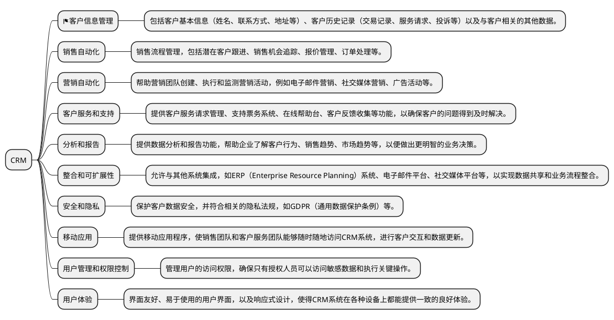
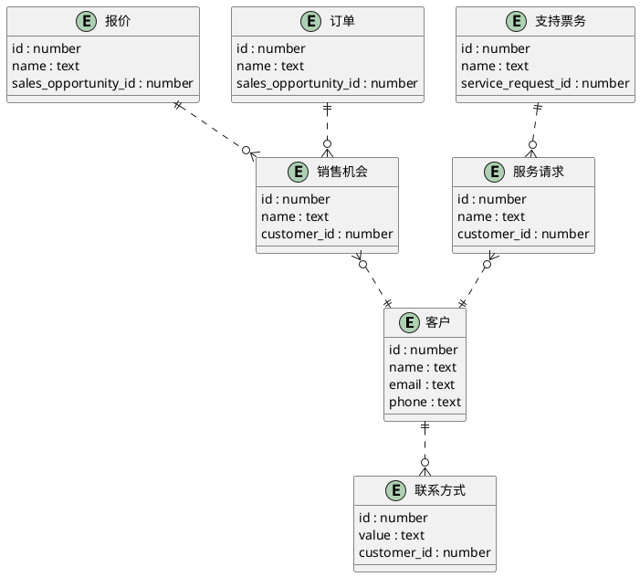

# crm

## 概念

CRM是客户关系管理（Customer Relationship Management）的缩写。它是一种管理和优化企业与客户之间关系的策略和技术。CRM系统帮助企业收集、整理和分析客户信息，以便更好地了解客户需求、提供个性化的服务和建立持久的客户关系。

CRM系统通常包括以下功能和特点：

1. **客户数据管理**：CRM系统可以存储和管理客户的基本信息，如姓名、联系方式、购买历史等。

2. **销售自动化**：CRM可以跟踪销售流程、管理销售机会、提供销售预测和报告，帮助企业提高销售效率。

3. **客户服务支持**：CRM系统可以跟踪客户问题、投诉和建议，并为客户服务团队提供支持，确保及时响应和解决客户问题。

4. **营销自动化**：CRM系统可以根据客户数据创建和执行营销活动，包括电子邮件营销、社交媒体营销等，以促进客户参与和销售。

5. **客户分析**：CRM系统通过分析客户数据，识别客户行为模式、喜好和趋势，帮助企业更好地了解客户，并制定相应的营销和服务策略。

综合来说，CRM系统可以帮助企业建立更加紧密和持久的客户关系，提高客户满意度和忠诚度，从而促进业务增长和利润增加。

## 如何初始化

独立的CRM系统通常可以通过不同的方式与客户的购买历史进行关联：

1. **手动输入**：CRM用户可以手动输入客户的购买历史信息。这包括购买日期、产品或服务名称、数量、价格等信息。虽然这种方法比较耗时，但对于少量的交易或者特定的重要交易，手动输入是一个有效的方式。

2. **数据导入**：如果购买历史数据存储在其他系统或文件中（比如电子表格或数据库），CRM系统通常支持数据导入功能。用户可以将购买历史数据导入CRM系统，以建立客户与其购买历史的关联。

3. **集成其他系统**：CRM系统通常可以与其他业务系统（如销售系统、电子商务平台等）进行集成。通过这种集成，CRM可以直接从其他系统中获取客户的购买历史数据，实现实时或定期更新。

4. **自动记录**：一些CRM系统支持自动记录客户交互和购买行为。例如，当客户通过CRM系统的电子邮件链接访问网站并进行购买时，系统可以自动记录这笔交易，建立客户与购买历史的关联。

无论采用何种方式，建立客户与购买历史的关联对于CRM系统来说都是至关重要的。这样的关联可以帮助企业更好地了解客户的购买行为、偏好和趋势，从而更精准地进行营销、销售和客户服务。

## 组成部分



## 业务模型



## 技术栈

spring / react

### 模型图

```bash
docker run --rm -it -p 18080:80 jhipster/jdl-studio
```

http://localhost:18080

## 模型细化
